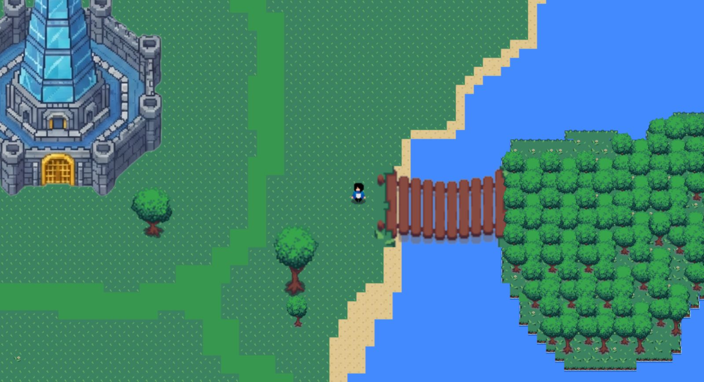
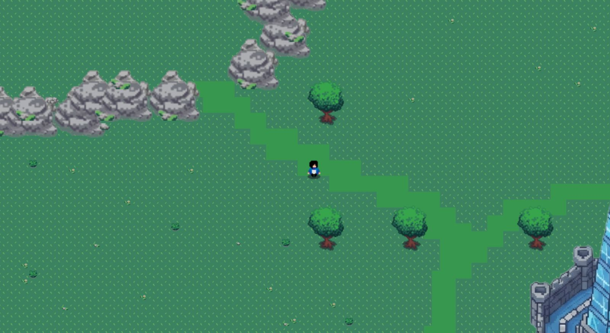

# GDD - Game Design Document - Módulo 1 - Inteli

**_Os trechos em itálico servem apenas como guia para o preenchimento da seção. Por esse motivo, não devem fazer parte da documentação final_**

## Nome do Grupo

#### Nomes dos integrantes do grupo


## Sumário

[1. Introdução](#c1)

[2. Visão Geral do Jogo](#c2)

[3. Game Design](#c3)

[4. Desenvolvimento do jogo](#c4)

[5. Casos de Teste](#c5)

[6. Conclusões e trabalhos futuros](#c6)

[7. Referências](#c7)

[Anexos](#c8)

<br>


# <a name="c1"></a>1. Introdução (sprints 1 a 4)

## 1.1. Plano Estratégico do Projeto

### 1.1.1. Contexto da indústria (sprint 2)

A Cielo atua no setor de serviços financeiros, mais especificamente no segmento de meios eletrônicos de pagamento e adquirência. Sua atividade principal consiste em credenciar estabelecimentos comerciais para aceitar pagamentos com cartões de crédito, débito e vouchers, realizando a captura, o processamento e a liquidação das transações financeiras. Essa operação conecta três pontas do ecossistema: os estabelecimentos comerciais, as instituições financeiras emissoras (bancos) e as bandeiras de cartão, como Visa e Mastercard. A empresa fornece terminais de ponto de venda (POS), soluções de e-commerce, links de pagamento, antecipação de recebíveis, gestão de vendas e serviços integrados de tecnologia financeira, operando como intermediadora tecnológica e financeira nesse fluxo (Cielo, 2024).

O mercado brasileiro de adquirência tornou-se mais competitivo após a quebra da exclusividade entre bandeiras e credenciadoras em 2010, ampliando a entrada de novos players como Stone e PagSeguro (InvestNews, 2024). Além disso, a implementação do Pix pelo Banco Central do Brasil em 2020 intensificou a transformação digital dos meios de pagamento, oferecendo transferências instantâneas com menor custo para lojistas e consumidores. Esse cenário reduziu margens no setor de terminais físicos e impactou a liderança histórica da Cielo em participação de mercado, exigindo reposicionamento estratégico diante da digitalização acelerada e da maior sensibilidade a preços (Banco Central do Brasil, 2024; Cielo, 2024).

Atualmente, a Cielo adota uma estratégia focada em eficiência operacional, ampliação de soluções digitais e diversificação de serviços financeiros, buscando ir além da captura de transações. A empresa investe em tecnologia, análise de dados e integração com plataformas digitais para oferecer soluções completas de gestão financeira aos lojistas. Sua atuação possui abrangência nacional, atendendo micro, pequenas, médias e grandes empresas em todo o território brasileiro, com forte capilaridade comercial e relacionamento com grandes bancos acionistas (Cielo, 2024). Esse reposicionamento visa fortalecer a competitividade em um ambiente de pagamentos cada vez mais digital, instantâneo e orientado por inovação.


#### 1.1.1.1. Modelo de 5 Forças de Porter (sprint 2)

O modelo das Cinco Forças de Porter, desenvolvido por Michael Porter, é uma ferramenta estratégica amplamente utilizada para analisar o nível de competitividade de um setor e compreender os fatores que influenciam a lucratividade das empresas. A partir dessa abordagem, é possível identificar as principais pressões competitivas do mercado, bem como oportunidades e desafios que impactam o posicionamento estratégico das organizações. No contexto do mercado de adquirência no Brasil, onde atua a Cielo, essa análise permite compreender como mudanças tecnológicas, regulações e novos modelos de negócio vêm transformando o setor de pagamentos (Porter, 2008).

**Análise da Ameaça de Novos Entrantes**
A análise da ameaça de novos entrantes para a Cielo revela um cenário de profunda transição, em que barreiras tradicionais, como a necessidade de elevados investimentos em redes físicas de terminais e infraestrutura de processamento, vêm sendo substituídas por exigências regulatórias rigorosas. O arcabouço do Banco Central do Brasil, especialmente por meio de normativas como a Resolução BCB nº 80/2021, alterou significativamente o rito de entrada, exigindo autorização prévia e estrita adequação de capital para o funcionamento de novas Instituições de Pagamento (IPs), atuando como um pesado filtro prudencial e de governança.
Apesar da barreira regulatória, o impacto potencial de novos entrantes continua disruptivo devido à drástica redução das barreiras tecnológicas. De acordo com o Relatório de Economia Bancária do Banco Central do Brasil (2021), o avanço de modelos como Banking as a Service (BaaS) e a implementação do Open Finance permitem que empresas de tecnologia, varejistas e marketplaces passem a oferecer produtos financeiros (como a "adquirência white label") sem precisar construir a infraestrutura do zero. Assim, a ameaça de novos entrantes pode ser classificada como moderada a alta, sendo contida pelas exigências do regulador, mas fortemente impulsionada pela facilidade tecnológica de implementação e escalabilidade.

**Análise da Ameaça de Produtos ou Serviços Substitutos**
O Pix consolidou-se como o principal e mais agressivo substituto tecnológico às maquininhas tradicionais e cartões de débito. O Relatório de Gestão do Pix (Banco Central do Brasil, 2023) demonstra que a ferramenta possui ampla adoção tanto por pessoas físicas (P2P) quanto em pagamentos comerciais (P2B), oferecendo liquidação em tempo real (D+0) e eliminando a dependência do hardware das adquirentes.
A concorrência direta dos meios substitutos força os adquirentes a reduzirem suas margens. O Banco Central do Brasil (2024), por meio de suas estatísticas oficiais do Sistema de Pagamentos Brasileiro (SPB), aponta que a pressão das transferências instantâneas tem forçado uma estagnação ou queda na Taxa de Desconto (MDR) cobrada pelas adquirentes nas transações de débito. Com o avanço do Pix por aproximação e do Pix Automático, a ameaça aos produtos tradicionais de adquirência e antecipação de recebíveis classifica-se como alta, dada a conveniência, a instantaneidade e o baixíssimo custo de aceitação para o lojista.

**Análise do Poder de Barganha dos Fornecedores**
O modelo de negócios da Cielo opera majoritariamente no chamado "arranjo de quatro partes", onde as bandeiras de cartão internacionais detêm papel estruturante, definindo as regras operacionais, os protocolos de segurança e a precificação primária do sistema.
Segundo estudo aprofundado do Conselho Administrativo de Defesa Econômica (CADE, 2019), o principal custo do adquirente é a "tarifa de intercâmbio" — a remuneração paga ao banco emissor do cartão. Como essa taxa é definida centralmente pelas bandeiras, as credenciadoras operam com custos de insumos engessados. A influência estrutural desses fornecedores é tão significativa que exigiu intervenção regulatória do Banco Central, como a edição da Resolução BCB nº 246/2022, para impor limites à tarifa de intercâmbio em cartões pré-pagos e de débito. Devido à alta concentração no mercado de bandeiras e à dependência das adquirentes na cadeia de liquidação, o poder de barganha dos fornecedores é classificado como alto.

**Análise do Poder de Barganha dos Clientes**
Na indústria de adquirência, o poder de barganha dos clientes (estabelecimentos comerciais) apresenta grande assimetria, variando radicalmente conforme o volume transacionado. Grandes redes varejistas e marketplaces possuem colossal alavancagem de negociação, conseguindo comprimir as taxas de desconto (MDR) e obter isenção total de aluguéis de POS (maquininhas).
Uma das estratégias centrais que elevam o poder do cliente é a adoção da multi adquirência e de gateways de pagamento. Conforme analisado pelo Departamento de Estudos Econômicos do CADE (2023), clientes de médio e grande porte utilizam softwares (TEF e roteadores) para enviar cada transação para a adquirente que oferecer a menor taxa no exato momento da venda. Isso reduz os custos de mudança a zero e acirra a disputa por volume. Por outro lado, o volume global continua crescendo, conforme atesta a Associação Brasileira das Empresas de Cartões de Crédito e Serviços (Abecs, 2024), mitigando o impacto em clientes menores (cauda longa). Considerando a pressão exercida pelos grandes originadores de volume, o poder de barganha agregado dos clientes é alto.

**Análise da Rivalidade entre os Concorrentes Existentes**
A rivalidade no mercado brasileiro de adquirência, frequentemente referida pelo mercado financeiro como "a guerra das maquininhas", é intensa, agressiva e baseada em forte compressão de margens. A Cielo, que historicamente operava em um mercado duopolista, enfrenta hoje a pulverização de market share disputando contra incumbentes (Rede, Getnet) e fintechs listadas em bolsa que adotam táticas predatórias de preço (Stone, PagSeguro, Mercado Pago)(Estadão Conteúdo, 2024).
O serviço básico de captura de transações tornou-se uma commodity. De acordo com informações prestadas pela própria companhia ao mercado (Cielo S.A., 2024), a estratégia de retenção deixou de ser o terminal físico e passou a exigir a oferta de serviços de valor agregado (SVA), como crédito integrado, conta digital, conciliação e softwares de gestão varejista. A fragmentação dos players, o alto custo de aquisição de clientes (CAC) na base da pirâmide (microempreendedores) e a necessidade de altíssimo investimento em tecnologia comprovam que a rivalidade entre os concorrentes existentes é muito alta.

A análise das Cinco Forças de Porter indica que o mercado de adquirência no Brasil é altamente competitivo e está em constante transformação. Fatores como avanços tecnológicos, surgimento de novos concorrentes e o crescimento de soluções como o Pix aumentam a pressão sobre os modelos tradicionais de pagamento. Nesse cenário, empresas como a Cielo precisam investir em inovação e serviços de valor agregado para manter sua competitividade no setor.


### 1.1.2. Análise SWOT (sprint 2)

A análise SWOT é uma ferramenta de planejamento estratégico utilizada para identificar forças, fraquezas, oportunidades e ameaças relacionadas à competição em negócios ou ao planejamento de projetos (Fernandes et al., 2015). Essa metodologia permite avaliar fatores internos e externos que influenciam o desempenho organizacional, contribuindo para a formulação de estratégias mais alinhadas ao ambiente competitivo.

No caso da Cielo, a análise dos fatores internos e externos evidencia os seguintes elementos estratégicos:

### Forças (Strengths)
 
- Marca consolidada com alta capilaridade — presente em mais de 1 milhão de estabelecimentos comerciais no Brasil (Cielo, 2023).
- Relacionamento preferencial com os maiores bancos emissores do país, criando barreiras de entrada para novos concorrentes.
- Infraestrutura própria de captura e processamento de transações, com expertise regulatória acumulada.
- Reconhecimento institucional no ecossistema de pagamentos digitais (Abecs, 2023).
 
### Fraquezas (Weaknesses)
 
- Elevada concentração das operações no mercado brasileiro, ampliando exposição a oscilações econômicas e regulatórias locais.
- Perda contínua de participação de mercado para concorrentes como Stone e PagSeguro desde 2018 (Cielo, 2023).
- Estrutura de custos elevada frente a fintechs nativas digitais, pressionando margens financeiras.
- Dependência significativa do modelo tradicional de adquirência, com baixa agilidade de desenvolvimento de novos produtos.
 
### Oportunidades (Opportunities)
 
- Digitalização de micro e pequenos negócios — segmento ainda sub-penetrado em soluções de gestão financeira (Vial, 2019).
- Expansão do comércio eletrônico e dos pagamentos recorrentes como novos fluxos de receita.
- Potencial de cross-sell de serviços financeiros (crédito, antecipação de recebíveis) via base instalada.
- Open Finance como canal de dados para personalização de ofertas e ampliação do portfólio.
 
### Ameaças (Threats)
 
- Crescimento do Pix como substituto de pagamentos no varejo físico, reduzindo a dependência de terminais de captura (Banco Central do Brasil, 2023).
- Compressão regulatória das taxas de intercâmbio, impactando margens financeiras.
- Entrada de BigTechs (Mercado Pago, Google Pay) com modelos de negócio de margem zero em adquirência.
- Saturação competitiva com fintechs de baixo custo no mercado de adquirência (Banco Central do Brasil, 2023).
 
---
 
### SWOT Cruzada
 
A partir da identificação desses fatores, é possível elaborar estratégias combinando elementos internos e externos, transformando o diagnóstico em direcionamento estratégico.
 
| | **Oportunidades (O)** | **Ameaças (T)** |
|---|---|---|
| **Forças (S)** | **SO — Alavancagem:** Usar capilaridade e vínculo bancário para escalar oferta de crédito e serviços financeiros a PMEs digitais; posicionar-se como hub de gestão financeira para o varejo omnichannel via Open Finance. | **ST — Defesa:** Integrar o Pix ao portfólio como funcionalidade complementar; usar vantagem regulatória para criar produtos que BigTechs não conseguem oferecer; diferenciar por confiabilidade e SLA frente a novos entrantes. |
| **Fraquezas (W)** | **WO — Desenvolvimento:** Reduzir time-to-market com squads ágeis para capturar demanda de e-commerce; modernizar stack tecnológica para competir em custo com fintechs nativas digitais. | **WT — Contenção:** Priorizar segmentos de maior margem onde o Pix não substitui o cartão (ex.: crédito parcelado); avaliar parcerias ou aquisições de fintechs para reduzir gap de custo operacional. |


### 1.1.3. Missão / Visão / Valores (sprint 2)

### Missão
 
Promover equidade no ensino dos Gerentes de Negócios da Cielo por meio de uma jornada gamificada que transforma o treinamento corporativo em uma experiência imersiva. Os jogadores percorrem o Quebra Gelo, a Vila do Varejo e a Floresta dos Proveitos para conquistar os Medalhões que representam os pilares essenciais da atuação comercial. Ao reunir esses conhecimentos e aplicá-los na Cidade Cielo, onde a teoria se transforma em prática nas negociações, o jogo democratiza o acesso ao aprendizado, reduz desigualdades regionais e padroniza a capacitação em todo o Brasil.

### Visão
 
Consolidar-se como uma solução digital escalável e inovadora de desenvolvimento comercial, fortalecendo uma cultura de aprendizado contínuo e estratégico na força de vendas da Cielo.

### Valores
 
| Valor | Descrição |
|---|---|
| **Equidade** | Garantir acesso igualitário ao aprendizado independentemente da região ou perfil do colaborador. |
| **Empatia** | Considerar as necessidades e realidades dos Gerentes de Negócios na construção da experiência. |
| **Inovação** | Transformar o treinamento corporativo por meio de mecânicas de jogo e tecnologia educacional. |
| **Colaboração** | Estimular a troca de conhecimento e o desenvolvimento coletivo da força de vendas. |

### 1.1.4. Proposta de Valor (sprint 4)

*Posicione aqui o canvas de proposta de valor. Descreva os aspectos essenciais para a criação de valor da ideia do produto com o objetivo de ajudar a entender melhor a realidade do cliente e entregar uma solução que está alinhado com o que ele espera.*

### 1.1.5. Descrição da Solução Desenvolvida (sprint 4)

O Cielo Verso é um jogo 2D de treinamento corporativo desenvolvido em Phaser 3, que simula a jornada real de um Gerente de Vendas da Cielo — da primeira abordagem ao cliente até o fechamento da negociação. A solução capacita GNs de qualquer região do Brasil de forma remota e engajante, sem depender de treinamentos presenciais.
A experiência é estruturada em quatro mundos temáticos sequenciais — Quebra-Gelo, Via do Varejo, Praia dos Proventos e Cidade Cielo — cada um cobrindo uma área essencial do treinamento: abordagem, produtos, benefícios e negociação. Em cada mundo, o jogador enfrenta um mini game diretamente relacionado ao conteúdo daquele mapa. Ao concluir os quatro mundos, uma fase final integra todas as habilidades desenvolvidas em um único desafio, avaliando se o aprendizado foi absorvido de forma completa.
O desempenho é medido pelo tempo de conclusão e pelo mapeamento de erros críticos ao final da jornada, gerando dados que permitem identificar lacunas de conhecimento individuais. Os detalhes técnicos e narrativos da solução estão descritos na seção 2 deste documento.

### 1.1.6. Matriz de Riscos (sprint 4)

*Registre na matriz os riscos identificados no projeto, visando avaliar situações que possam representar ameaças e oportunidades, bem como os impactos relevantes sobre o projeto. Apresente os riscos, ressaltando, para cada um, impactos e probabilidades com plano de ação e respostas.*

### 1.1.7. Objetivos, Metas e Indicadores (sprint 4)

*Definição de metas SMART (específicas, mensuráveis, alcançáveis, relevantes e temporais) para seu projeto, com indicadores claros para mensuração*

## 1.2. Requisitos do Projeto (sprints 1 e 2)

Os requisitos do projeto são as peças identitárias, tanto fundamentais para o funcionamento do jogo quanto aspectos mais específicos de jogabilidade. Estes incluem mecânicas básicas de movimentação e interação, até partes mais detalhadas do combate de cartas e o design geral do jogo. Além disso, definem os limites e o escopo geral esperado do projeto final.

Abaixo estão os requisitos trabalhados na sprint 1 e 2:

\# | Requisito | Explicação
--- | --- | ---
1 | Introdução narrativa | O jogo deve apresentar uma introdução narrativa na Casa da Cielita, na qual a NPC Cielita contextualiza o universo do jogo e apresenta suas regras básicas por meio de caixas de diálogo.
2 | Configuração Inicial do Avatar | O jogo deverá disponibilizar quatro (4) opções de avatares jogáveis para seleção do jogador em uma tela específica no início da partida. Após a escolha do avatar, o jogador deverá definir o nome do personagem, que será utilizado para sua identificação ao longo da experiência. A seleção do avatar e do nome poderá ser alterada posteriormente por meio das configurações do jogo.
3 | Mapa geral | O jogo deve conter um mapa geral com uma área introdutória e quatro regiões principais: Casa da Cielta, Quebra Gelo, Vila do Varejo, Floresta dos Proveitos e Cidade Cielo.
4 | Regiões principais | O jogo deve conter a primeira região, Quebra-Gelo, que abordará proposta de valor, conceitos fundamentais e superação de objeções; a segunda, Vila do Varejo, que deverá contemplar a aplicação prática de produtos e soluções conforme o perfil do cliente; a terceira, Floresta dos Proveitos, que deverá tratar da identificação e argumentação de benefícios e diferenciais competitivos; e a quarta e última, Cidade da Negociação, que deverá consolidar os conhecimentos adquiridos nas regiões anteriores por meio de desafios de estratégia, negociação e fechamento.
5 | Movimentação e interação do jogador | A movimentação do personagem será realizada por meio das teclas W, A, S e D do teclado, responsáveis pelo deslocamento direcional. A tecla E será destinada à interação do jogador com NPCs e objetos presentes no mapa.
6 | Barra de satisfação e sprites | O jogo deve apresentar o nível de satisfação dos clientes por meio de uma barra de interface que, durante a negociação com o vendedor, aumenta ou diminui de acordo com a resposta do GN. Os sprites do cliente mudarão de acordo com a negociação (por exemplo: nervoso ou feliz).
7 | Cartas | O jogo irá implementar um sistema de respostas à base de cartas aconselhadoras de fundamentos típicos em negociações, como: abordagem, sondagem, negociação, demonstração e fechamento.
8 | Combate | O nosso sistema de combate consistirá nas negociações entre os GNs e os comerciantes durante as missões nos mapas, alinhado com o nosso sistema de cartas.
9 | Tutorial | O jogo deve apresentar um tutorial explicando o funcionamento das mecânicas gerais e das mecânicas de combate.


## 1.3. Público-alvo do Projeto (sprint 2)

O público-alvo do projeto é composto pelos Gerentes de Negócios da Cielo, com média de idade estimada de 44 anos, distribuídos por todas as regiões do Brasil e inseridos em diferentes contextos demográficos e socioeconômicos. A maioria possui ensino médio completo, sendo que cerca de 35% conta com ensino superior completo. Esses profissionais atuam diretamente na prospecção de clientes, gestão de carteira e comercialização de soluções de pagamento para estabelecimentos comerciais. Devido à atuação em diferentes regiões do país, esses gerentes enfrentam desafios regionais distintos que impactam sua rotina, metas e desempenho comercial (Cielo, 2024).

# <a name="c2"></a>2. Visão Geral do Jogo (sprint 2)

## 2.1. Objetivos do Jogo (sprint 2)

O jogo será dividido em 5 áreas principais, estruturadas de forma progressiva tanto na narrativa quanto na complexidade das mecânicas.
A jornada começa na área inicial, desbloqueada logo após uma cutscene de contextualização da história. Nessa introdução, o jogador compreende seu papel dentro do universo do jogo e seus objetivos como participante do treinamento. Ao surgir no mapa, ele se encontra próximo à Casa da Cielita, personagem guia que o acompanhará durante toda a experiência.
Cielita atua como mentora, explicando as mecânicas básicas, orientando sobre o uso das cartas e /direcionando o jogador para as próximas áreas. Essa primeira região funciona como um hub central, preparando o jogador para os desafios seguintes.
Após essa etapa introdutória, o jogador avança para as demais áreas do jogo. Cada uma delas representa um estágio do treinamento, com:

Clientes específicos e perfis variados;


Um número mínimo de vendas necessárias para progressão;


Cartas próprias daquela fase;


Aumento gradual da dificuldade estratégica.


**Progressão por Fases**
Nas três primeiras áreas de desafio, o jogador deve utilizar corretamente o baralho disponibilizado para atingir a meta mínima de vendas. A progressão depende da aplicação estratégica das cartas de acordo com o perfil de cada cliente, simulando situações reais de negociação.
Ao final de cada área, o jogador enfrentará um “boss”, que representa o maior desafio conceitual daquela região. Esse boss:
Possui maior resistência e complexidade;


Exige combinações estratégicas mais elaboradas;


Testa o domínio completo das técnicas aprendidas na fase.


A derrota do boss libera a próxima área.
Na quarta área de progressão, o nível de exigência aumenta, demandando maior eficiência na leitura de cliente, combinação de cartas e tomada de decisão.
Na quinta e última área, o jogador passa a ter acesso aos três baralhos utilizados anteriormente, consolidando todo o aprendizado adquirido. O objetivo final é convencer todos os clientes da cidade a adotarem as maquininhas Cielo, aplicando corretamente as técnicas desenvolvidas desde o início do jogo. A conclusão ocorre após derrotar o boss final e completar todas as metas de vendas.
**Para avançar de área, o jogador deve:**
Atingir a meta mínima de vendas estabelecida;


Utilizar corretamente as cartas conforme o perfil do cliente;


Derrotar o boss da região.


**Para concluir o jogo, o jogador deve:**
Utilizar estrategicamente todos os baralhos desbloqueados;


Convencer todos os clientes da cidade final;


Superar o boss final;


Demonstrar domínio completo das técnicas aprendidas ao longo das 5 áreas.


## 2.2. Características do Jogo (sprint 2)

### 2.2.1. Gênero do Jogo (sprint 2)

RPG 2D com visão Top View, combinando exploração de mapa, interação com NPCs e progressão por áreas. O jogador percorre diferentes regiões, enfrenta desafios estratégicos por meio de mecânicas de cartas e evolui conforme avança na narrativa.
 

### 2.2.2. Plataforma do Jogo (sprint 2)

O jogo será desenvolvido para:
Dispositivos Desktop


Dispositivos Mobile


Execução via navegador Google Chrome


A proposta multiplataforma garante maior acessibilidade e facilidade de uso como ferramenta de treinamento.

### 2.2.3. Número de jogadores (sprint 2)

**1 jogador (Single Player)**


A experiência é individual, focada no desenvolvimento estratégico e no aprendizado progressivo.


### 2.2.4. Títulos semelhantes e inspirações (sprint 2)

**The Legend of Zelda: A Link to the Past**
 Inspiração na ambientação, movimentação em visão superior e construção de mapas interconectados.


**Pokémon FireRed**
 Referência na exploração por regiões, interação com NPCs e progressão por áreas.


**Undertale**
 Inspiração na estética em pixel art e no design narrativo.


**Balatro**
 Base para as mecânicas estratégicas de cartas e combinações táticas.


### 2.2.5. Tempo estimado de jogo (sprint 5)

*Ex. O jogo pode ser concluído em 3 horas passando por todas as fases.*

*Ex. cada partida dura até 15 minutos*

# <a name="c3"></a>3. Game Design (sprints 2 e 3)

## 3.1. Enredo do Jogo (sprints 2 e 3)

O Cielo Verso é uma dimensão digital estratégica desenvolvida em pixel art 2D, onde o conhecimento técnico da companhia ganha forma, desafios e vida. O enredo coloca o jogador no papel de um Gerente de Negócios em busca de especialização, iniciando sua jornada em uma tela inicial que serve como um Hub Central tecnológico. É neste ponto de encontro que o protagonista conhece a Cielita, mentora e guia do universo Cielo, que revela a missão principal: desbravar os três domínios do conhecimento para obter as ferramentas necessárias e enfrentar o desafio final na Cidade Cielo, o centro pulsante das decisões reais.
A narrativa desenrola-se através da exploração de três mundos fundamentais de aprendizagem. No mapa Quebra-Gelo, um cenário de neve e ventos cortantes, o jogador aprende acerca da cultura e valores da empresa, construindo o alicerce para efetuar boas negociações. Na Vila do Varejo, uma área caracterizada por diversos comércios, o foco narrativo está no domínio do portfólio de produtos, transformando informação técnica em segurança para o dia a dia comercial. Por fim, na Floresta dos Proveitos, o jogador deve encontrar o caminho estratégico para apresentar os benefícios durante as negociações, forjando argumentos de valor como uma de suas principais ferramentas de trabalho. Em cada território, o sucesso nas negociações recompensa o vendedor com insígnias, cartas de habilidade e itens colecionáveis que representam o seu amadurecimento técnico e argumentativo.
O ciclo narrativo reforça o conceito de aperfeiçoamento contínuo, permitindo que o vendedor retorne aos domínios de aprendizado a qualquer momento para refinar as suas estratégias e coletar recursos mais poderosos. O ápice da história acontece na Cidade Cielo, onde o "Mundo de Negociação" coloca o aprendizado à prova. Utilizando o deck de cartas acumulado, o jogador deve gerenciar a Barra de Satisfação do Cliente, provando que o domínio sobre os pilares da Cielo é a chave para transformar desafios em parcerias de sucesso.
Portanto, muito além de uma sequência de desafios, o Cielo Verso é a jornada de transformação de um vendedor em um parceiro estratégico. Ao final da experiência, o protagonista não apenas domina conhecimento acerca dos produtos e pilares da Cielo, mas compreende que seu verdadeiro poder reside em simplificar a vida de quem empreende. O rito de passagem final, compreendido na aventura pela Cidade Cielo, representa quando  o jogador deixa de ser um aprendiz para se tornar o rosto da inovação e da confiança que a marca representa. No Cielo Verso, a jornada do vendedor é uma evolução constante, onde cada mundo superado o prepara para ser um protagonista no mercado real.

## 3.2. Personagens (sprints 2 e 3)

### 3.2.1. Controláveis

Os personagens jogáveis são representados por quatro avatares, que contemplam dois modelos femininos e dois modelos masculinos, ambos com características diferentes, estilizados em Pixel Art 2D. Além disso, o jogador poderá inserir seu próprio nome para o avatar que o representa, buscando uma maior identificação do jogador com seu personagem. Os avatares serão de caracterização única, sendo sua única diferença os modelos fornecidos para a escolha.
Ademais, as habilidades do avatar serão compreendidas através do desempenho do jogador, pois, a ideia central é o personagem como uma representação do usuário dentro do Cielo Verso, portanto, as aptidões atribuídas serão ligadas ao desenvolvimento do jogador, garantindo assim uma trilha de aprendizado espelhada no avatar. Dessa forma, os controláveis do jogo estarão enquadrados de uma forma a produzir identificação entre usuário e gameplay.

### 3.2.2. Non-Playable Characters (NPC)

| Personagem / Categoria | Descrição e Papel no Jogo |
| :--- | :--- |
| **Cielita** | Personagem não jogável (NPC) que atua como tutora. Ela fornece dicas, suporte sob demanda e acompanha o jogador durante toda a jornada, validando conquistas e oferecendo feedbacks de desempenho. |*
| **Vilões** | Atuam como uma forma de validação de aprendizado. Surgem no final de cada etapa como o desafio definitivo (última fase) necessário para desbloquear novas áreas do mapa. |
| **Clientes** | NPCs essenciais para o funcionamento do gameplay. São caracterizados de formas distintas para promover a diversidade e pluralidade da cultura brasileira. |


### 3.2.3. Diversidade e Representatividade dos Personagens

O Cielo Verso opta por um elenco de personagens fixos estrategicamente desenhados para representar a pluralidade do povo brasileiro. Ao invés de avatares genéricos, o jogo apresenta o protagonista e diversos NPCs (personagens não jogáveis) que abrangem as diversas etnias, faixas etárias, gêneros e identidades do nosso país. Essa escolha garante que a diversidade seja uma característica intrínseca do design, onde o jogador interage com figuras que refletem o quadro real da companhia e o mercado consumidor nacional. Ao encontrar NPCs que representam essa pluralidade, o jogador é treinado para oferecer um  atendimento inclusivo e personalizado, reconhecendo no ambiente virtual os mesmos perfis humanos que encontrará no dia a dia real.
A diversidade no jogo também se manifesta através do regionalismo, onde cada um dos cenários principais é inspirado em uma faceta cultural e geográfica do Brasil, influenciando diretamente o visual e o comportamento dos personagens:
Como exemplo:
Mapa 1: Quebra-Gelo (Região Sul): Sob uma estética de neve e ventos cortantes, o mapa integra elementos como o Chimarrão e vestimentas típicas de frio. O cenário humaniza a teoria da cultura corporativa ao conectá-la a hábitos tradicionais, demonstrando que a Cielo entende o comportamento específico do lojista e do cliente sulista.
Mapa 2: Vila do Varejo (Região Sudeste/Centro-Oeste): Um centro comercial dinâmico que remete às grandes metrópoles e polos de distribuição. Os NPCs possuem um perfil focado em soluções ágeis e cotidiano urbano. Elementos visuais como o "cafézinho" e a arquitetura familiar conectam o jogador ao coração financeiro do país.
Mapa 3: Floresta dos Proveitos (Região Norte/Nordeste): Uma trilha rica em biodiversidade que utiliza a natureza brasileira como metáfora para o valor agregado. Os NPCs e produtos remetem à economia criativa e ao turismo, exigindo que o vendedor identifique ganhos reais para negócios baseados nessas riquezas regionais.
Mapa 4: Cidade Cielo (O Brasil Integrado): A fase final ocorre em uma metrópole moderna que sintetiza todas as regiões. É o ponto de encontro de todos os perfis de NPCs apresentados anteriormente, onde a diversidade brasileira se manifesta em sua totalidade nos desafios finais de negociação.
O impacto esperado é o fortalecimento da empatia e da eficácia no atendimento. Ao unir o protagonista a NPCs diversos em cenários que respeitam o regionalismo, a Cielo demonstra que o sucesso de uma negociação depende do respeito às diferenças. Essa abordagem garante que o jogador reconheça no ambiente virtual os mesmos rostos e culturas que encontrará no mercado real, consolidando a imagem da Cielo como uma empresa que entende, valoriza e capacita a pluralidade do Brasil para gerar melhores negócios.


## 3.3. Mundo do jogo (sprints 2 e 3)

### 3.3.1. Locações Principais e/ou Mapas (sprints 2 e 3)

O jogo se passa nas Terras da Negociação, um mundo fictício dividido em cinco grandes regiões, cada uma representando um desafio real enfrentado por grandes negociadores. O ambiente é construído de forma simbólica, onde clima, cores e arquitetura refletem o tipo de aprendizado que o jogador desenvolverá em cada etapa da jornada.
A aventura começa na Casa da Cielita. O cenário transmite tranquilidade e base sólida, com céu claro e paisagem aberta, simbolizando clareza de propósito. É nesse local que habita Cielita, a guardiã das Terras de Aprendizado, responsável por apresentar ao jogador o verdadeiro significado da jornada. Ali funciona como a fase introdutória do jogo, onde o Player aprende valores, postura e propósito, entendendo que negociar não é apenas vender, mas gerar valor.
Seguindo pelo mapa, o jogador chega ao Quebra-Gelo, uma ilha congelada cercada por águas frias e ventos intensos. O ambiente é dominado por cristais de gelo que representam desinformação e dúvidas. Os habitantes parecem presos ao frio das objeções e dos mitos, e o cenário transmite resistência e incerteza. Nessa fase, o jogador precisa investigar confusões, dialogar com moradores e reconstruir o entendimento sobre conceitos e proposta de valor. Ao enfrentar o Guardião da Resistência, formado por objeções comuns, o gelo começa a derreter, e o ambiente gradualmente se transforma, simbolizando o domínio do conhecimento e da argumentação.
Depois, o caminho leva à Vila do Varejo, uma região quente, vibrante e movimentada. Pequenos comércios, barracas e lojas compõem o cenário, demonstrando esforço e potencial de crescimento. O problema ali não é falta de trabalho, mas ausência de soluções adequadas. O jogador assume um papel estratégico, diagnosticando as necessidades de cada comerciante e conectando os produtos certos ao perfil correto. Conforme as escolhas são feitas de maneira assertiva, a vila evolui visualmente: lojas se expandem, o comércio cresce e o ambiente se torna mais próspero. Essa fase reforça o domínio de produtos, maquininhas, soluções financeiras e benefícios.
A jornada continua na Floresta dos Proveitos, uma mata densa e estratégica, com caminhos ramificados e símbolos escondidos entre as árvores. O ambiente é mais complexo e exige atenção. Guardiões antigos protegem o Medalhão dos Benefícios, enquanto criaturas chamadas “Comparadores” tentam confundir o jogador com ofertas ilusórias. A progressão nessa fase depende da capacidade de identificar vantagens competitivas e destacar diferenciais reais. À medida que o jogador escolhe os caminhos corretos, trilhas se iluminam e a floresta se torna menos ameaçadora, simbolizando clareza estratégica e domínio da diferenciação.
Por fim, o Player alcança a Cidade da Negociação, a maior e mais imponente região do mapa. Trata-se de uma metrópole vibrante, com prédios altos, movimento intenso e decisões acontecendo a todo momento. No centro da cidade ergue-se a Torre dos Acordos, onde ocorre o desafio final: uma grande negociação estratégica que reúne todos os conhecimentos adquiridos nas fases anteriores. Nessa etapa, o jogador precisa aplicar leitura de perfil, superar objeções, estruturar estratégia e realizar um fechamento assertivo. Ao vencer esse confronto final, recebe o título de Mestre dos Negócios, consolidando sua evolução completa.
Assim, o ambiente do jogo evolui junto com o aprendizado do jogador: começa em um campo aberto e simples, passa por gelo e resistência, avança por crescimento comercial e estratégia competitiva, e culmina em uma cidade onde decisões moldam resultados. Cada local não é apenas um cenário, mas uma representação visual e simbólica do desenvolvimento das habilidades de negociação ao longo da jornada.


### 3.3.2. Navegação pelo mundo (sprints 2 e 3)

Os personagens se movem pelo mapa principal de forma progressiva, desbloqueando novas áreas conforme concluem os desafios da fase anterior.
Após o aprendizado inicial na Casa da Cielita, o caminho para o Quebra-Gelo é liberado se você tiver usado certo as mecânicas das cartas e perceber se você está desenvolvido para passar pela fase. Ao superar o Guardião da Resistência, a passagem para a Vila do Varejo se abre. Quando o jogador demonstra domínio sobre produtos e soluções, surge a rota para a Floresta dos Proveitos. Ao conquistar o Medalhão dos Benefícios, é liberado o acesso à Cidade da Negociação.
Cada área só é acessada após a comprovação de competência na anterior, simbolizando a evolução do jogador até o desafio final na Torre dos Acordos.

### 3.3.3. Condições climáticas e temporais (sprints 2 e 3)

O tempo não possui relevância no jogo

### 3.3.4. Concept Art (sprint 2)

 


Figura 1: Mapa de Introdução
Figura 2: Casa Celita
Figura 3: Menu Inicial


### 3.3.5. Trilha sonora (sprint 4)

*Descreva a trilha sonora do jogo, indicando quais músicas serão utilizadas no mundo e nas fases. Utilize listas ou tabelas para organizar esta seção. Caso utilize material de terceiros em licença Creative Commons, não deixe de citar os autores/fontes.*

*Exemplo de tabela*
\# | titulo | ocorrência | autoria
--- | --- | --- | ---
1 | tema de abertura | tela de início | própria
2 | tema de combate | cena de combate com inimigos comuns | Hans Zimmer
3 | ... 

## 3.4. Inventário e Bestiário (sprint 3)

### 3.4.1. Inventário

*\<opcional\> Caso seu jogo utilize itens ou poderes para os personagens obterem, descreva-os aqui, indicando títulos, imagens, meios de obtenção e funções no jogo. Utilize listas ou tabelas para organizar esta seção. Caso utilize material de terceiros em licença Creative Commons, não deixe de citar os autores/fontes.* 

*Exemplo de tabela*
\# | item |  | como obter | função | efeito sonoro
--- | --- | --- | --- | --- | ---
1 | moeda |  | há muitas espalhadas em todas as fases | acumula dinheiro para comprar outros itens | som de moeda
2 | madeira |  | há muitas espalhadas em todas as fases | acumula madeira para construir casas | som de madeiras
3 | ... 

### 3.4.2. Bestiário

*\<opcional\> Caso seu jogo tenha inimigos, descreva-os aqui, indicando nomes, imagens, momentos de aparição, funções e impactos no jogo. Utilize listas ou tabelas para organizar esta seção. Caso utilize material de terceiros em licença Creative Commons, não deixe de citar os autores/fontes.* 

*Exemplo de tabela*
\# | inimigo |  | ocorrências | função | impacto | efeito sonoro
--- | --- | --- | --- | --- | --- | ---
1 | robô terrestre |  |  a partir da fase 1 | ataca o personagem vindo pelo chão em sua direção, com velocidade constante, atirando parafusos | se encostar no inimigo ou no parafuso arremessado, o personagem perde 1 ponto de vida | sons de tiros e engrenagens girando
2 | robô voador |  | a partir da fase 2 | ataca o personagem vindo pelo ar, fazendo movimento em 'V' quando se aproxima | se encostar, o personagem perde 3 pontos de vida | som de hélice
3 | ... 

## 3.5. Gameflow (Diagrama de cenas) (sprint 2)


## 3.6. Regras do jogo (sprint 3)

# Objetivo do jogo
O principal objetivo do jogador é interagir com os NPCs presentes em cada região do jogo até achar o CPC (Contato com pessoa certa) e convencê-lo a se tornarem clientes da empresa. Para isso, o jogador deverá utilizar estratégias de abordagem, compreender as necessidades do personagem e apresentar soluções adequadas durante a interação.
# Desafios e decisões 
Durante o jogo, o jogador enfrentará situações de negociação com um NPC específico em cada região. Ao iniciar a interação, serão apresentadas opções de diálogo e escolhas que representam diferentes formas de abordagem e argumentação. O jogador deverá analisar cada situação e selecionar as respostas mais adequadas para convencer o personagem.
Essas decisões influenciam diretamente o resultado da negociação, podendo aumentar ou diminuir as chances de o NPC aceitar a proposta apresentada.
# Progressão no jogo
A progressão do jogador ocorre por meio da conversão de um NPC principal em cada região do jogo. Cada área possui um personagem que representa o desafio daquela fase. O jogador deverá interagir com esse NPC e conduzir a negociação de forma adequada para convencê-lo a se tornar cliente da empresa.
Ao conseguir converter o NPC daquela região, o jogador conquista a insígnia da área, que representa o sucesso da negociação. Após obter essa insígnia, o jogador desbloqueia a próxima região do jogo, podendo avançar para novos ambientes e desafios.
# Consequências das escolhas
As decisões tomadas durante a interação com o NPC podem influenciar o resultado da negociação. Escolhas adequadas aumentam as chances de sucesso, enquanto decisões inadequadas podem fazer com que o personagem fique irritado ou descrente com o jogador e acabe recusando a proposta. Nesse caso, o jogador deverá tentar novamente até conseguir concluir a negociação e avançar para a próxima área do jogo.

## 3.7. Mecânicas do jogo (sprint 3)

# Interface e Menu Inicial (HUD)
O jogo possui um menu inicial que apresenta as principais opções para o jogador antes de iniciar a partida.
Opção do Menu | Função
--- | ---
Iniciar | Inicia a partida
Configurações | Permite ajustar opções do jogo
Sair | Encerra o jogo

A interface foi projetada para ser clara e simples, permitindo que o jogador compreenda rapidamente as opções disponíveis e inicie a experiência de forma intuitiva.

# Seleção de Personagem
O jogador pode escolher entre quatro personagens jogáveis, buscando representar diversidade entre os avatares disponíveis. As opções incluem:

- Homem branco
- Homem negro
- Mulher branca
- Mulher negra

Essa escolha permite que o jogador selecione o personagem com o qual mais se identifica, contribuindo para uma experiência mais personalizada.

# Personalização do Nome
Após escolher o personagem, o jogador pode definir o nome do seu avatar. Esse nome será utilizado durante o jogo, especialmente em interações com NPCs e em elementos da interface.

O nome do personagem não é permanente, podendo ser alterado posteriormente através do menu de Configurações, garantindo maior flexibilidade ao jogador.

# Alteração de Personagem
Além da escolha inicial, o jogador também pode alterar o personagem selecionado posteriormente através do menu de Configurações. Essa funcionalidade permite que o jogador experimente diferentes avatares ao longo do jogo sem a necessidade de reiniciar o progresso.

# Controles e Interações do Jogador
O jogo foi desenvolvido para a plataforma web/PC, sendo controlado principalmente por teclado e mouse. O teclado é utilizado para a movimentação do personagem e interação com o ambiente, enquanto o mouse é utilizado durante o sistema de combate baseado em cartas.

# Movimentação e Interação
A movimentação do personagem utiliza o padrão WASD, amplamente adotado em jogos para computador por ser intuitivo para os jogadores. Além disso, o jogador pode interagir com elementos do cenário, como NPCs e portas, utilizando uma tecla específica de interação.
Comando | Ação
--- | ---
W | Movimentar o personagem para cima
A | Movimentar o personagem para a esquerda
S | Movimentar o personagem para baixo
D | Movimentar o personagem para a direita
E | Interagir com NPCs ou portas
H | Exibir o tutorial de movimentação e interação

# Interação com o Ambiente
Durante a exploração, o jogador pode interagir com diferentes elementos do cenário. As principais interações incluem:
Conversar com NPCs, iniciando diálogos ou negociações.
Entrar em ambientes internos ao interagir com portas.
Acessar instruções de controle pressionando a tecla de ajuda.

Essas interações permitem que o jogador explore o mapa e avance nas atividades do jogo.

# Sistema de Combate
O sistema de combate substitui o combate físico por negociações comerciais estratégicas, onde os NPCs atuam como clientes potenciais que o jogador deve conquistar. Através de um baralho de cartas selecionadas via mouse, o jogador executa táticas de vendas que simulam as etapas reais de um funil de vendas, desde o contato inicial e apresentação de propostas até o estágio final de fechamento do negócio.

O sucesso de cada interação é mensurado pelo parâmetro de convencimento, visualizado através de uma barra de satisfação que flutua em tempo real. Cada carta jogada impacta diretamente esse medidor: abordagens precisas preenchem a barra, aproximando o jogador da conversão, enquanto escolhas equivocadas podem reduzir a satisfação do cliente, exigindo novas estratégias para recuperar a confiança e evitar que a negociação seja cancelada.

Comando | Ação
--- | ---
Clique do mouse | Selecionar cartas durante a negociação
Clique do mouse | Confirmar ações ou escolhas


## 3.8. Implementação Matemática de Animação/Movimento (sprint 4)

*Descreva aqui a função que implementa a movimentação/animação de personagens ou elementos gráficos no seu jogo. Sua função deve se basear em alguma formulação matemática (e.g. fórmula de aceleração). A explicação do funcionamento desta função deve conter notação matemática formal de fórmulas/equações. Se necessário, crie subseções para sua descrição.*

# <a name="c4"></a>4. Desenvolvimento do Jogo

## 4.1. Desenvolvimento preliminar do jogo (sprint 1)

A primeira versão do jogo foi desenvolvida com foco na implementação das mecânicas essenciais, garantindo que a estrutura básica estivesse funcional. Durante essa fase inicial, foram trabalhados o design do personagem principal, a criação de suas animações de movimentação e a construção de seu storytelling, estabelecendo a identidade visual e narrativa do projeto. Paralelamente, foi elaborada uma versão inicial do mapa, dividido em regiões temáticas: Quebra Gelo, Vila do Varejo, Floresta dos Proveitos e Cidade Cielo.

Em termos de código, foi implementado um sistema de movimentação utilizando as teclas WASD, permitindo que o jogador explore o ambiente. O personagem é inserido no mundo do jogo com um corpo físico (hitbox), garantindo a colisão com os limites do mapa e impedindo que ultrapasse as áreas definidas ou saia da tela. Além disso, foi desenvolvido o sistema responsável por carregar a imagem de fundo do mapa e posicionar os objetos estáticos na tela, compondo o cenário inicial do jogo.

A câmera foi configurada com zoom dinâmico e programada para acompanhar o personagem constantemente, reforçando a sensação de exploração e imersão. As animações foram integradas ao sistema de movimentação, tornando a experiência mais natural e visualmente coerente. A estrutura do mapa foi pensada para incentivar a progressão do jogador entre as diferentes regiões, promovendo uma exploração organizada e alinhada aos objetivos do jogo.


###Ilustrações e prints de tela






## Dificuldades encontradas e próximos passos
Durante o desenvolvimento inicial, foram identificadas dificuldades relacionadas principalmente à definição e segmentação do processo de negociação, de modo que ele pudesse ser estruturado e aplicado ao formato de cartas dentro da mecânica do jogo. Transformar situações reais de negociação em elementos sistematizados exigiu equilíbrio entre clareza conceitual, jogabilidade e coerência com os objetivos do projeto. 

Além disso, o design do personagem principal representou um desafio, pois foi necessário alinhar identidade visual, proposta narrativa e viabilidade técnica para animações e implementação.
Como próximos passos, está previsto o desenvolvimento e a digitalização de um baralho inicial para o MVP (Minimum Viable Product), organizando as cartas de acordo com as mecânicas de negociação previamente estabelecidas. Essa etapa será essencial para validar a dinâmica central do jogo e testar o equilíbrio entre desafio, progressão e aprendizado.

Também serão criadas as primeiras interações estruturadas e versões mais detalhadas dos mapas, expandindo as regiões já definidas e integrando-as às mecânicas de exploração e negociação. Esses avanços permitirão consolidar a base jogável do projeto e preparar o ambiente para futuras iterações e testes.


## 4.2. Desenvolvimento básico do jogo (sprint 2)

A jornada do jogador inicia-se em uma tela central de interação, que funciona como o ponto de encontro principal entre o Vendedor Cielo e a Celita. Neste ambiente, a mentora orienta o protagonista, contextualiza os próximos passos e serve como elo narrativo entre as missões. A partir deste ponto central, o jogador tem acesso aos quatro pilares do jogo, desenhados em uma estética nostálgica de pixel art 2D que remete aos grandes clássicos dos anos 90.

O desenvolvimento do jogo é segmentado em duas fases distintas. A primeira fase compreende três mundos de aprendizagem, onde cada ambiente é dedicado ao domínio de uma competência técnica ou comportamental específica do ecossistema Cielo. Dentro desses mundos, o jogador enfrenta minigames que traduzem conceitos complexos em mecânicas lúdicas e interativas. Ao superar esses desafios, o vendedor é recompensado com insígnias de mestria e cartas de habilidade, que representam o conhecimento adquirido, os produtos disponíveis e as soluções estratégicas da marca. Um diferencial importante na estrutura é a liberdade de navegação: o vendedor pode retornar aos mundos de aprendizagem a qualquer momento para refinar suas técnicas, buscar melhores pontuações nos minigames e garantir o seu aperfeiçoamento constante antes de avançar para os desafios maiores.

A fase final ocorre no Mundo de Negociação, onde o jogo transita para um sistema de gameplay estratégico baseado em cartas. Diferente dos mundos anteriores focados em minigames, este cenário coloca o jogador frente a frente com o Cliente. O objetivo central desta etapa é a gestão da Barra de Satisfação, na qual o vendedor deve utilizar de forma tática o deck de cartas acumulado durante sua jornada de aprendizado. Cada carta jogada representa uma abordagem de venda ou solução técnica que, se aplicada corretamente às necessidades do cliente, eleva seu nível de contentamento. O sucesso nesta etapa final consolida a jornada do vendedor, transformando o conhecimento teórico e o aperfeiçoamento prático colhidos nos mundos anteriores em uma conversão de negócio bem-sucedida e eficaz.


## 4.3. Desenvolvimento intermediário do jogo (sprint 3)

O projeto **Cielo Verso** é estruturado sobre um conjunto de sistemas integrados que garantem a experiência central do jogo: navegação pelo mundo, interação com NPCs e realização de negociações por meio de cartas. Esta seção documenta a implementação técnica desses sistemas, descrevendo as decisões de arquitetura, os padrões de código adotados e as soluções encontradas para os desafios de desenvolvimento. O documento será atualizado conforme novos sistemas forem incorporados ao jogo.


### Sistema de transição com fadeOut/fadeIn

Todas as trocas de cena utilizam um padrão consistente de fade para evitar cortes abruptos. O evento `FADE_OUT_COMPLETE` garante que a nova cena só carrega após a animação terminar:

```javascript
// MundoCasa.js — transição para o MapaGelo
this.cameras.main.fadeOut(500, 0, 0, 0);
this.cameras.main.once(Phaser.Cameras.Scene2D.Events.FADE_OUT_COMPLETE, () => {
    this.scene.start('MapaGelo');
});
```

### Preservação de origem entre cenas

Para evitar que o personagem reapareça na posição padrão ao retornar de uma cena, todas as cenas que recebem o jogador de outra utilizam o parâmetro `init(data)` para verificar a origem e reposicionar corretamente:

```javascript
// MapaGelo.js
init(data) {
    this.origem = data.vindoDe;
}

create() {
    // ...
    if (this.origem === 'CenaCasaGelo') {
        this.personagem.sprite.setPosition(655, 210);
    }
}
```

Sem esse mecanismo, o jogador sofreria "spawn incorreto" ao retornar da Casa do Pedro para o Mapa de Gelo.

---

### Sistema de Personagem e Movimentação (Jogador.js)

### O que foi implementado

A classe `Jogador` encapsula toda a lógica de movimentação, animação e colisão do personagem jogável. Ela lê o personagem escolhido na tela de seleção via `registry` e aplica automaticamente as animações corretas:

```javascript
// Jogador.js
const skin = cena.game.registry.get('spriteJogador') || 'man_whi';
this.sprite = cena.physics.add.sprite(x, y, `${skin}_front_idl`).setScale(scale);

// Hitbox reduzida ao nível dos pés para colisão realista
this.sprite.body.setSize(10, 5);
this.sprite.setOffset(27, 40);
```

### Animações direcionais

O sistema define quatro animações por skin (idle, andar frente, andar de costas, andar de lado) e controla qual toca com base nas teclas pressionadas. O flip horizontal (`setFlipX`) evita a necessidade de um spritesheet separado para a direção oposta:

```javascript
// Movimento para a esquerda
if (teclas.left.isDown) {
    sprite.setVelocityX(-velocidade);
    sprite.play(`${s}_lado`, true);
    sprite.setFlipX(false);
} else if (teclas.right.isDown) {
    sprite.setVelocityX(velocidade);
    sprite.play(`${s}_lado`, true);
    sprite.setFlipX(true); // espelha o sprite — sem asset duplicado
}
```

### Tutorial integrado (tecla H)

O tutorial pode ser aberto a qualquer momento com a tecla **H**. Ao abrir, o input da cena ativa é desabilitado para evitar movimento em segundo plano; ao fechar, é reativado automaticamente via evento `shutdown`:

```javascript
// TutorialOverlay.js
this.events.on('shutdown', () => {
    if (this.cenaAnterior) {
        this.cenaAnterior.input.keyboard.enabled = true;
    }
});
```

---

## Sistema de Colisão com Hitboxes do Tiled

### O que foi implementado

As colisões do **Mapa de Gelo** e da **Casa do Pedro** são definidas visualmente na ferramenta **Tiled Map Editor** e exportadas como arquivo `.tmj`. O Phaser lê a camada de objetos em tempo de execução e cria colisores físicos dinamicamente:

```javascript
// MapaGelo.js — leitura das hitboxes do Tiled
const mapa = this.make.tilemap({ key: 'mapa_dados' });
const camadaObjetos = mapa.getObjectLayer('Object Layer 1');

camadaObjetos.objects.forEach(obj => {
    if (obj.polygon) {
        // Rochas e objetos irregulares: Polygon Collider
        const poly = this.add.polygon(obj.x, obj.y, obj.polygon, 0x0000ff, 0);
        this.physics.add.existing(poly, true);
        this.personagem.adicionarColisao(poly);
    } else {
        // Casas e objetos retangulares: Box Collider (mais eficiente)
        let zona = this.add.zone(
            obj.x + (obj.width / 2),
            obj.y + (obj.height / 2),
            obj.width, obj.height
        );
        this.physics.add.existing(zona, true);
        this.personagem.adicionarColisao(zona);
    }
});
```

**Decisão de design:** objetos retangulares (casas) usam `zone` (Box Collider) por ser mais leve computacionalmente. Polígonos são reservados para geometria irregular (rochas), onde um Box Collider criaria "paredes invisíveis" no ar.

**Correção implementada:** O Tiled exporta coordenadas com origem no **canto superior esquerdo**, mas o Phaser posiciona zones pelo **centro**. O offset `obj.width / 2` e `obj.height / 2` corrige esse deslocamento, evitando que as colisões apareçam com posição errada no mapa.

---

## Sistema de Diálogo com Typewriter (DialogoManager.js)

### O que foi implementado

A classe `DialogoManager` é reutilizável e gerencia caixas de diálogo com efeito typewriter para qualquer NPC do jogo. O sistema funciona com uma fila de falas e avança via tecla **E**:

```javascript
// DialogoManager.js — efeito typewriter
this._timer = this._cena.time.addEvent({
    delay:    35, // 35ms por caractere
    repeat:   textoCompleto.length - 1,
    callback: () => {
        this._textoFala.setText(textoCompleto.substring(0, i + 1));
        i++;
        if (i >= textoCompleto.length) {
            this._digitando = false;
            this._indicador.setVisible(true); // mostra ▼ ao terminar
        }
    },
});
```

### Funcionalidades implementadas

| Funcionalidade | Descrição |
|---|---|
| **Skip do typewriter** | Apertar E durante a digitação exibe o texto completo instantaneamente |
| **Cores por personagem** | Cada NPC tem cor de nome configurável via `CORES_PERSONAGEM` |
| **Fechamento por distância** | Se o jogador se afastar durante o diálogo, ele fecha automaticamente |
| **Substituição de nome** | Falas do `Jogador` exibem o nome real digitado na tela de seleção |
| **Callback de fim** | Ao terminar todas as falas, executa uma função opcional (ex: iniciar negociação) |

### Fechamento por distância (CenaCasa.js)

```javascript
// update() — fecha o diálogo se o jogador se afastar da Cielita
if (!perto && this.dialogo.aberto) {
    this.dialogo.fechar();
}
```

### Integração com NegociacaoPedro

A classe `DialogoPedro` estende `DialogoManager` com as falas específicas do NPC. Ao terminar o último diálogo, o callback inicia automaticamente a cena de negociação:

```javascript
// CenaCasaGelo.js
this.dialogoPedro.abrir(() => {
    this.cameras.main.fadeOut(500, 0, 0, 0);
    this.cameras.main.once('camerafadeoutcomplete', () => {
        this.scene.start('NegociacaoPedro');
    });
});
```

---

## Sistema de Negociação por Cartas (CenaNegociacao.js / NegociacaoPedro.js)

### O que foi implementado

O sistema de negociação é a mecânica central do jogo. A classe `CenaNegociacao` é uma **classe base abstrata** que define toda a lógica da UI e do fluxo de jogo. Cada cliente é implementado como uma subclasse (ex: `NegociacaoPedro`) que sobrescreve apenas o conteúdo específico daquele cliente.

### Estrutura das 5 fases

```javascript
// CenaNegociacao.js
static FASES = ['abordagem', 'sondagem', 'demonstracao', 'negociacao', 'fechamento'];
```

Cada fase tem um conjunto de cartas exigidas e uma quantidade de cartas distribuídas na mão do jogador:

```javascript
// NegociacaoPedro.js
cartasExigidas: {
    abordagem:    ['DiretoAoPonto', 'GanchoSocial', 'AntiPitch'],
    sondagem:     ['PerguntaDeImpacto', 'GanchoDaDor'],
    demonstracao: [], // qualquer produto vale — pontuação varia
    negociacao:   ['carta_desconto'],
    fechamento:   ['carta_contrato'],
},
cartasPorFase: {
    abordagem: 5, sondagem: 6, demonstracao: 4,
    negociacao: 3, fechamento: 3,
},
```

### Barra de satisfação com 3 estados

O cliente reage visualmente às jogadas do jogador. A satisfação vai de 0 a 100 e determina o sprite exibido e a cor da barra:

```javascript
// CenaNegociacao.js
static SATISFACAO_ESTADOS = [
    { min: 67, max: 100, estado: 'satisfeito', cor: 0x44cc88 },
    { min: 34, max: 66,  estado: 'neutro',     cor: 0xccaa44 },
    { min: 0,  max: 33,  estado: 'bravo',      cor: 0xcc4444 },
];

static GANHO_SATISFACAO = 20;
static PERDA_SATISFACAO = 30;
```

A barra anima suavemente via `tween` ao receber ou perder satisfação:

```javascript
this.tweens.add({
    targets:  this.barraSatisfacaoFill,
    width:    larguraTotal * (this.satisfacao / 100),
    duration: 400,
    ease:     'Quad.easeOut',
});
```

### Sistema de pontuação na fase de Demonstração

Na fase de demonstração, cada produto Cielo tem uma pontuação diferente. O jogador escolhe qual produto apresentar e a satisfação aumenta de acordo:

```javascript
// NegociacaoPedro.js
const PONTUACAO_PRODUTO = {
    CieloLioOn:  10,
    CieloFlash:  15,
    CVBA:        20,
    CieloFlash2: 25,
};

// A satisfação ganha = GANHO_BASE (20) + pontuação do produto
this._alterarSatisfacao(CenaNegociacao.GANHO_SATISFACAO + soma);
```

### Paginação na fase de Sondagem

Como a fase de Sondagem tem 6 cartas (acima do limite visual de 3), o sistema divide automaticamente as cartas em páginas navegáveis com botões `<` e `>`:

```javascript
// CenaNegociacao.js
if (fase === 'sondagem' && cartasDaFase.length > 3) {
    Phaser.Utils.Array.Shuffle(cartasDaFase);
    this._paginas = [];
    for (let i = 0; i < cartasDaFase.length; i += 3) {
        this._paginas.push(cartasDaFase.slice(i, i + 3));
    }
    this._paginaAtual = 0;
    this._mostrarPaginaSondagem();
}
```

### Modal de detalhes da carta

Ao clicar em uma carta, um overlay exibe a imagem ampliada com botões de "Voltar" e "Selecionar". Na fase de Demonstração, selecionar a carta já aciona o avanço de fase automaticamente, sem precisar do botão CONFIRMAR:

```javascript
// NegociacaoPedro.js
if (fase === 'demonstracao') {
    this.time.delayedCall(300, () => {
        fecharModal();
        const soma = PONTUACAO_PRODUTO[carta.key] ?? 0;
        this._mostrarDialogo(this._falaAcertoFase(fase));
        this._alterarSatisfacao(CenaNegociacao.GANHO_SATISFACAO + soma);
        this.time.delayedCall(4000, () => this._avancarOuVencer());
    });
}
```

### Indicador de progresso de fases

A barra de fases no topo da tela usa tweens para animar o indicador da fase atual:

```javascript
// CenaNegociacao.js — indicador pulsa ao entrar em nova fase
this.tweens.add({
    targets: circulo, scaleX: 1.2, scaleY: 1.2,
    duration: 200, yoyo: true,
});
```

---

## Carregamento de Assets (Preloader.js / BootScene.js)

### O que foi implementado

Para evitar o erro **"Texture key already in use"**, todos os assets do jogo são carregados uma única vez no `Preloader`, que roda antes de qualquer cena de gameplay. O `BootScene` possui uma barra de progresso visual que reflete o carregamento em tempo real:

```javascript
// BootScene.js
this.load.on('progress', (value) => {
    fill.width = barraW * value;
    textoPorc.setText(`${Math.floor(value * 100)}%`);
});
```

Os assets de cartas carregados nesta sprint incluem 5 cartas de Abordagem, 6 de Sondagem e 4 Produtos Cielo (`CieloLioOn`, `CieloFlash`, `CieloFlash2`, `CVBA`), além de 4 skins de jogador com 5 animações cada (total de 20 spritesheets).

---

## Tela de Seleção de Personagem (CenaPersonagem.js)

### O que foi implementado

Antes de entrar no jogo, o jogador escolhe entre **4 skins** (homem/mulher × branco/negro) e digita seu nome. As escolhas são persistidas via `game.registry` para durar durante toda a sessão:

```javascript
// CenaPersonagem.js
this.game.registry.set('nomeJogador', nome);
this.game.registry.set('spriteJogador', this.spriteSelecionado);
```

O input de nome é feito diretamente via `input.keyboard`, com limite de 16 caracteres, suporte a Backspace e confirmação por Enter ou pelo botão "COMEÇAR". As skins são exibidas com animação idle em loop e efeito de hover com `tween` de escala.


## 4.4. Desenvolvimento final do MVP (sprint 4)

*Descreva e ilustre aqui o desenvolvimento da versão final do jogo, explicando brevemente o que foi entregue em termos de MVP. Utilize prints de tela para ilustrar. Indique as eventuais dificuldades e planos futuros.*

## 4.5. Revisão do MVP (sprint 5)

*Descreva e ilustre aqui o desenvolvimento dos refinamentos e revisões da versão final do jogo, explicando brevemente o que foi entregue em termos de MVP. Utilize prints de tela para ilustrar.*

# <a name="c5"></a>5. Testes

## 5.1. Casos de Teste (sprints 2 a 4)

Esta seção detalha os procedimentos de teste fundamentais para garantir a integridade técnica e a fluidez da experiência do jogador em Cielo. O foco aqui é validar o "Caminho Crítico": a transição entre a interface inicial, a navegação pelo ambiente e a funcionalidade dos gatilhos de interação. Esses testes devem ser executados de forma cíclica a cada nova implementação para assegurar que as partes do sistema (menus, mapas e eventos) 
continuem integradas corretamente.
| # | Pré-condição | Descrição do Teste | Pós-condição |
| :--- | :--- | :--- | :--- |
| **1** | Tela de abertura ativa | Clicar no botão INICIAR | O jogo deve carregar o Mapa Introdutório e exibir automaticamente a imagem de Tutorial. |
| **2** | Imagem de Tutorial ativa na tela | Pressionar a tecla **H** | A imagem de tutorial deve fechar, liberando a movimentação do personagem. |
| **3** | Personagem em qualquer mapa | Pressionar a tecla **H** durante a exploração | A imagem de tutorial deve abrir (se fechada) ou fechar (se aberta) a qualquer momento. |
| **4** | Personagem no Mapa Introdutório | Caminhar em direção à porta da Casa da Cielita e pressionar a tecla **E** | O sistema deve teletransportar o personagem para o interior da casa. |
| **5** | Personagem no interior da Casa da Cielita | Caminhar em direção à porta de saída e pressionar a tecla **E** | O personagem deve retornar ao Mapa Introdutório, posicionado do lado de fora da casa. |
| **6** | Personagem no Mapa Introdutório | Atravessar a ponte de conexão entre os mapas | O sistema deve carregar o Mapa "Quebra-Gelo" e posicionar o jogador na nova área (funciona para ida e volta). |
| **7** | Personagem no Mapa Quebra-Gelo | Caminhar contra as Casas de Gelo, Pedras e limites do cenário | O sistema de colisão deve impedir o personagem de atravessar os objetos ou sair do mapa. |
| **8** | Personagem no Mapa Quebra-Gelo | Aproximar-se da porta da Casa das Carnes Congeladas e pressionar a tecla **E** | O sistema deve carregar o interior da casa das carnes; o mesmo deve ocorrer ao pressionar **E** para sair. |
| **9** | Personagem próximo à NPC Cielita | Entrar no raio de distância de interação | Um indicador visual (Botão **E**) deve aparecer flutuando sobre a NPC. |
| **10** | Diálogo com Cielita ativo | Afastar-se da NPC para fora do raio de interação | A caixa de texto e o ícone de interação devem desaparecer e o diálogo deve ser encerrado. |
| **11** | Diálogo iniciado (Texto em movimento) | Pressionar a tecla **E** enquanto o texto aparece letra por letra | O efeito "máquina de escrever" deve ser ignorado e o texto atual deve aparecer completo na tela. |
| **12** | Texto da fala atual completo na tela | Pressionar a tecla **E** após a conclusão do texto | O sistema deve avançar para a próxima fala da Cielita ou encerrar o diálogo caso seja a última fala. |

A execução consistente dos casos de teste listados acima garante que o núcleo fundamental de CIELO permaneça estável durante todo o processo de desenvolvimento. Ao validar a transição bem-sucedida entre o Mapa Introdutório e a Casa da Celita, asseguramos que os sistemas de colisão, gatilhos de cena e interações com NPCs estejam operando em harmonia. 


## 5.2. Testes de jogabilidade (playtests) (sprint 5)

### 5.2.1 Registros de testes

*Descreva nesta seção as sessões de teste/entrevista com diferentes jogadores. Registre cada teste conforme o template a seguir.*

Nome | João Jonas (use nomes fictícios)
--- | ---
Já possuía experiência prévia com games? | sim, é um jogador casual
Conseguiu iniciar o jogo? | sim
Entendeu as regras e mecânicas do jogo? | entendeu as regras, mas sobre as mecânicas, apenas as essenciais, não explorou os comandos complexos
Conseguiu progredir no jogo? | sim, sem dificuldades  
Apresentou dificuldades? | Não, conseguiu jogar com facilidade e afirmou ser fácil
Que nota deu ao jogo? | 9.0
O que gostou no jogo? | Gostou  de como o jogo vai ficando mais difícil ao longo do tempo sem deixar de ser divertido
O que poderia melhorar no jogo? | A responsividade do personagem aos controles, disse que havia um pouco de atraso desde o momento do comando até a resposta do personagem

### 5.2.2 Melhorias

*Descreva nesta seção um plano de melhorias sobre o jogo, com base nos resultados dos testes de jogabilidade*

# <a name="c6"></a>6. Conclusões e trabalhos futuros (sprint 5)

*Escreva de que formas a solução do jogo atingiu os objetivos descritos na seção 1 deste documento. Indique pontos fortes e pontos a melhorar de maneira geral.*

*Relacione os pontos de melhorias evidenciados nos testes com plano de ações para serem implementadas no jogo. O grupo não precisa implementá-las, pode deixar registrado aqui o plano para futuros desenvolvimentos.*

*Relacione também quaisquer ideias que o grupo tenha para melhorias futuras*

# <a name="c7"></a>7. Referências (sprint 5)

_Incluir as principais referências de seu projeto, para que seu parceiro possa consultar caso ele se interessar em aprofundar. Um exemplo de referência de livro e de site:_<br>

LUCK, Heloisa. Liderança em gestão escolar. 4. ed. Petrópolis: Vozes, 2010. <br>
SOBRENOME, Nome. Título do livro: subtítulo do livro. Edição. Cidade de publicação: Nome da editora, Ano de publicação. <br>

INTELI. Adalove. Disponível em: https://adalove.inteli.edu.br/feed. Acesso em: 1 out. 2023 <br>
SOBRENOME, Nome. Título do site. Disponível em: link do site. Acesso em: Dia Mês Ano

Porter, M. E. (2008). The five competitive forces that shape strategy. Harvard Business Review.
https://hbr.org/2008/01/the-five-competitive-forces-that-shape-strategy

> - ABECS. *Associação Brasileira das Empresas de Cartões de Crédito e Serviços*. 2023.
> - BANCO CENTRAL DO BRASIL. *Relatório de Estabilidade Financeira*. 2023.
> - CIELO. *Relatório Anual*. 2023.
> - FERNANDES, A. et al. *Planejamento estratégico*. 2015.
> - VIAL, G. Understanding digital transformation. *Journal of Strategic Information Systems*, 2019.


# <a name="c8"></a>Anexos

*Inclua aqui quaisquer complementos para seu projeto, como diagramas, imagens, tabelas etc. Organize em sub-tópicos utilizando headings menores (use ## ou ### para isso)*
