# GDD - Game Design Document - Módulo 1 - Inteli

## O Octeto Fantástico

### Nomes dos integrantes do grupo

Arthur Augusto Proença Gonçalves, Eric Pimentel Ferraz, Felipe Menossi Estrada, Jorge Nader, Júlia Silva Sales, Rafael Sleumer Hamacek Succi, Thainá Camilly Alves de Lima e William Junior dos Santos.


## Sumário

[1. Introdução](#c1)

[2. Visão Geral do Jogo](#c2)

[3. Game Design](#c3)

[4. Desenvolvimento do jogo](#c4)

[5. Casos de Teste](#c5)

[6. Conclusões e trabalhos futuros](#c6)

[7. Referências](#c7)

[Anexos](#c8)

<br>


# <a name="c1"></a>1. Introdução (sprints 1 a 4)

## 1.1. Plano Estratégico do Projeto

### 1.1.1. Contexto da indústria (sprint 2)

A Cielo atua no setor de serviços financeiros, mais especificamente no segmento de meios eletrônicos de pagamento e adquirência. Sua atividade principal consiste em credenciar estabelecimentos comerciais para aceitar pagamentos com cartões de crédito, débito e vouchers, realizando a captura, o processamento e a liquidação das transações financeiras. Essa operação conecta três pontas do ecossistema: os estabelecimentos comerciais, as instituições financeiras emissoras (bancos) e as bandeiras de cartão, como Visa e Mastercard. A empresa fornece terminais de ponto de venda (POS), soluções de e-commerce, links de pagamento, antecipação de recebíveis, gestão de vendas e serviços integrados de tecnologia financeira, operando como intermediadora tecnológica e financeira nesse fluxo (Cielo, 2024).

O mercado brasileiro de adquirência tornou-se mais competitivo após a quebra da exclusividade entre bandeiras e credenciadoras em 2010, ampliando a entrada de novos players como Stone e PagSeguro (InvestNews, 2024). Além disso, a implementação do Pix pelo Banco Central do Brasil em 2020 intensificou a transformação digital dos meios de pagamento, oferecendo transferências instantâneas com menor custo para lojistas e consumidores. Esse cenário reduziu margens no setor de terminais físicos e impactou a liderança histórica da Cielo em participação de mercado, exigindo reposicionamento estratégico diante da digitalização acelerada e da maior sensibilidade a preços (Banco Central do Brasil, 2024; Cielo, 2024).

Atualmente, a Cielo adota uma estratégia focada em eficiência operacional, ampliação de soluções digitais e diversificação de serviços financeiros, buscando ir além da captura de transações. A empresa investe em tecnologia, análise de dados e integração com plataformas digitais para oferecer soluções completas de gestão financeira aos lojistas. Sua atuação possui abrangência nacional, atendendo micro, pequenas, médias e grandes empresas em todo o território brasileiro, com forte capilaridade comercial e relacionamento com grandes bancos acionistas (Cielo, 2024). Esse reposicionamento visa fortalecer a competitividade em um ambiente de pagamentos cada vez mais digital, instantâneo e orientado por inovação.


#### 1.1.1.1. Modelo de 5 Forças de Porter (sprint 2)

O modelo das Cinco Forças de Porter, desenvolvido por Michael Porter, é uma ferramenta estratégica amplamente utilizada para analisar o nível de competitividade de um setor e compreender os fatores que influenciam a lucratividade das empresas. A partir dessa abordagem, é possível identificar as principais pressões competitivas do mercado, bem como oportunidades e desafios que impactam o posicionamento estratégico das organizações. No contexto do mercado de adquirência no Brasil, onde atua a Cielo, essa análise permite compreender como mudanças tecnológicas, regulações e novos modelos de negócio vêm transformando o setor de pagamentos (Porter, 2008).

**Análise da Ameaça de Novos Entrantes**
A análise da ameaça de novos entrantes para a Cielo revela um cenário de profunda transição, em que barreiras tradicionais, como a necessidade de elevados investimentos em redes físicas de terminais e infraestrutura de processamento, vêm sendo substituídas por exigências regulatórias rigorosas. O arcabouço do Banco Central do Brasil, especialmente por meio de normativas como a Resolução BCB nº 80/2021, alterou significativamente o rito de entrada, exigindo autorização prévia e estrita adequação de capital para o funcionamento de novas Instituições de Pagamento (IPs), atuando como um pesado filtro prudencial e de governança.
Apesar da barreira regulatória, o impacto potencial de novos entrantes continua disruptivo devido à drástica redução das barreiras tecnológicas. De acordo com o Relatório de Economia Bancária do Banco Central do Brasil (2021), o avanço de modelos como Banking as a Service (BaaS) e a implementação do Open Finance permitem que empresas de tecnologia, varejistas e marketplaces passem a oferecer produtos financeiros (como a "adquirência white label") sem precisar construir a infraestrutura do zero. Assim, a ameaça de novos entrantes pode ser classificada como moderada a alta, sendo contida pelas exigências do regulador, mas fortemente impulsionada pela facilidade tecnológica de implementação e escalabilidade.

**Análise da Ameaça de Produtos ou Serviços Substitutos**
O Pix consolidou-se como o principal e mais agressivo substituto tecnológico às maquininhas tradicionais e cartões de débito. O Relatório de Gestão do Pix (Banco Central do Brasil, 2023) demonstra que a ferramenta possui ampla adoção tanto por pessoas físicas (P2P) quanto em pagamentos comerciais (P2B), oferecendo liquidação em tempo real (D+0) e eliminando a dependência do hardware das adquirentes.
A concorrência direta dos meios substitutos força os adquirentes a reduzirem suas margens. O Banco Central do Brasil (2024), por meio de suas estatísticas oficiais do Sistema de Pagamentos Brasileiro (SPB), aponta que a pressão das transferências instantâneas tem forçado uma estagnação ou queda na Taxa de Desconto (MDR) cobrada pelas adquirentes nas transações de débito. Com o avanço do Pix por aproximação e do Pix Automático, a ameaça aos produtos tradicionais de adquirência e antecipação de recebíveis classifica-se como alta, dada a conveniência, a instantaneidade e o baixíssimo custo de aceitação para o lojista.

**Análise do Poder de Barganha dos Fornecedores**
O modelo de negócios da Cielo opera majoritariamente no chamado "arranjo de quatro partes", onde as bandeiras de cartão internacionais detêm papel estruturante, definindo as regras operacionais, os protocolos de segurança e a precificação primária do sistema.
Segundo estudo aprofundado do Conselho Administrativo de Defesa Econômica (CADE, 2019), o principal custo do adquirente é a "tarifa de intercâmbio" — a remuneração paga ao banco emissor do cartão. Como essa taxa é definida centralmente pelas bandeiras, as credenciadoras operam com custos de insumos engessados. A influência estrutural desses fornecedores é tão significativa que exigiu intervenção regulatória do Banco Central, como a edição da Resolução BCB nº 246/2022, para impor limites à tarifa de intercâmbio em cartões pré-pagos e de débito. Devido à alta concentração no mercado de bandeiras e à dependência das adquirentes na cadeia de liquidação, o poder de barganha dos fornecedores é classificado como alto.

**Análise do Poder de Barganha dos Clientes**
Na indústria de adquirência, o poder de barganha dos clientes (estabelecimentos comerciais) apresenta grande assimetria, variando radicalmente conforme o volume transacionado. Grandes redes varejistas e marketplaces possuem colossal alavancagem de negociação, conseguindo comprimir as taxas de desconto (MDR) e obter isenção total de aluguéis de POS (maquininhas).
Uma das estratégias centrais que elevam o poder do cliente é a adoção da multi adquirência e de gateways de pagamento. Conforme analisado pelo Departamento de Estudos Econômicos do CADE (2023), clientes de médio e grande porte utilizam softwares (TEF e roteadores) para enviar cada transação para a adquirente que oferecer a menor taxa no exato momento da venda. Isso reduz os custos de mudança a zero e acirra a disputa por volume. Por outro lado, o volume global continua crescendo, conforme atesta a Associação Brasileira das Empresas de Cartões de Crédito e Serviços (Abecs, 2024), mitigando o impacto em clientes menores (cauda longa). Considerando a pressão exercida pelos grandes originadores de volume, o poder de barganha agregado dos clientes é alto.

**Análise da Rivalidade entre os Concorrentes Existentes**
A rivalidade no mercado brasileiro de adquirência, frequentemente referida pelo mercado financeiro como "a guerra das maquininhas", é intensa, agressiva e baseada em forte compressão de margens. A Cielo, que historicamente operava em um mercado duopolista, enfrenta hoje a pulverização de market share disputando contra incumbentes (Rede, Getnet) e fintechs listadas em bolsa que adotam táticas predatórias de preço (Stone, PagSeguro, Mercado Pago)(Estadão Conteúdo, 2024).
O serviço básico de captura de transações tornou-se uma commodity. De acordo com informações prestadas pela própria companhia ao mercado (Cielo S.A., 2024), a estratégia de retenção deixou de ser o terminal físico e passou a exigir a oferta de serviços de valor agregado (SVA), como crédito integrado, conta digital, conciliação e softwares de gestão varejista. A fragmentação dos players, o alto custo de aquisição de clientes (CAC) na base da pirâmide (microempreendedores) e a necessidade de altíssimo investimento em tecnologia comprovam que a rivalidade entre os concorrentes existentes é muito alta.

A análise das Cinco Forças de Porter indica que o mercado de adquirência no Brasil é altamente competitivo e está em constante transformação. Fatores como avanços tecnológicos, surgimento de novos concorrentes e o crescimento de soluções como o Pix aumentam a pressão sobre os modelos tradicionais de pagamento. Nesse cenário, empresas como a Cielo precisam investir em inovação e serviços de valor agregado para manter sua competitividade no setor.


### 1.1.2. Análise SWOT (sprint 2)

A análise SWOT é uma ferramenta de planejamento estratégico utilizada para identificar forças, fraquezas, oportunidades e ameaças relacionadas à competição em negócios ou ao planejamento de projetos (Fernandes et al., 2015). Essa metodologia permite avaliar fatores internos e externos que influenciam o desempenho organizacional, contribuindo para a formulação de estratégias mais alinhadas ao ambiente competitivo.

No caso da Cielo, a análise dos fatores internos e externos evidencia os seguintes elementos estratégicos:

#### Forças (Strengths)
 
- Marca consolidada com alta capilaridade — presente em mais de 1 milhão de estabelecimentos comerciais no Brasil (Cielo, 2023).
- Relacionamento preferencial com os maiores bancos emissores do país, criando barreiras de entrada para novos concorrentes.
- Infraestrutura própria de captura e processamento de transações, com expertise regulatória acumulada.
- Reconhecimento institucional no ecossistema de pagamentos digitais (Abecs, 2023).
 
#### Fraquezas (Weaknesses)
 
- Elevada concentração das operações no mercado brasileiro, ampliando exposição a oscilações econômicas e regulatórias locais.
- Perda contínua de participação de mercado para concorrentes como Stone e PagSeguro desde 2018 (Cielo, 2023).
- Estrutura de custos elevada frente a fintechs nativas digitais, pressionando margens financeiras.
- Dependência significativa do modelo tradicional de adquirência, com baixa agilidade de desenvolvimento de novos produtos.
 
#### Oportunidades (Opportunities)
 
- Digitalização de micro e pequenos negócios — segmento ainda sub-penetrado em soluções de gestão financeira (Vial, 2019).
- Expansão do comércio eletrônico e dos pagamentos recorrentes como novos fluxos de receita.
- Potencial de cross-sell de serviços financeiros (crédito, antecipação de recebíveis) via base instalada.
- Open Finance como canal de dados para personalização de ofertas e ampliação do portfólio.
 
#### Ameaças (Threats)
 
- Crescimento do Pix como substituto de pagamentos no varejo físico, reduzindo a dependência de terminais de captura (Banco Central do Brasil, 2023).
- Compressão regulatória das taxas de intercâmbio, impactando margens financeiras.
- Entrada de BigTechs (Mercado Pago, Google Pay) com modelos de negócio de margem zero em adquirência.
- Saturação competitiva com fintechs de baixo custo no mercado de adquirência (Banco Central do Brasil, 2023).
 
 
#### SWOT Cruzada
 
A partir da identificação desses fatores, é possível elaborar estratégias combinando elementos internos e externos, transformando o diagnóstico em direcionamento estratégico.
 
| | **Oportunidades (O)** | **Ameaças (T)** |
|---|---|---|
| **Forças (S)** | **SO — Alavancagem:** Usar capilaridade e vínculo bancário para escalar oferta de crédito e serviços financeiros a PMEs digitais; posicionar-se como hub de gestão financeira para o varejo omnichannel via Open Finance. | **ST — Defesa:** Integrar o Pix ao portfólio como funcionalidade complementar; usar vantagem regulatória para criar produtos que BigTechs não conseguem oferecer; diferenciar por confiabilidade e SLA frente a novos entrantes. |
| **Fraquezas (W)** | **WO — Desenvolvimento:** Reduzir time-to-market com squads ágeis para capturar demanda de e-commerce; modernizar stack tecnológica para competir em custo com fintechs nativas digitais. | **WT — Contenção:** Priorizar segmentos de maior margem onde o Pix não substitui o cartão (ex.: crédito parcelado); avaliar parcerias ou aquisições de fintechs para reduzir gap de custo operacional. |


### 1.1.3. Missão / Visão / Valores (sprint 2)

#### Missão
 
Promover equidade no ensino dos Gerentes de Negócios da Cielo por meio de uma jornada gamificada que transforma o treinamento corporativo em uma experiência imersiva. Os jogadores percorrem o Quebra Gelo, a Vila do Varejo e a Praia dos Proveitos para conquistar os Medalhões que representam os pilares essenciais da atuação comercial. Ao reunir esses conhecimentos e aplicá-los na Cidade Cielo, onde a teoria se transforma em prática nas negociações, o jogo democratiza o acesso ao aprendizado, reduz desigualdades regionais e padroniza a capacitação em todo o Brasil.

#### Visão
 
Consolidar-se como uma solução digital escalável e inovadora de desenvolvimento comercial, fortalecendo uma cultura de aprendizado contínuo e estratégico na força de vendas da Cielo.

#### Valores
 
| Valor | Descrição |
|---|---|
| **Equidade** | Garantir acesso igualitário ao aprendizado independentemente da região ou perfil do colaborador. |
| **Empatia** | Considerar as necessidades e realidades dos Gerentes de Negócios na construção da experiência. |
| **Inovação** | Transformar o treinamento corporativo por meio de mecânicas de jogo e tecnologia educacional. |
| **Colaboração** | Estimular a troca de conhecimento e o desenvolvimento coletivo da força de vendas. |

### 1.1.4. Proposta de Valor (sprint 4)

O canvas de proposta de valor a seguir foi estruturado com base no framework de Alexander Osterwalder, composto por dois blocos: o Perfil do Cliente — dividido em tarefas, dores e ganhos — e o Mapa de Valor — dividido em produtos e serviços, aliviadores de dor e criadores de ganho.

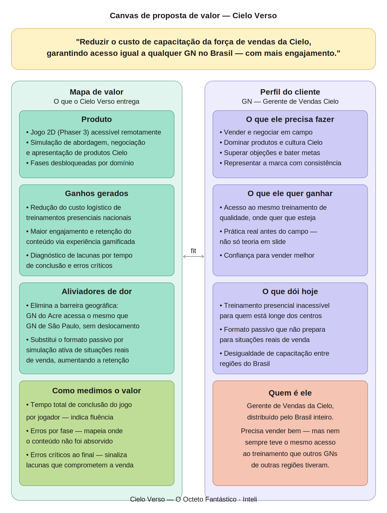

#### A proposta central

No contexto deste projeto, desenvolvido no âmbito do curso de tecnologia do Inteli, o jogo digital foi adotado como formato de solução, unindo a demanda da Cielo por capacitação escalável à proposta pedagógica de aprendizado por experiência. O Cielo Verso existe para resolver um problema concreto: reduzir o custo de capacitação da força de vendas da Cielo, garantindo que qualquer Gerente de Vendas (GN) no Brasil — independente de onde esteja — tenha acesso ao mesmo treinamento de qualidade, em um formato que engaja e que prepara para situações reais de venda.

#### O problema que justifica o produto

O modelo atual de capacitação da Cielo é presencial. Isso cria duas consequências diretas: um custo logístico significativo para deslocar GNs de todo o Brasil, e uma desigualdade estrutural de acesso — profissionais de regiões remotas recebem menos treinamento do que os de grandes centros, simplesmente por uma questão geográfica. Além disso, o formato presencial e expositivo resulta em baixo engajamento e limitada retenção do conteúdo, sem oferecer ao GN qualquer prática simulada antes de enfrentar situações reais de venda.

#### A transformação que o produto entrega

O Cielo Verso elimina a barreira geográfica: um GN no Acre acessa exatamente o mesmo conteúdo que um GN em São Paulo, sem deslocamento, sem custo adicional e no seu próprio ritmo. A experiência gamificada substitui o formato passivo por simulações ativas de abordagem, negociação e apresentação de produtos — aumentando o engajamento e a retenção do conteúdo de forma mensurável.

#### Como o valor é medido

O desempenho de cada GN é acompanhado por duas métricas: o tempo total de conclusão do jogo, que indica a fluência do aprendizado ao longo da jornada, e o mapeamento de erros — incluindo a identificação de erros críticos ao final da experiência. Essas métricas permitem identificar lacunas de conhecimento individuais e regionais, transformando o Cielo Verso em um instrumento de diagnóstico além de capacitação.

### 1.1.5. Descrição da Solução Desenvolvida (sprint 4)

O Cielo Verso é um jogo 2D de treinamento corporativo desenvolvido em Phaser 3, que simula a jornada real de um Gerente de Vendas da Cielo — da primeira abordagem ao cliente até o fechamento da negociação. A solução capacita GNs de qualquer região do Brasil de forma remota e engajante, sem depender de treinamentos presenciais.

A experiência é estruturada em quatro mundos temáticos sequenciais — Quebra-Gelo, Vila do Varejo, Praia dos Proveitos e Cidade Cielo — cada um cobrindo uma área essencial do treinamento: abordagem, produtos, benefícios e negociação. Em cada mundo, o jogador enfrenta um mini game diretamente relacionado ao conteúdo daquele mapa. Ao concluir os quatro mundos, uma fase final integra todas as habilidades desenvolvidas em um único desafio, avaliando se o aprendizado foi absorvido de forma completa.

O desempenho é medido pelo tempo de conclusão e pelo mapeamento de erros críticos ao final da jornada, gerando dados que permitem identificar lacunas de conhecimento individuais. Os detalhes técnicos e narrativos da solução estão descritos na seção 2 deste documento.


### 1.1.6. Matriz de Riscos (sprint 4)

A matriz de riscos do Cielo Verso foi elaborada a partir da análise do escopo entregue, dos sistemas implementados e das dependências identificadas ao longo do desenvolvimento. Os itens estão classificados por probabilidade de ocorrência e nível de impacto no projeto, separados entre ameaças — fatores que podem comprometer a entrega ou a qualidade do produto — e oportunidades — fatores que, se aproveitados, ampliam o valor da solução para o parceiro.

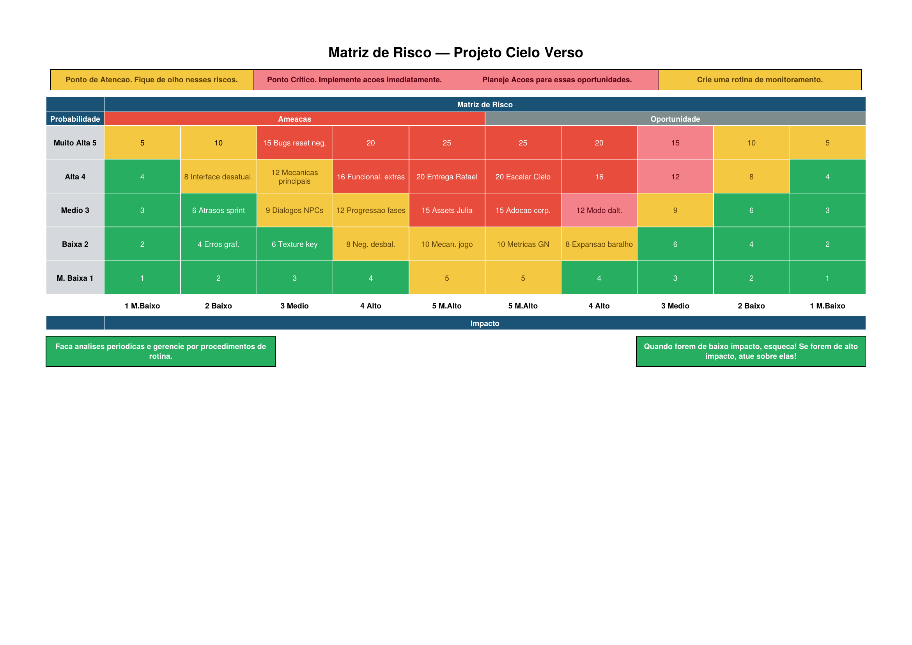

#### Ameaças

| Risco | Probabilidade | Impacto | Plano de ação |
| :--- | :---: | :---: | :--- |
| Bugs no reset de estado das cartas entre tentativas de negociação | Muito Alta | Médio | Corrigir a limpeza do grupo de cartas em `CenaNegociacao.js` antes da entrega final da sprint 5, garantindo que o estado seja reinicializado corretamente a cada nova tentativa. |
| Entrega da negociação do Rafael (Cidade Cielo) incompleta | Alta | Muito Alto | Priorizar o desenvolvimento e os testes da cena do boss final na sprint 5. Validar o fluxo completo de fases e a concessão da insígnia final antes da entrega. |
| Adição de funcionalidades fora do escopo do MVP | Alta | Alto | Registrar novas ideias como backlog pós-MVP e manter o escopo da sprint controlado, priorizando apenas o que está previsto na definição de pronto. |
| Falhas nas mecânicas principais do sistema de negociação | Alta | Médio | Executar casos de teste de regressão a cada nova implementação, cobrindo o fluxo completo de fases, a barra de satisfação e os modais de carta. |
| Falha na lógica de progressão entre regiões e diálogos com NPCs | Média | Alto | Validar as chaves de registry (`pedro_vencido`, `varejo_vencido`, `cielita_gelo_concluido`) em todos os mapas após cada entrega, garantindo que insígnias e desbloqueios funcionem corretamente. |
| Assets e roteiro da negociação com Julia incompletos | Média | Muito Alto | Concluir os sprites de estados (satisfeita, neutra, brava) e as falas definitivas da Julia até o final da sprint atual, tornando a cena visualmente e narrativamente completa. |
| Indicador de fase não sincronizado com a lógica interna da negociação | Média | Médio | Revisar o método `_atualizarIndicadoresFase()` e garantir que o avanço visual dos círculos de fase ocorra em sincronia com a lógica de `_avancarOuVencer()`. |
| Atrasos na entrega por subestimação do esforço técnico | Média | Médio | Registrar impedimentos no início de cada sprint e priorizar as entregas essenciais ao MVP, postergando melhorias estéticas para o backlog. |
| Interface e HUD desatualizados em relação às cenas mais recentes | Alta | Baixo | Realizar revisão visual ao final de cada sprint para garantir consistência entre menus, HUD e novas cenas adicionadas. |
| Desbalanceamento das pontuações de satisfação na negociação | Baixa | Alto | Realizar testes de jogabilidade com usuários externos e ajustar as constantes `GANHO_SATISFACAO` e `PERDA_SATISFACAO` em `CenaNegociacao.js` conforme o feedback coletado. |
| Erros gráficos e conflito de texturas no Phaser | Baixa | Baixo | Monitorar o console do navegador a cada build. O Preloader centralizado já mitiga o erro `Texture key already in use`; manter esse padrão em todas as cenas novas. |
| Mecânicas de movimentação e colisão instáveis após novas implementações | Baixa | Alto | Executar os casos de teste de movimentação e colisão (categorias 1 e 2 da seção 5.1) a cada nova cena ou mapa adicionado ao projeto. |

#### Oportunidades

| Oportunidade | Probabilidade | Impacto | Plano de aproveitamento |
| :--- | :---: | :---: | :--- |
| Escalabilidade da solução para toda a força de vendas da Cielo | Alta | Muito Alto | A arquitetura de herança de `CenaNegociacao` permite adicionar novos clientes e regiões com custo mínimo. Documentar o padrão de extensão para facilitar a continuidade do projeto por outras equipes ou sprints futuras. |
| Adoção corporativa como ferramenta oficial de treinamento | Média | Muito Alto | Apresentar o jogo à Cielo com foco nas métricas de desempenho por GN. Se validado internamente, o Cielo Verso pode substituir parte do treinamento presencial, reduzindo custo logístico e padronizando a capacitação nacional. |
| Modo daltônico como diferencial de acessibilidade e inclusão | Média | Alto | Destacar o `ColorblindManager` (deuteranopia, protanopia e tritanopia) na apresentação ao parceiro como evidência de design inclusivo — argumento relevante para uma empresa com força de vendas geograficamente diversa. |
| Sistema de métricas de desempenho individual do GN | Baixa | Alto | O registro de vitórias e derrotas já existe no `game.registry`. Com a implementação do sistema de métricas previsto para a sprint 5, o jogo se torna um instrumento de diagnóstico — permitindo que gestores identifiquem lacunas de competência por região e por colaborador. |
| Expansão do baralho com cartas desbloqueáveis por desempenho | Baixa | Alto | O sistema de cartas é modular e extensível. A adição de novas cartas como recompensa por desempenho aprofundaria a progressão do jogador e aumentaria o engajamento com a plataforma de treinamento a longo prazo. |

A análise evidencia que os riscos de maior criticidade estão concentrados na entrega final da sprint 5 — especialmente a negociação do Rafael e a finalização da Julia — e na estabilidade do sistema de cartas. As oportunidades de maior impacto estão diretamente relacionadas à escalabilidade da arquitetura desenvolvida, que permite à Cielo expandir o jogo como plataforma de treinamento contínuo sem necessidade de reconstrução do núcleo técnico.

### 1.1.7. Objetivos, Metas e Indicadores (sprint 4)

As metas SMART do projeto foram definidas com base nos objetivos estratégicos identificados junto à Cielo: padronizar a capacitação dos Gerentes de Negócios entre regiões e garantir a cobertura completa das etapas do Funil de Vendas por meio de uma experiência gamificada.

#### Meta 1 — Entregar o MVP do jogo educacional

- **Específica:** Desenvolver um jogo RPG 2D com quatro regiões temáticas e sistema de negociação por cartas cobrindo as cinco etapas do Funil de Vendas.
- **Mensurável:** Número de regiões e fases implementadas a cada sprint, com meta final de 4 regiões e 5 fases funcionais.
- **Atingível:** Regiões e mecânicas já definidas, com Quebra-Gelo e Casa da Cielita implementadas na sprint 3 e sistema de cartas validado.
- **Relevante:** Garante que o Gerente de Negócios seja capacitado em toda a jornada comercial, independentemente de sua região.
- **Temporal:** Entrega do MVP até a sprint 4 (27/03/2025).

#### Meta 2 — Monitorar desempenho nas negociações

- **Específica:** Registrar taxa de acerto, taxa de erros normais e taxa de erros críticos por sessão de jogo para avaliar a absorção do conteúdo de vendas pelo Gerente de Negócios.
- **Mensurável:** Taxas comparadas entre sessões de playtest para identificar evolução do jogador, com valores de referência a serem definidos pela Cielo.
- **Atingível:** Os playtests da sprint 5 fornecerão os dados necessários para calibrar e validar os valores de referência junto à Cielo.
- **Relevante:** Permite à Cielo avaliar objetivamente se o GN está absorvendo o conteúdo de vendas proposto pelo jogo.
- **Temporal:** Coleta iniciada na sprint 5 (10/04/2025), com valores de referência validados com a Cielo até o final da sprint 5.

#### Meta 3 — Monitorar fluidez da experiência de treinamento

- **Específica:** Registrar o tempo médio que o jogador leva para concluir cada negociação ao longo das sessões de playtest.
- **Mensurável:** Tempo médio comparado entre sessões para identificar evolução da fluência do jogador, com valor de referência a ser definido pela Cielo.
- **Atingível:** Os playtests da sprint 5 fornecerão os dados necessários para calibrar e validar o tempo de referência junto à Cielo.
- **Relevante:** Indica se a experiência está fluida e adequada ao contexto corporativo de treinamento da Cielo.
- **Temporal:** Coleta iniciada na sprint 5 (10/04/2025), com valor de referência validado com a Cielo até o final da sprint 5.

## 1.2. Requisitos do Projeto (sprints 1 e 2)

Os requisitos do projeto são as peças identitárias, tanto fundamentais para o funcionamento do jogo quanto aspectos mais específicos de jogabilidade. Estes incluem mecânicas básicas de movimentação e interação, até partes mais detalhadas do combate de cartas e o design geral do jogo. Além disso, definem os limites e o escopo geral esperado do projeto final.

Abaixo estão os requisitos trabalhados na sprint 1 e 2:

\# | Requisito | Explicação | Critérios de Aceitação
--- | --- | --- | ---
1 | Menu principal | O jogo deve apresentar uma tela inicial com os botões de Iniciar, Configurações e Sair. | O botão Iniciar deve redirecionar para a tela de seleção de personagem; o botão Configurações deve abrir a tela de configurações; o botão Sair deve fechar a aba do navegador; todos os botões devem apresentar feedback visual de hover.
2 | Configurações e filtro de daltonismo | A tela de configurações deve permitir que o jogador ative um filtro de daltonismo que será aplicado globalmente em todo o jogo. | O filtro deve ser aplicado em todas as cenas do jogo sem exceção; a ativação e desativação do filtro deve ocorrer imediatamente, sem necessidade de reiniciar o jogo.
3 | Configuração inicial do avatar | O jogo deverá disponibilizar quatro (4) opções de avatares jogáveis para seleção do jogador em uma tela específica no início da partida. Após a escolha do avatar, o jogador deverá definir o nome do personagem, que será utilizado para sua identificação ao longo da experiência. | As 4 opções de avatar devem ser exibidas simultaneamente na tela de seleção; o nome deve aceitar entre 1 e 16 caracteres; caso nenhum nome seja digitado, o valor padrão "Jogador" deve ser utilizado.
4 | Salvamento de configuração do jogador | O jogo deve preservar o nome e o avatar escolhidos pelo jogador entre sessões utilizando localStorage. O progresso de regiões desbloqueadas não é persistido no MVP atual. | O nome e o avatar devem ser recuperados corretamente ao recarregar a página, desde que o jogador tenha concluído a tela de seleção.
5 | Introdução narrativa | O jogo deve apresentar uma cutscene narrativa com a Cielita contextualizando o universo do jogo e o papel do jogador antes de entrar no mapa. O jogador deve apertar E para avançar cada etapa do diálogo. | Todas as falas devem ser exibidas na ordem correta; o jogador deve conseguir avançar e pular o texto com a tecla E; ao fim do diálogo o jogador deve ser redirecionado automaticamente para a Casa da Cielita.
6 | Tutorial | O jogo deve apresentar um tutorial explicando o funcionamento das mecânicas de movimentação e interação ao entrar na Casa da Cielita pela primeira vez. | O tutorial deve aparecer automaticamente ao entrar na Casa da Cielita; deve ser acessível a qualquer momento pela tecla H; deve fechar e reabrir corretamente sem travar o jogo.
7 | Movimentação e interação do jogador | A movimentação do personagem será realizada por meio das teclas W, A, S e D do teclado, responsáveis pelo deslocamento direcional. A tecla E será destinada à interação do jogador com NPCs e objetos presentes no mapa. | O personagem deve responder ao comando de movimentação em até 100ms; a tecla E deve iniciar o diálogo ou interação em até 1 segundo quando o jogador estiver no raio de alcance do NPC ou objeto.
8 | Mapa geral e regiões principais | O jogo deve conter um mapa geral com uma área introdutória e quatro regiões principais: Casa da Cielita, Quebra-Gelo, Vila do Varejo, Praia dos Proveitos e Cidade Cielo. Cada região cobre etapas específicas do funil de vendas da Cielo. | As 5 regiões devem estar presentes e acessíveis conforme a progressão; a progressão entre regiões só deve ser liberada após o jogador concluir o desafio da região anterior; nenhuma região deve apresentar falha de carregamento ou tela preta durante a transição.
9 | Diálogo de transição da Cielita | Ao se aproximar da ponte de transição entre regiões, a Cielita deve apresentar um breve diálogo explicando o objetivo da próxima fase antes de o jogador avançar. | O diálogo deve ser exibido antes de cada transição de região; o jogador deve poder avançar o diálogo com a tecla E; a transição para a próxima região só deve ocorrer após o fim do diálogo.
10 | Introdução narrativa da Cielita na Casa | A NPC Cielita deve estar presente na Casa da Cielita como guia, oferecendo diálogo de orientação ao jogador. | O diálogo deve ser iniciado ao pressionar E dentro do raio de interação da Cielita; o texto deve ser exibido com efeito typewriter; o jogador deve conseguir avançar e pular o texto com a tecla E.
11 | Combate e progressão pelo funil de vendas | O sistema de negociação por cartas é estruturado em fases que espelham o funil de vendas da Cielo: o Quebra-Gelo aborda Abordagem e Sondagem; a Vila do Varejo aborda Abordagem, Sondagem e Demonstração de Produtos; a Praia dos Proveitos abordará os Benefícios da Cielo; e a Cidade Cielo consolida todas as etapas em um desafio completo. | Cada região deve conter apenas as cartas correspondentes às etapas do funil que ela cobre; a Cidade Cielo deve disponibilizar cartas de todas as fases anteriores; o resultado final deve ser exibido ao término da última fase de cada negociação.
12 | Barra de satisfação e sprites | O jogo deve apresentar o nível de satisfação dos clientes por meio de uma barra de interface que aumenta ou diminui de acordo com as escolhas do GN durante a negociação. Os sprites do cliente mudarão conforme o estado da negociação. | A barra deve atualizar visualmente em até 400ms após cada jogada de carta; o sprite do cliente deve alternar corretamente entre os 3 estados (satisfeito, neutro, bravo) conforme o valor da barra.
13 | Cartas | O jogo deve implementar um sistema de cartas que representam as etapas do funil de vendas, distribuídas conforme a região e fase atual da negociação. | As cartas corretas para cada fase devem ser exibidas sem repetição; a seleção de uma carta deve gerar resposta visual e alterar a barra de satisfação em até 500ms.
14 | Acessibilidade | O jogo deve ser jogável por pessoas com diferentes níveis de familiaridade com jogos digitais. | Todos os textos devem ter tamanho mínimo de 14px e contraste suficiente para leitura; nenhuma mecânica deve exigir mais de 2 teclas simultâneas; as instruções de controle devem estar disponíveis a qualquer momento pela tecla H.


## 1.3. Público-alvo do Projeto (sprint 2)

O público-alvo do projeto é composto pelos Gerentes de Negócios da Cielo, com média de idade estimada de 44 anos, distribuídos por todas as regiões do Brasil e inseridos em diferentes contextos demográficos e socioeconômicos. A maioria possui ensino médio completo, sendo que cerca de 35% conta com ensino superior completo. Esses profissionais atuam diretamente na prospecção de clientes, gestão de carteira e comercialização de soluções de pagamento para estabelecimentos comerciais. Devido à atuação em diferentes regiões do país, esses gerentes enfrentam desafios regionais distintos que impactam sua rotina, metas e desempenho comercial (Cielo, 2024).

# <a name="c2"></a>2. Visão Geral do Jogo (sprint 2)

## 2.1. Objetivos do Jogo (sprint 2)

O jogo será dividido em 5 áreas principais, estruturadas de forma progressiva tanto na narrativa quanto na complexidade das mecânicas.

A jornada começa na área inicial, desbloqueada logo após uma cutscene de contextualização da história. Nessa introdução, o jogador compreende seu papel dentro do universo do jogo e seus objetivos como participante do treinamento. Ao surgir no mapa, ele se encontra próximo à Casa da Cielita, personagem guia que o acompanhará durante toda a experiência.

Cielita atua como mentora, explicando as mecânicas básicas, orientando sobre o uso das cartas e /direcionando o jogador para as próximas áreas. Essa primeira região funciona como um hub central, preparando o jogador para os desafios seguintes.

Após essa etapa introdutória, o jogador avança para as demais áreas do jogo. Cada uma delas representa um estágio do treinamento, com:

- Clientes específicos e perfis variados;


- Um número mínimo de vendas necessárias para progressão;


- Cartas próprias daquela fase;


- Aumento gradual da dificuldade estratégica.


#### Progressão por Fases
Nas três primeiras áreas de desafio, o jogador deve utilizar corretamente o baralho disponibilizado para atingir a meta mínima de vendas. A progressão depende da aplicação estratégica das cartas de acordo com o perfil de cada cliente, simulando situações reais de negociação.

Ao final de cada área, o jogador enfrentará um “boss”, que representa o maior desafio conceitual daquela região. Esse boss:

- Possui maior resistência e complexidade;

- Exige combinações estratégicas mais elaboradas;

- Testa o domínio completo das técnicas aprendidas na fase.


A derrota do boss libera a próxima área.

Na quarta área de progressão, o nível de exigência aumenta, demandando maior eficiência na leitura de cliente, combinação de cartas e tomada de decisão.

Na quinta e última área, o jogador passa a ter acesso aos três baralhos utilizados anteriormente, consolidando todo o aprendizado adquirido. O objetivo final é convencer todos os clientes da cidade a adotarem as maquininhas Cielo, aplicando corretamente as técnicas desenvolvidas desde o início do jogo. A conclusão ocorre após derrotar o boss final e completar todas as metas de vendas.

**Para avançar de área, o jogador deve:**
- Atingir a meta mínima de vendas estabelecida;

- Utilizar corretamente as cartas conforme o perfil do cliente;

- Derrotar o boss da região.

**Para concluir o jogo, o jogador deve:**
- Utilizar estrategicamente todos os baralhos desbloqueados;

- Convencer todos os clientes da cidade final;

- Superar o boss final;

- Demonstrar domínio completo das técnicas aprendidas ao longo das 5 áreas.


## 2.2. Características do Jogo (sprint 2)

### 2.2.1. Gênero do Jogo (sprint 2)

RPG 2D com visão Top View, combinando exploração de mapa, interação com NPCs e progressão por áreas. O jogador percorre diferentes regiões, enfrenta desafios estratégicos por meio de mecânicas de cartas e evolui conforme avança na narrativa.
 

### 2.2.2. Plataforma do Jogo (sprint 2)

O jogo será desenvolvido para:
- Dispositivos Desktop

- Dispositivos Mobile

- Execução via navegador Google Chrome

A proposta multiplataforma garante maior acessibilidade e facilidade de uso como ferramenta de treinamento.

### 2.2.3. Número de jogadores (sprint 2)

**1 jogador (Single Player)**

A experiência é individual, focada no desenvolvimento estratégico e no aprendizado progressivo.


### 2.2.4. Títulos semelhantes e inspirações (sprint 2)

#### The Legend of Zelda: A Link to the Past
 Inspiração na ambientação, movimentação em visão superior e construção de mapas interconectados.


#### Pokémon FireRed
 Referência na exploração por regiões, interação com NPCs e progressão por áreas.


#### Undertale
 Inspiração na estética em pixel art e no design narrativo.


#### Balatro
 Base para as mecânicas estratégicas de cartas e combinações táticas.


### 2.2.5. Tempo estimado de jogo (sprint 5)

*Ex. O jogo pode ser concluído em 3 horas passando por todas as fases.*

*Ex. cada partida dura até 15 minutos*

# <a name="c3"></a>3. Game Design (sprints 2 e 3)

## 3.1. Enredo do Jogo (sprints 2 e 3)

O Cielo Verso é uma dimensão digital estratégica desenvolvida em pixel art 2D, onde o conhecimento técnico da companhia ganha forma, desafios e vida. O enredo coloca o jogador no papel de um Gerente de Negócios em busca de especialização, iniciando sua jornada em uma tela inicial que serve como um Hub Central tecnológico. É neste ponto de encontro que o protagonista conhece a Cielita, mentora e guia do universo Cielo, que revela a missão principal: desbravar os três domínios do conhecimento para obter as ferramentas necessárias e enfrentar o desafio final na Cidade Cielo, o centro pulsante das decisões reais.

A narrativa desenrola-se através da exploração de três mundos fundamentais de aprendizagem. No mapa Quebra-Gelo, um cenário de neve e ventos cortantes, o jogador aprende acerca da cultura e valores da empresa, construindo o alicerce para efetuar boas negociações. Na Vila do Varejo, uma área caracterizada por diversos comércios, o foco narrativo está no domínio do portfólio de produtos, transformando informação técnica em segurança para o dia a dia comercial. Por fim, na Praia dos Proveitos, o jogador deve encontrar o caminho estratégico para apresentar os benefícios durante as negociações, forjando argumentos de valor como uma de suas principais ferramentas de trabalho. Em cada território, o sucesso nas negociações recompensa o vendedor com insígnias, cartas de habilidade e itens colecionáveis que representam o seu amadurecimento técnico e argumentativo.

O ciclo narrativo reforça o conceito de aperfeiçoamento contínuo, permitindo que o vendedor retorne aos domínios de aprendizado a qualquer momento para refinar as suas estratégias e coletar recursos mais poderosos. O ápice da história acontece na Cidade Cielo, onde o "Mundo de Negociação" coloca o aprendizado à prova. Utilizando o deck de cartas acumulado, o jogador deve gerenciar a Barra de Satisfação do Cliente, provando que o domínio sobre os pilares da Cielo é a chave para transformar desafios em parcerias de sucesso.

Portanto, muito além de uma sequência de desafios, o Cielo Verso é a jornada de transformação de um vendedor em um parceiro estratégico. Ao final da experiência, o protagonista não apenas domina conhecimento acerca dos produtos e pilares da Cielo, mas compreende que seu verdadeiro poder reside em simplificar a vida de quem empreende. O rito de passagem final, compreendido na aventura pela Cidade Cielo, representa quando  o jogador deixa de ser um aprendiz para se tornar o rosto da inovação e da confiança que a marca representa. No Cielo Verso, a jornada do vendedor é uma evolução constante, onde cada mundo superado o prepara para ser um protagonista no mercado real.

## 3.2. Personagens (sprints 2 e 3)

### 3.2.1. Controláveis

Os personagens jogáveis são representados por quatro avatares, que contemplam dois modelos femininos e dois modelos masculinos, ambos com características diferentes, estilizados em Pixel Art 2D. Além disso, o jogador poderá inserir seu próprio nome para o avatar que o representa, buscando uma maior identificação do jogador com seu personagem. Os avatares serão de caracterização única, sendo sua única diferença os modelos fornecidos para a escolha.

Ademais, as habilidades do avatar serão compreendidas através do desempenho do jogador, pois, a ideia central é o personagem como uma representação do usuário dentro do Cielo Verso, portanto, as aptidões atribuídas serão ligadas ao desenvolvimento do jogador, garantindo assim uma trilha de aprendizado espelhada no avatar. Dessa forma, os controláveis do jogo estarão enquadrados de uma forma a produzir identificação entre usuário e gameplay.

### 3.2.2. Non-Playable Characters (NPC)

| Personagem / Categoria | Descrição e Papel no Jogo |
| :--- | :--- |
| **Cielita** | Personagem não jogável (NPC) que atua como tutora. Ela fornece dicas, suporte sob demanda e acompanha o jogador durante toda a jornada, validando conquistas e oferecendo feedbacks de desempenho. |*
| **Vilões** | Atuam como uma forma de validação de aprendizado. Surgem no final de cada etapa como o desafio definitivo (última fase) necessário para desbloquear novas áreas do mapa. |
| **Clientes** | NPCs essenciais para o funcionamento do gameplay. São caracterizados de formas distintas para promover a diversidade e pluralidade da cultura brasileira. |


### 3.2.3. Diversidade e Representatividade dos Personagens

O Cielo Verso opta por um elenco de personagens fixos estrategicamente desenhados para representar a pluralidade do povo brasileiro. Ao invés de avatares genéricos, o jogo apresenta o protagonista e diversos NPCs (personagens não jogáveis) que abrangem as diversas etnias, faixas etárias, gêneros e identidades do nosso país. Essa escolha garante que a diversidade seja uma característica intrínseca do design, onde o jogador interage com figuras que refletem o quadro real da companhia e o mercado consumidor nacional. Ao encontrar NPCs que representam essa pluralidade, o jogador é treinado para oferecer um  atendimento inclusivo e personalizado, reconhecendo no ambiente virtual os mesmos perfis humanos que encontrará no dia a dia real.

A diversidade no jogo também se manifesta através do regionalismo, onde cada um dos cenários principais é inspirado em uma faceta cultural e geográfica do Brasil, influenciando diretamente o visual e o comportamento dos personagens.

**Como exemplo:**

**Mapa 1:** Quebra-Gelo (Região Sul): Sob uma estética de neve e ventos cortantes, o mapa integra elementos como o Chimarrão e vestimentas típicas de frio. O cenário humaniza a teoria da cultura corporativa ao conectá-la a hábitos tradicionais, demonstrando que a Cielo entende o comportamento específico do lojista e do cliente sulista.

**Mapa 2:** Vila do Varejo (Região Sudeste/Centro-Oeste): Um centro comercial dinâmico que remete às grandes metrópoles e polos de distribuição. Os NPCs possuem um perfil focado em soluções ágeis e cotidiano urbano. Elementos visuais como o "cafézinho" e a arquitetura familiar conectam o jogador ao coração financeiro do país.

**Mapa 3:** Praia dos Proveitos (Região Norte/Nordeste): Uma trilha rica em biodiversidade que utiliza a natureza brasileira como metáfora para o valor agregado. Os NPCs e produtos remetem à economia criativa e ao turismo, exigindo que o vendedor identifique ganhos reais para negócios baseados nessas riquezas regionais.

**Mapa 4:** Cidade Cielo (O Brasil Integrado): A fase final ocorre em uma metrópole moderna que sintetiza todas as regiões. É o ponto de encontro de todos os perfis de NPCs apresentados anteriormente, onde a diversidade brasileira se manifesta em sua totalidade nos desafios finais de negociação.

O impacto esperado é o fortalecimento da empatia e da eficácia no atendimento. Ao unir o protagonista a NPCs diversos em cenários que respeitam o regionalismo, a Cielo demonstra que o sucesso de uma negociação depende do respeito às diferenças. Essa abordagem garante que o jogador reconheça no ambiente virtual os mesmos rostos e culturas que encontrará no mercado real, consolidando a imagem da Cielo como uma empresa que entende, valoriza e capacita a pluralidade do Brasil para gerar melhores negócios.


## 3.3. Mundo do jogo (sprints 2 e 3)

### 3.3.1. Locações Principais e/ou Mapas (sprints 2 e 3)

O jogo se passa nas Terras da Negociação, um mundo fictício dividido em cinco grandes regiões, cada uma representando um desafio real enfrentado por grandes negociadores. O ambiente é construído de forma simbólica, onde clima, cores e arquitetura refletem o tipo de aprendizado que o jogador desenvolverá em cada etapa da jornada.

A aventura começa na Casa da Cielita. O cenário transmite tranquilidade e base sólida, com céu claro e paisagem aberta, simbolizando clareza de propósito. É nesse local que habita Cielita, a guardiã das Terras de Aprendizado, responsável por apresentar ao jogador o verdadeiro significado da jornada. Ali funciona como a fase introdutória do jogo, onde o Player aprende valores, postura e propósito, entendendo que negociar não é apenas vender, mas gerar valor.

Seguindo pelo mapa, o jogador chega ao Quebra-Gelo, uma ilha congelada cercada por águas frias e ventos intensos. O ambiente é dominado por cristais de gelo que representam desinformação e dúvidas. Os habitantes parecem presos ao frio das objeções e dos mitos, e o cenário transmite resistência e incerteza. Nessa fase, o jogador precisa investigar confusões, dialogar com moradores e reconstruir o entendimento sobre conceitos e proposta de valor. Ao enfrentar o Guardião da Resistência, formado por objeções comuns, o gelo começa a derreter, e o ambiente gradualmente se transforma, simbolizando o domínio do conhecimento e da argumentação.

Depois, o caminho leva à Vila do Varejo, uma região quente, vibrante e movimentada. Pequenos comércios, barracas e lojas compõem o cenário, demonstrando esforço e potencial de crescimento. O problema ali não é falta de trabalho, mas ausência de soluções adequadas. O jogador assume um papel estratégico, diagnosticando as necessidades de cada comerciante e conectando os produtos certos ao perfil correto. Conforme as escolhas são feitas de maneira assertiva, a vila evolui visualmente: lojas se expandem, o comércio cresce e o ambiente se torna mais próspero. Essa fase reforça o domínio de produtos, maquininhas, soluções financeiras e benefícios.

A jornada continua na Praia dos Proveitos, uma mata densa e estratégica, com caminhos ramificados e símbolos escondidos entre as árvores. O ambiente é mais complexo e exige atenção. Guardiões antigos protegem o Medalhão dos Benefícios, enquanto criaturas chamadas “Comparadores” tentam confundir o jogador com ofertas ilusórias. A progressão nessa fase depende da capacidade de identificar vantagens competitivas e destacar diferenciais reais. À medida que o jogador escolhe os caminhos corretos, trilhas se iluminam e a praia se torna menos ameaçadora, simbolizando clareza estratégica e domínio da diferenciação.

Por fim, o Player alcança a Cidade da Negociação, a maior e mais imponente região do mapa. Trata-se de uma metrópole vibrante, com prédios altos, movimento intenso e decisões acontecendo a todo momento. No centro da cidade ergue-se a Torre dos Acordos, onde ocorre o desafio final: uma grande negociação estratégica que reúne todos os conhecimentos adquiridos nas fases anteriores. Nessa etapa, o jogador precisa aplicar leitura de perfil, superar objeções, estruturar estratégia e realizar um fechamento assertivo. Ao vencer esse confronto final, recebe o título de Mestre dos Negócios, consolidando sua evolução completa.

Assim, o ambiente do jogo evolui junto com o aprendizado do jogador: começa em um campo aberto e simples, passa por gelo e resistência, avança por crescimento comercial e estratégia competitiva, e culmina em uma cidade onde decisões moldam resultados. Cada local não é apenas um cenário, mas uma representação visual e simbólica do desenvolvimento das habilidades de negociação ao longo da jornada.


### 3.3.2. Navegação pelo mundo (sprints 2 e 3)

Os personagens se movem pelo mapa principal de forma progressiva, desbloqueando novas áreas conforme concluem os desafios da fase anterior.

Após o aprendizado inicial na Casa da Cielita, o caminho para o Quebra-Gelo é liberado se você tiver usado certo as mecânicas das cartas e perceber se você está desenvolvido para passar pela fase. Ao superar o Guardião da Resistência, a passagem para a Vila do Varejo se abre. Quando o jogador demonstra domínio sobre produtos e soluções, surge a rota para a Praia dos Proveitos. Ao conquistar o Medalhão dos Benefícios, é liberado o acesso à Cidade da Negociação.

Cada área só é acessada após a comprovação de competência na anterior, simbolizando a evolução do jogador até o desafio final na Torre dos Acordos.

### 3.3.3. Condições climáticas e temporais (sprints 2 e 3)

O tempo não possui relevância no jogo

### 3.3.4. Concept Art (sprint 2)


<div align="center">
  <sub>Menu Inicial</sub><br>
  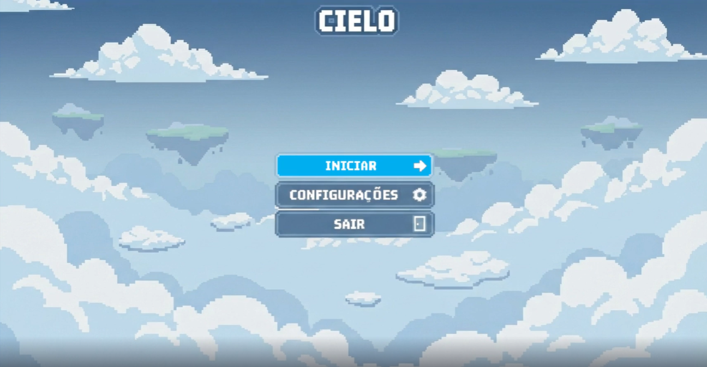<br>
  <sup>Fonte: Autoria própria</sup>
</div>


<div align="center">
  <sub>Mapa de Introdução</sub><br>
  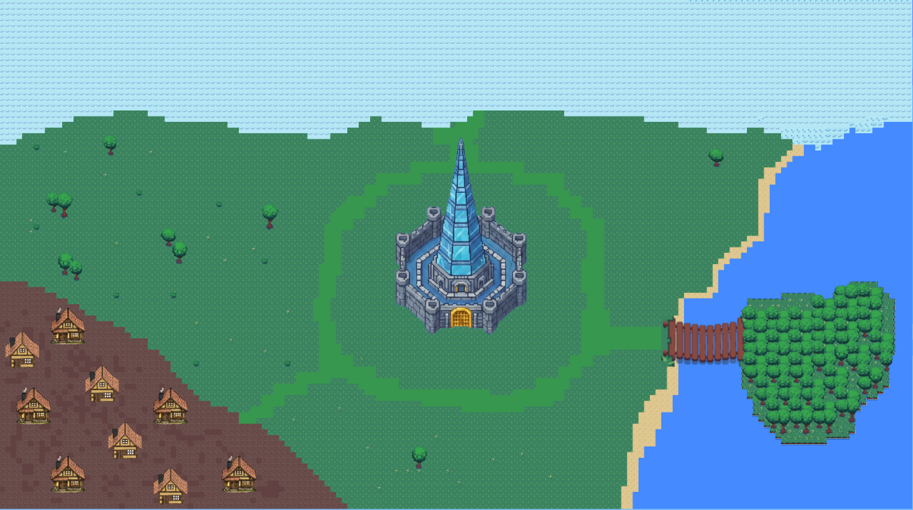<br>
  <sup>Fonte: Autoria própria</sup>
</div>

<div align="center">
  <sub>Casa da Cielita</sub><br>
  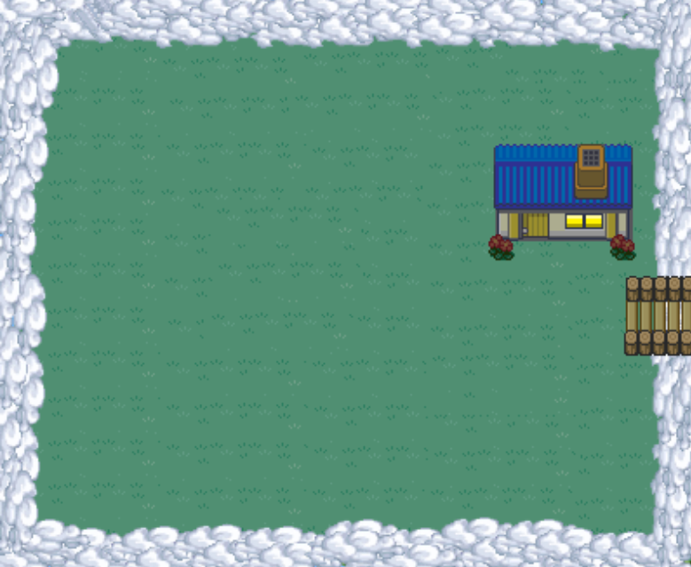<br>
  <sup>Fonte: Autoria própria</sup>
</div>


### 3.3.5. Trilha sonora (sprint 4)

A identidade sonora dos efeitos (SFX) foi desenvolvida para reforçar a estética RPG e assegurar uma navegação responsiva, convertendo cada interação do usuário em um feedback tátil-auditivo. No Menu Principal, a trilha temática define o tom tecnológico e introduz o jogador à experiência de aprendizado. Nas cutscenes, o aparecimento do texto é sincronizado com um efeito de digitação que direciona a atenção do jogador, assegurando que o contexto narrativo seja absorvido de maneira dinâmica. Em todas as ações de clique, "blips" sintéticos fornecem confirmação imediata de comando, mantendo o usuário engajado através de respostas sonoras breves e precisas que previnem a fadiga auditiva e consolidam a sensação de controle sobre a interface.

A movimentação do personagem é acompanhada por sons de passos distintos por superfície e localização, com variações dedicadas ao Mundo da Cielita, ao Quebra-Gelo, à Vila do Varejo, à Praia dos Proveitos e aos interiores das casas, assegurando que a movimentação seja sonoramente coerente com cada ambiente. A cena de negociação dispõe de uma música específica que será utilizada em todo o contato com o suposto cliente

Cada cenário explorável conta com trilha musical temática e sons de ambiente particulares. O Mundo da Cielita (Área Inicial), o Quebra-Gelo (Primeira Fase), a Vila do Varejo (Segunda Fase), Praia dos Proveitos (Terceira Fase) e Cidade Cielo (Última Fase) apresentam composições que complementam a identidade visual e narrativa de cada espaço, enquanto os sons ambientes, vento das áreas nevadas, som da natureza e vila, do murmúrio do litoral, movimento urbano acabam intensificam a sensação de imersão. As transições entre mapas são indicadas por um efeito sonoro exclusivo, demarcando os espaços narrativos de forma clara e fluida.

## Tabela Trilha Sonora

| Título | Ocorrência | Nome da Música e Autoria |
|---|---|---|
| Música de Fundo | Menu Principal/Tela de Início/Mundo Cielita | High Tide - Laura Platt |
| Música Quebra-Gelo | Cena: Quebra-Gelo/Casas Quebra Gelo | Mainden Voyage - Helmut Schenker |
| Música Vila do Varejo | Cena: Vila do Varejo/Casas Vila do Varejo | Barefoot Adventures - Adriel Fair |
| Música Praia dos Proveitos | Cena: Praia dos Proveitos/Casas Praia dos Proveitos | Beach Goer - Frook |
| Música Cidade Cielo | Cena: Cidade Cielo, e posteriormente Casas Cidade Cielo | slow down - Loyae |
| Música Negociação | Cena: Negociação | The Only Way Out - Dian Shuai |
| Passos | Movimentação na Casa da Cielita | By Epidemic Sound |
| Passos | Movimentação no Quebra-Gelo | By Epidemic Sound |
| Passos | Movimentação na Vila do Varejo | By Epidemic Sound |
| Passos | Movimentação na Praia dos Proveitos | By Epidemic Sound |
| Passos | Movimentação no Interior das Casas | By Epidemic Sound |
| Ambiente | Som ambiente: Quebra-Gelo | By Epidemic Sound |
| Ambiente | Som ambiente: Vila do Varejo | By Epidemic Sound |
| Ambiente | Som ambiente: Praia dos Proveitos | By Epidemic Sound |
| Ambiente | Som ambiente: Cidade Cielo | By Epidemic Sound |
| Transição | Transição entre mapas/cenas | By Epidemic Sound |
| Botão UI | Cliques nos botões | By Epidemic Sound |
| Teclado | Exibição de texto nas Cutscenes | (CherryMX Red - ABS keycaps) - By Mechvibes |

## 3.5. Gameflow (Diagrama de cenas) (sprint 2)

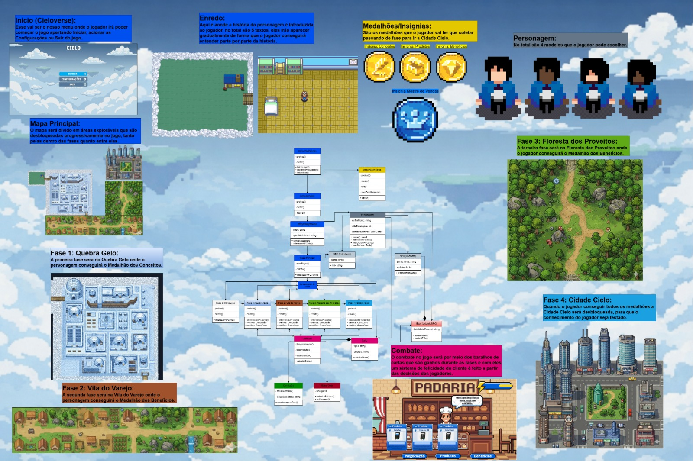

## 3.6. Regras do jogo (sprint 3)

#### Objetivo do jogo
O principal objetivo do jogador é interagir com os NPCs presentes em cada região do jogo até achar o CPC (Contato com pessoa certa) e convencê-lo a se tornarem clientes da empresa. Para isso, o jogador deverá utilizar estratégias de abordagem, compreender as necessidades do personagem e apresentar soluções adequadas durante a interação.
#### Desafios e decisões 
Durante o jogo, o jogador enfrentará situações de negociação com um NPC específico em cada região. Ao iniciar a interação, serão apresentadas opções de diálogo e escolhas que representam diferentes formas de abordagem e argumentação. O jogador deverá analisar cada situação e selecionar as respostas mais adequadas para convencer o personagem.
Essas decisões influenciam diretamente o resultado da negociação, podendo aumentar ou diminuir as chances de o NPC aceitar a proposta apresentada.
#### Progressão no jogo
A progressão do jogador ocorre por meio da conversão de um NPC principal em cada região do jogo. Cada área possui um personagem que representa o desafio daquela fase. O jogador deverá interagir com esse NPC e conduzir a negociação de forma adequada para convencê-lo a se tornar cliente da empresa.
Ao conseguir converter o NPC daquela região, o jogador conquista a insígnia da área, que representa o sucesso da negociação. Após obter essa insígnia, o jogador desbloqueia a próxima região do jogo, podendo avançar para novos ambientes e desafios.
#### Consequências das escolhas
As decisões tomadas durante a interação com o NPC podem influenciar o resultado da negociação. Escolhas adequadas aumentam as chances de sucesso, enquanto decisões inadequadas podem fazer com que o personagem fique irritado ou descrente com o jogador e acabe recusando a proposta. Nesse caso, o jogador deverá tentar novamente até conseguir concluir a negociação e avançar para a próxima área do jogo.

## 3.7. Mecânicas do jogo (sprint 3)

### Interface e Menu Inicial (HUD)
O jogo possui um menu inicial que apresenta as principais opções para o jogador antes de iniciar a partida.
Opção do Menu | Função
--- | ---
Iniciar | Inicia a partida
Configurações | Permite ajustar opções do jogo
Sair | Encerra o jogo

A interface foi projetada para ser clara e simples, permitindo que o jogador compreenda rapidamente as opções disponíveis e inicie a experiência de forma intuitiva.

### Seleção de Personagem
O jogador pode escolher entre quatro personagens jogáveis, buscando representar diversidade entre os avatares disponíveis. As opções incluem:

- Homem branco
- Homem negro
- Mulher branca
- Mulher negra

Essa escolha permite que o jogador selecione o personagem com o qual mais se identifica, contribuindo para uma experiência mais personalizada.

### Personalização do Nome
Após escolher o personagem, o jogador pode definir o nome do seu avatar. Esse nome será utilizado durante o jogo, especialmente em interações com NPCs e em elementos da interface.

O nome do personagem não é permanente, podendo ser alterado posteriormente através do menu de Configurações, garantindo maior flexibilidade ao jogador.

# Alteração de Personagem
Além da escolha inicial, o jogador também pode alterar o personagem selecionado posteriormente através do menu de Configurações. Essa funcionalidade permite que o jogador experimente diferentes avatares ao longo do jogo sem a necessidade de reiniciar o progresso.

# Controles e Interações do Jogador
O jogo foi desenvolvido para a plataforma web/PC, sendo controlado principalmente por teclado e mouse. O teclado é utilizado para a movimentação do personagem e interação com o ambiente, enquanto o mouse é utilizado durante o sistema de combate baseado em cartas.

# Movimentação e Interação
A movimentação do personagem utiliza o padrão WASD, amplamente adotado em jogos para computador por ser intuitivo para os jogadores. Além disso, o jogador pode interagir com elementos do cenário, como NPCs e portas, utilizando uma tecla específica de interação.
Comando | Ação
--- | ---
W | Movimentar o personagem para cima
A | Movimentar o personagem para a esquerda
S | Movimentar o personagem para baixo
D | Movimentar o personagem para a direita
E | Interagir com NPCs ou portas
H | Exibir o tutorial de movimentação e interação

# Interação com o Ambiente
Durante a exploração, o jogador pode interagir com diferentes elementos do cenário. As principais interações incluem:
Conversar com NPCs, iniciando diálogos ou negociações.
Entrar em ambientes internos ao interagir com portas.
Acessar instruções de controle pressionando a tecla de ajuda.

Essas interações permitem que o jogador explore o mapa e avance nas atividades do jogo.

# Sistema de Combate
O sistema de combate substitui o combate físico por negociações comerciais estratégicas, onde os NPCs atuam como clientes potenciais que o jogador deve conquistar. Através de um baralho de cartas selecionadas via mouse, o jogador executa táticas de vendas que simulam as etapas reais de um funil de vendas, desde o contato inicial e apresentação de propostas até o estágio final de fechamento do negócio.

O sucesso de cada interação é mensurado pelo parâmetro de convencimento, visualizado através de uma barra de satisfação que flutua em tempo real. Cada carta jogada impacta diretamente esse medidor: abordagens precisas preenchem a barra, aproximando o jogador da conversão, enquanto escolhas equivocadas podem reduzir a satisfação do cliente, exigindo novas estratégias para recuperar a confiança e evitar que a negociação seja cancelada.

Comando | Ação
--- | ---
Clique do mouse | Selecionar cartas durante a negociação
Clique do mouse | Confirmar ações ou escolhas


## 3.8. Implementação Matemática de Animação/Movimento (sprint 4)

Esta seção descreve os modelos matemáticos que fundamentam os sistemas de movimentação e animação de personagens no jogo. Dois subsistemas distintos são abordados: a movimentação do jogador por entrada de teclado e a navegação autônoma dos NPCs por waypoints.


### Movimentação do Jogador (Jogador.js)

#### Fundamentos: Vetores no Plano 2D

Antes de descrever as fórmulas, é importante compreender o conceito de **vetor**. No contexto de um jogo 2D, um vetor é um par ordenado $(v_x, v_y)$ que representa simultaneamente uma direção e uma intensidade (magnitude). Visualmente, pode-se imaginar uma seta: ela aponta para onde algo está indo e seu comprimento indica quão rápido.

O motor Phaser representa cada objeto no mundo por suas coordenadas $(x, y)$ no plano cartesiano. A cada quadro (*frame*) de animação, o motor atualiza a posição de cada objeto somando sua velocidade ao longo do tempo:

$$x_{t+1} = x_t + v_x \cdot \Delta t$$

$$y_{t+1} = y_t + v_y \cdot \Delta t$$

onde:

| Símbolo | Descrição |
|---|---|
| $x_t,\ y_t$ | Posição do personagem no frame $t$ (em pixels) |
| $v_x,\ v_y$ | Componentes do vetor velocidade (em pixels por segundo) |
| $\Delta t$ | Intervalo de tempo entre dois frames consecutivos (em segundos) |

> **Nota:** Este é o modelo de cinemática de posição com velocidade constante: a posição varia linearmente com o tempo, sem aceleração.

#### Decomposição Vetorial — Teclas WASD

Cada tecla pressionada define o sinal de uma das componentes do vetor velocidade, onde $V = 100$ px/s é a velocidade escalar configurada na classe `Jogador`:

| Tecla | Componente | Valor atribuído |
|---|---|---|
| A | $v_x$ | $-V$ (esquerda) |
| D | $v_x$ | $+V$ (direita) |
| W | $v_y$ | $-V$ (cima — eixo invertido) |
| S | $v_y$ | $+V$ (baixo) |

> **Convenção de eixos:** Em Phaser, o eixo $y$ cresce **para baixo** — diferente do plano cartesiano tradicional. Por isso, pressionar W (mover para cima na tela) resulta em $v_y = -V$.

Quando apenas uma tecla é pressionada, a magnitude do vetor resultante é simplesmente $V$:

$$\|\vec{v}\| = \sqrt{v_x^2 + v_y^2} = \sqrt{V^2 + 0^2} = V$$

#### Movimento Diagonal com Velocidade Constante

Quando dois eixos são ativados simultaneamente — por exemplo, as teclas D e W pressionadas ao mesmo tempo —, o vetor de entrada passa a ter componentes em ambos os eixos. Sem tratamento, a magnitude desse vetor cresceria:

$$\|\vec{v}_{\text{diagonal}}\|_{\text{sem normalização}} = \sqrt{V^2 + V^2} = \sqrt{2} \cdot V \approx 1{,}414 \cdot V$$

Para garantir que o personagem se desloque sempre à mesma velocidade escalar $V$ independentemente da direção, o sistema aplica a **normalização** do vetor de entrada antes de escaloná-lo pela velocidade desejada. Normalizar significa dividir cada componente pela magnitude total do vetor, produzindo um **vetor unitário** $\hat{v}$ de comprimento exatamente igual a 1:

$$\hat{v} = \frac{\vec{v}}{\|\vec{v}\|} = \left(\frac{v_x}{\|\vec{v}\|},\ \frac{v_y}{\|\vec{v}\|}\right)$$

O vetor velocidade final aplicado ao personagem é então:

$$\vec{v}_{\text{final}} = V \cdot \hat{v} = \left(\frac{v_x \cdot V}{\|\vec{v}\|},\ \frac{v_y \cdot V}{\|\vec{v}\|}\right)$$

#### Verificação Formal

Para o caso diagonal onde $v_x = V$ e $v_y = -V$, demonstra-se que a magnitude resultante é sempre $V$:

$$\|\vec{v}\| = \sqrt{V^2 + V^2} = V\sqrt{2}$$

$$\vec{v}_{\text{final}} = \left(\frac{V}{\sqrt{2}},\ \frac{-V}{\sqrt{2}}\right)$$

$$\|\vec{v}_{\text{final}}\| = \sqrt{\left(\frac{V}{\sqrt{2}}\right)^2 + \left(\frac{V}{\sqrt{2}}\right)^2} = \sqrt{\frac{V^2}{2} + \frac{V^2}{2}} = \sqrt{V^2} = V \checkmark$$

A magnitude é $V$ em qualquer direção — eixos ortogonais e diagonais.

A implementação correspondente em `Jogador.js`:
```javascript
// Vetor de entrada — leitura das teclas
let vx = 0, vy = 0;
if (teclas.left.isDown)  vx -= velocidade;
if (teclas.right.isDown) vx += velocidade;
if (teclas.up.isDown)    vy -= velocidade;
if (teclas.down.isDown)  vy += velocidade;

//  garante ‖v⃗_final‖ = V em qualquer direção
const mag = Math.sqrt(vx * vx + vy * vy);
if (mag > 0) {
    sprite.setVelocityX((vx / mag) * velocidade);
    sprite.setVelocityY((vy / mag) * velocidade);
} else {
    sprite.setVelocity(0);
}
```


### Movimentação Autônoma dos NPCs — Patrulha por Waypoints (NPC.js)

#### Visão Geral

Os NPCs do jogo navegam autonomamente entre uma sequência de pontos predefinidos chamados **waypoints** — coordenadas absolutas no mapa que definem o caminho de patrulha. A cada frame, o sistema executa quatro etapas:

1. Identificar o waypoint atual $\mathbf{w} = (w_x, w_y)$
2. Calcular a distância euclidiana até ele
3. Se a distância for menor que o limiar $\varepsilon = 4$ px, avançar para o próximo waypoint
4. Caso contrário, mover o NPC em direção ao waypoint com velocidade constante $V_{\text{NPC}}$

#### Distância Euclidiana

A distância entre a posição atual do NPC $\mathbf{p} = (p_x, p_y)$ e o waypoint $\mathbf{w} = (w_x, w_y)$ é calculada pela **distância euclidiana**, derivada diretamente do Teorema de Pitágoras. Ela mede o comprimento do segmento de reta que conecta dois pontos no plano — a menor distância possível entre eles:

$$d(\mathbf{p},\ \mathbf{w}) = \sqrt{(w_x - p_x)^2 + (w_y - p_y)^2}$$

| Símbolo | Descrição |
|---|---|
| $\mathbf{p} = (p_x, p_y)$ | Posição atual do NPC no mundo (em pixels) |
| $\mathbf{w} = (w_x, w_y)$ | Coordenadas do waypoint alvo (em pixels) |
| $d(\mathbf{p}, \mathbf{w})$ | Distância euclidiana entre os dois pontos (em pixels) |

#### Vetor Direção e Normalização

O vetor deslocamento $\vec{d}$ aponta da posição atual do NPC até o waypoint alvo:

$$\vec{d} = \mathbf{w} - \mathbf{p} = (w_x - p_x,\ w_y - p_y)$$

Note que $\|\vec{d}\| = d(\mathbf{p}, \mathbf{w})$. Para que o NPC se mova com velocidade constante independentemente da distância ao alvo, normaliza-se $\vec{d}$ para obter o vetor unitário $\hat{d}$:

$$\hat{d} = \frac{\vec{d}}{\|\vec{d}\|} = \left(\frac{w_x - p_x}{\|\vec{d}\|},\ \frac{w_y - p_y}{\|\vec{d}\|}\right)$$

O vetor velocidade final aplicado ao NPC é:

$$\vec{v}_{\text{NPC}} = V_{\text{NPC}} \cdot \hat{d} = \left(\frac{(w_x - p_x) \cdot V_{\text{NPC}}}{\|\vec{d}\|},\ \frac{(w_y - p_y) \cdot V_{\text{NPC}}}{\|\vec{d}\|}\right)$$

Esta é exatamente a formulação implementada em `NPC.js`:
```javascript
const dx  = alvo.x - this.x;           // componente x do vetor d⃗
const dy  = alvo.y - this.y;           // componente y do vetor d⃗
const mag = Math.sqrt(dx*dx + dy*dy);  // ‖d⃗‖ — distância euclidiana

this.setVelocityX((dx / mag) * vel);   // vₓ = (dx / ‖d⃗‖) · V
this.setVelocityY((dy / mag) * vel);   // vᵧ = (dy / ‖d⃗‖) · V
```

#### Condição de Chegada ao Waypoint

O NPC é considerado como tendo alcançado o waypoint quando a distância euclidiana cai abaixo de um limiar $\varepsilon$:

$$d(\mathbf{p},\ \mathbf{w}) < \varepsilon, \quad \varepsilon = 4 \text{ px}$$

O limiar $\varepsilon$ é necessário porque, com velocidade discreta frame a frame, o NPC pode nunca pousar exatamente sobre o waypoint. Ao detectar a chegada, o NPC é teleportado para a posição exata do waypoint — eliminando deriva acumulada — e o índice é avançado.

#### Progressão Cíclica dos Waypoints

A patrulha é cíclica e infinita. O índice do waypoint atual avança utilizando a operação de módulo:

$$i_{\text{próximo}} = (i_{\text{atual}} + 1) \bmod N$$

| Símbolo | Descrição |
|---|---|
| $i_{\text{atual}}$ | Índice do waypoint que o NPC acabou de alcançar |
| $N$ | Número total de waypoints definidos na patrulha |
| $\bmod$ | Operação de módulo (resto da divisão inteira) |

> **Nota:** A operação $\bmod\ N$ garante que, ao atingir o último waypoint (índice $N-1$), o próximo índice calculado seja $0$ — reiniciando a patrulha ciclicamente.

#### Seleção de Animação por Eixo Dominante

Após definir o vetor velocidade, o sistema determina qual animação reproduzir comparando os valores absolutos das componentes $d_x$ e $d_y$. O eixo com maior deslocamento absoluto é considerado o **eixo dominante**:

$$\text{animação}(d_x, d_y) = \begin{cases} \textit{lado} & \text{se } |d_x| \geq |d_y| \\ \textit{costas} & \text{se } |d_x| < |d_y| \text{ e } d_y < 0 \\ \textit{frente} & \text{se } |d_x| < |d_y| \text{ e } d_y \geq 0 \end{cases}$$

A condição $|d_x| \geq |d_y|$ seleciona o eixo de maior deslocamento como eixo dominante, produzindo uma animação coerente com a direção percebida pelo jogador mesmo em movimentos diagonais. Quando o eixo horizontal domina, o flip horizontal (`setFlipX`) evita a necessidade de um spritesheet separado para a direção oposta.

# <a name="c4"></a>4. Desenvolvimento do Jogo

## 4.1. Desenvolvimento preliminar do jogo (sprint 1)

A primeira versão do jogo foi desenvolvida com foco na implementação das mecânicas essenciais, garantindo que a estrutura básica estivesse funcional. Durante essa fase inicial, foram trabalhados o design do personagem principal, a criação de suas animações de movimentação e a construção de seu storytelling, estabelecendo a identidade visual e narrativa do projeto. Paralelamente, foi elaborada uma versão inicial do mapa, dividido em regiões temáticas: Quebra Gelo, Vila do Varejo, Praia dos Proveitos e Cidade Cielo.

Em termos de código, foi implementado um sistema de movimentação utilizando as teclas WASD, permitindo que o jogador explore o ambiente. O personagem é inserido no mundo do jogo com um corpo físico (hitbox), garantindo a colisão com os limites do mapa e impedindo que ultrapasse as áreas definidas ou saia da tela. Além disso, foi desenvolvido o sistema responsável por carregar a imagem de fundo do mapa e posicionar os objetos estáticos na tela, compondo o cenário inicial do jogo.

A câmera foi configurada com zoom dinâmico e programada para acompanhar o personagem constantemente, reforçando a sensação de exploração e imersão. As animações foram integradas ao sistema de movimentação, tornando a experiência mais natural e visualmente coerente. A estrutura do mapa foi pensada para incentivar a progressão do jogador entre as diferentes regiões, promovendo uma exploração organizada e alinhada aos objetivos do jogo.


#### Ilustrações e prints de tela

<div align="center">
  <sub>Imagem 1 - Sprite do personagem jogável — homem (idle)</sub><br>
  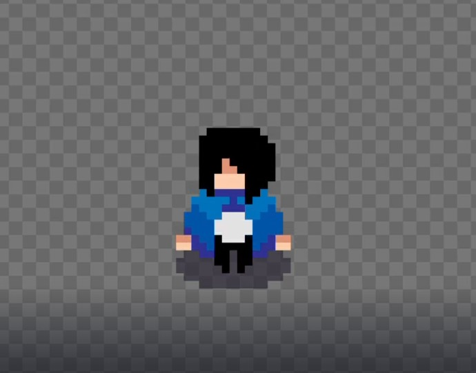<br>
  <sup>Fonte: Autoria própria</sup>
</div>

<div align="center">
  <sub>Imagem 2 - Sprite do personagem jogável — homem (animação lateral)</sub><br>
  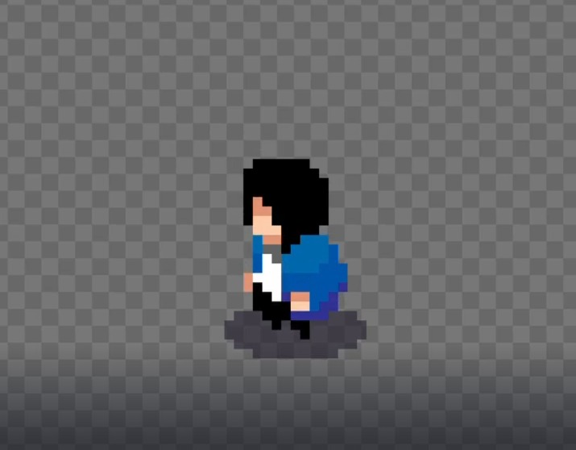<br>
  <sup>Fonte: Autoria própria</sup>
</div>

<div align="center">
  <sub>Imagem 3 - Mapa introdutório - Visão geral</sub><br>
  <br>
  <sup>Fonte: Autoria própria</sup>
</div>

<div align="center">
  <sub>Imagem 4 - Esboço da região do Quebra Gelo</sub><br>
  <br>
  <sup>Fonte: Autoria própria</sup>
</div>

<div align="center">
  <sub>Imagem 5 - Torre de negociação</sub><br>
  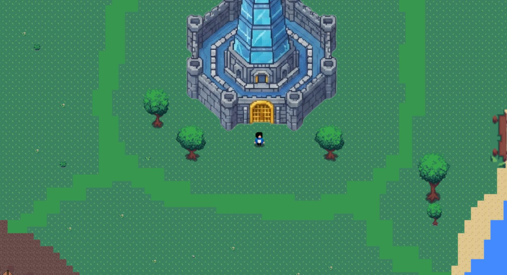<br>
  <sup>Fonte: Autoria própria</sup>
</div>


#### Dificuldades encontradas e próximos passos
Durante o desenvolvimento inicial, foram identificadas dificuldades relacionadas principalmente à definição e segmentação do processo de negociação, de modo que ele pudesse ser estruturado e aplicado ao formato de cartas dentro da mecânica do jogo. Transformar situações reais de negociação em elementos sistematizados exigiu equilíbrio entre clareza conceitual, jogabilidade e coerência com os objetivos do projeto. 

Além disso, o design do personagem principal representou um desafio, pois foi necessário alinhar identidade visual, proposta narrativa e viabilidade técnica para animações e implementação.
Como próximos passos, está previsto o desenvolvimento e a digitalização de um baralho inicial para o MVP (Minimum Viable Product), organizando as cartas de acordo com as mecânicas de negociação previamente estabelecidas. Essa etapa será essencial para validar a dinâmica central do jogo e testar o equilíbrio entre desafio, progressão e aprendizado.

Também serão criadas as primeiras interações estruturadas e versões mais detalhadas dos mapas, expandindo as regiões já definidas e integrando-as às mecânicas de exploração e negociação. Esses avanços permitirão consolidar a base jogável do projeto e preparar o ambiente para futuras iterações e testes.


## 4.2. Desenvolvimento básico do jogo (sprint 2)

A jornada do jogador inicia-se em uma tela central de interação, que funciona como o ponto de encontro principal entre o Vendedor Cielo e a Celita. Neste ambiente, a mentora orienta o protagonista, contextualiza os próximos passos e serve como elo narrativo entre as missões. A partir deste ponto central, o jogador tem acesso aos quatro pilares do jogo, desenhados em uma estética nostálgica de pixel art 2D que remete aos grandes clássicos dos anos 90.

O desenvolvimento do jogo é segmentado em duas fases distintas. A primeira fase compreende três mundos de aprendizagem, onde cada ambiente é dedicado ao domínio de uma competência técnica ou comportamental específica do ecossistema Cielo. Dentro desses mundos, o jogador enfrenta minigames que traduzem conceitos complexos em mecânicas lúdicas e interativas. Ao superar esses desafios, o vendedor é recompensado com insígnias de mestria e cartas de habilidade, que representam o conhecimento adquirido, os produtos disponíveis e as soluções estratégicas da marca. Um diferencial importante na estrutura é a liberdade de navegação: o vendedor pode retornar aos mundos de aprendizagem a qualquer momento para refinar suas técnicas, buscar melhores pontuações nos minigames e garantir o seu aperfeiçoamento constante antes de avançar para os desafios maiores.

A fase final ocorre no Mundo de Negociação, onde o jogo transita para um sistema de gameplay estratégico baseado em cartas. Diferente dos mundos anteriores focados em minigames, este cenário coloca o jogador frente a frente com o Cliente. O objetivo central desta etapa é a gestão da Barra de Satisfação, na qual o vendedor deve utilizar de forma tática o deck de cartas acumulado durante sua jornada de aprendizado. Cada carta jogada representa uma abordagem de venda ou solução técnica que, se aplicada corretamente às necessidades do cliente, eleva seu nível de contentamento. O sucesso nesta etapa final consolida a jornada do vendedor, transformando o conhecimento teórico e o aperfeiçoamento prático colhidos nos mundos anteriores em uma conversão de negócio bem-sucedida e eficaz.


## 4.3. Desenvolvimento intermediário do jogo (sprint 3)

O projeto **Cielo Verso** é estruturado sobre um conjunto de sistemas integrados que garantem a experiência central do jogo: navegação pelo mundo, interação com NPCs e realização de negociações por meio de cartas. Esta seção documenta a implementação técnica desses sistemas, descrevendo as decisões de arquitetura, os padrões de código adotados e as soluções encontradas para os desafios de desenvolvimento. O documento será atualizado conforme novos sistemas forem incorporados ao jogo.


### Sistema de transição com fadeOut/fadeIn

Todas as trocas de cena utilizam um padrão consistente de fade para evitar cortes abruptos. O evento `FADE_OUT_COMPLETE` garante que a nova cena só carrega após a animação terminar:

```javascript
// MundoCasa.js — transição para o MapaGelo
this.cameras.main.fadeOut(500, 0, 0, 0);
this.cameras.main.once(Phaser.Cameras.Scene2D.Events.FADE_OUT_COMPLETE, () => {
    this.scene.start('MapaGelo');
});
```

### Preservação de origem entre cenas

Para evitar que o personagem reapareça na posição padrão ao retornar de uma cena, todas as cenas que recebem o jogador de outra utilizam o parâmetro `init(data)` para verificar a origem e reposicionar corretamente:

```javascript
// MapaGelo.js
init(data) {
    this.origem = data.vindoDe;
}

create() {
    // ...
    if (this.origem === 'CenaCasaGelo') {
        this.personagem.sprite.setPosition(655, 210);
    }
}
```

Sem esse mecanismo, o jogador sofreria "spawn incorreto" ao retornar da Casa do Pedro para o Mapa de Gelo.


### Sistema de Personagem e Movimentação (Jogador.js)

### O que foi implementado

A classe `Jogador` encapsula toda a lógica de movimentação, animação e colisão do personagem jogável. Ela lê o personagem escolhido na tela de seleção via `registry` e aplica automaticamente as animações corretas:

```javascript
// Jogador.js
const skin = cena.game.registry.get('spriteJogador') || 'man_whi';
this.sprite = cena.physics.add.sprite(x, y, `${skin}_front_idl`).setScale(scale);

// Hitbox reduzida ao nível dos pés para colisão realista
this.sprite.body.setSize(10, 5);
this.sprite.setOffset(27, 40);
```

### Animações direcionais

O sistema define quatro animações por skin (idle, andar frente, andar de costas, andar de lado) e controla qual toca com base nas teclas pressionadas. O flip horizontal (`setFlipX`) evita a necessidade de um spritesheet separado para a direção oposta:

```javascript
// Movimento para a esquerda
if (teclas.left.isDown) {
    sprite.setVelocityX(-velocidade);
    sprite.play(`${s}_lado`, true);
    sprite.setFlipX(false);
} else if (teclas.right.isDown) {
    sprite.setVelocityX(velocidade);
    sprite.play(`${s}_lado`, true);
    sprite.setFlipX(true); // espelha o sprite — sem asset duplicado
}
```

### Tutorial integrado (tecla H)

O tutorial pode ser aberto a qualquer momento com a tecla **H**. Ao abrir, o input da cena ativa é desabilitado para evitar movimento em segundo plano; ao fechar, é reativado automaticamente via evento `shutdown`:

```javascript
// TutorialOverlay.js
this.events.on('shutdown', () => {
    if (this.cenaAnterior) {
        this.cenaAnterior.input.keyboard.enabled = true;
    }
});
```

---

## Sistema de Colisão com Hitboxes do Tiled

### O que foi implementado

As colisões do **Mapa de Gelo** e da **Casa do Pedro** são definidas visualmente na ferramenta **Tiled Map Editor** e exportadas como arquivo `.tmj`. O Phaser lê a camada de objetos em tempo de execução e cria colisores físicos dinamicamente:

```javascript
// MapaGelo.js — leitura das hitboxes do Tiled
const mapa = this.make.tilemap({ key: 'mapa_dados' });
const camadaObjetos = mapa.getObjectLayer('Object Layer 1');

camadaObjetos.objects.forEach(obj => {
    if (obj.polygon) {
        // Rochas e objetos irregulares: Polygon Collider
        const poly = this.add.polygon(obj.x, obj.y, obj.polygon, 0x0000ff, 0);
        this.physics.add.existing(poly, true);
        this.personagem.adicionarColisao(poly);
    } else {
        // Casas e objetos retangulares: Box Collider (mais eficiente)
        let zona = this.add.zone(
            obj.x + (obj.width / 2),
            obj.y + (obj.height / 2),
            obj.width, obj.height
        );
        this.physics.add.existing(zona, true);
        this.personagem.adicionarColisao(zona);
    }
});
```

**Decisão de design:** objetos retangulares (casas) usam `zone` (Box Collider) por ser mais leve computacionalmente. Polígonos são reservados para geometria irregular (rochas), onde um Box Collider criaria "paredes invisíveis" no ar.

**Correção implementada:** O Tiled exporta coordenadas com origem no **canto superior esquerdo**, mas o Phaser posiciona zones pelo **centro**. O offset `obj.width / 2` e `obj.height / 2` corrige esse deslocamento, evitando que as colisões apareçam com posição errada no mapa.

---

## Sistema de Diálogo com Typewriter (DialogoManager.js)

### O que foi implementado

A classe `DialogoManager` é reutilizável e gerencia caixas de diálogo com efeito typewriter para qualquer NPC do jogo. O sistema funciona com uma fila de falas e avança via tecla **E**:

```javascript
// DialogoManager.js — efeito typewriter
this._timer = this._cena.time.addEvent({
    delay:    35, // 35ms por caractere
    repeat:   textoCompleto.length - 1,
    callback: () => {
        this._textoFala.setText(textoCompleto.substring(0, i + 1));
        i++;
        if (i >= textoCompleto.length) {
            this._digitando = false;
            this._indicador.setVisible(true); // mostra ▼ ao terminar
        }
    },
});
```

### Funcionalidades implementadas

| Funcionalidade | Descrição |
|---|---|
| **Skip do typewriter** | Apertar E durante a digitação exibe o texto completo instantaneamente |
| **Cores por personagem** | Cada NPC tem cor de nome configurável via `CORES_PERSONAGEM` |
| **Fechamento por distância** | Se o jogador se afastar durante o diálogo, ele fecha automaticamente |
| **Substituição de nome** | Falas do `Jogador` exibem o nome real digitado na tela de seleção |
| **Callback de fim** | Ao terminar todas as falas, executa uma função opcional (ex: iniciar negociação) |

### Fechamento por distância (CenaCasa.js)

```javascript
// update() — fecha o diálogo se o jogador se afastar da Cielita
if (!perto && this.dialogo.aberto) {
    this.dialogo.fechar();
}
```

### Integração com NegociacaoPedro

A classe `DialogoPedro` estende `DialogoManager` com as falas específicas do NPC. Ao terminar o último diálogo, o callback inicia automaticamente a cena de negociação:

```javascript
// CenaCasaGelo.js
this.dialogoPedro.abrir(() => {
    this.cameras.main.fadeOut(500, 0, 0, 0);
    this.cameras.main.once('camerafadeoutcomplete', () => {
        this.scene.start('NegociacaoPedro');
    });
});
```

---

## Sistema de Negociação por Cartas (CenaNegociacao.js / NegociacaoPedro.js)

### O que foi implementado

O sistema de negociação é a mecânica central do jogo. A classe `CenaNegociacao` é uma **classe base abstrata** que define toda a lógica da UI e do fluxo de jogo. Cada cliente é implementado como uma subclasse (ex: `NegociacaoPedro`) que sobrescreve apenas o conteúdo específico daquele cliente.

### Estrutura das 5 fases

```javascript
// CenaNegociacao.js
static FASES = ['abordagem', 'sondagem', 'demonstracao', 'negociacao', 'fechamento'];
```

Cada fase tem um conjunto de cartas exigidas e uma quantidade de cartas distribuídas na mão do jogador:

```javascript
// NegociacaoPedro.js
cartasExigidas: {
    abordagem:    ['DiretoAoPonto', 'GanchoSocial', 'AntiPitch'],
    sondagem:     ['PerguntaDeImpacto', 'GanchoDaDor'],
    demonstracao: [], // qualquer produto vale — pontuação varia
    negociacao:   ['carta_desconto'],
    fechamento:   ['carta_contrato'],
},
cartasPorFase: {
    abordagem: 5, sondagem: 6, demonstracao: 4,
    negociacao: 3, fechamento: 3,
},
```

### Barra de satisfação com 3 estados

O cliente reage visualmente às jogadas do jogador. A satisfação vai de 0 a 100 e determina o sprite exibido e a cor da barra:

```javascript
// CenaNegociacao.js
static SATISFACAO_ESTADOS = [
    { min: 67, max: 100, estado: 'satisfeito', cor: 0x44cc88 },
    { min: 34, max: 66,  estado: 'neutro',     cor: 0xccaa44 },
    { min: 0,  max: 33,  estado: 'bravo',      cor: 0xcc4444 },
];

static GANHO_SATISFACAO = 20;
static PERDA_SATISFACAO = 30;
```

A barra anima suavemente via `tween` ao receber ou perder satisfação:

```javascript
this.tweens.add({
    targets:  this.barraSatisfacaoFill,
    width:    larguraTotal * (this.satisfacao / 100),
    duration: 400,
    ease:     'Quad.easeOut',
});
```

### Sistema de pontuação na fase de Demonstração

Na fase de demonstração, cada produto Cielo tem uma pontuação diferente. O jogador escolhe qual produto apresentar e a satisfação aumenta de acordo:

```javascript
// NegociacaoPedro.js
const PONTUACAO_PRODUTO = {
    CieloLioOn:  10,
    CieloFlash:  15,
    CVBA:        20,
    CieloFlash2: 25,
};

// A satisfação ganha = GANHO_BASE (20) + pontuação do produto
this._alterarSatisfacao(CenaNegociacao.GANHO_SATISFACAO + soma);
```

### Paginação na fase de Sondagem

Como a fase de Sondagem tem 6 cartas (acima do limite visual de 3), o sistema divide automaticamente as cartas em páginas navegáveis com botões `<` e `>`:

```javascript
// CenaNegociacao.js
if (fase === 'sondagem' && cartasDaFase.length > 3) {
    Phaser.Utils.Array.Shuffle(cartasDaFase);
    this._paginas = [];
    for (let i = 0; i < cartasDaFase.length; i += 3) {
        this._paginas.push(cartasDaFase.slice(i, i + 3));
    }
    this._paginaAtual = 0;
    this._mostrarPaginaSondagem();
}
```

### Modal de detalhes da carta

Ao clicar em uma carta, um overlay exibe a imagem ampliada com botões de "Voltar" e "Selecionar". Na fase de Demonstração, selecionar a carta já aciona o avanço de fase automaticamente, sem precisar do botão CONFIRMAR:

```javascript
// NegociacaoPedro.js
if (fase === 'demonstracao') {
    this.time.delayedCall(300, () => {
        fecharModal();
        const soma = PONTUACAO_PRODUTO[carta.key] ?? 0;
        this._mostrarDialogo(this._falaAcertoFase(fase));
        this._alterarSatisfacao(CenaNegociacao.GANHO_SATISFACAO + soma);
        this.time.delayedCall(4000, () => this._avancarOuVencer());
    });
}
```

### Indicador de progresso de fases

A barra de fases no topo da tela usa tweens para animar o indicador da fase atual:

```javascript
// CenaNegociacao.js — indicador pulsa ao entrar em nova fase
this.tweens.add({
    targets: circulo, scaleX: 1.2, scaleY: 1.2,
    duration: 200, yoyo: true,
});
```


## Carregamento de Assets (Preloader.js / BootScene.js)

### O que foi implementado

Para evitar o erro **"Texture key already in use"**, todos os assets do jogo são carregados uma única vez no `Preloader`, que roda antes de qualquer cena de gameplay. O `BootScene` possui uma barra de progresso visual que reflete o carregamento em tempo real:

```javascript
// BootScene.js
this.load.on('progress', (value) => {
    fill.width = barraW * value;
    textoPorc.setText(`${Math.floor(value * 100)}%`);
});
```

Os assets de cartas carregados nesta sprint incluem 5 cartas de Abordagem, 6 de Sondagem e 4 Produtos Cielo (`CieloLioOn`, `CieloFlash`, `CieloFlash2`, `CVBA`), além de 4 skins de jogador com 5 animações cada (total de 20 spritesheets).


## Tela de Seleção de Personagem (CenaPersonagem.js)

### O que foi implementado

Antes de entrar no jogo, o jogador escolhe entre **4 skins** (homem/mulher × branco/negro) e digita seu nome. As escolhas são persistidas via `game.registry` para durar durante toda a sessão:

```javascript
// CenaPersonagem.js
this.game.registry.set('nomeJogador', nome);
this.game.registry.set('spriteJogador', this.spriteSelecionado);
```

O input de nome é feito diretamente via `input.keyboard`, com limite de 16 caracteres, suporte a Backspace e confirmação por Enter ou pelo botão "COMEÇAR". As skins são exibidas com animação idle em loop e efeito de hover com `tween` de escala.

## 4.4. Desenvolvimento final do MVP (sprint 4)

A sprint 4 representa a entrega do Cielo Verso como produto jogável de ponta a ponta. O MVP consolidado vai além de um protótipo navegável: é um ciclo completo de aprendizado e aplicação comercial, no qual o jogador parte do menu inicial, atravessa todos os mundos interligados com seus respectivos NPCs e negociações, conquista insígnias por vitória e avança até a negociação final na Cidade Cielo. O que resta para a sprint 5 é a tela de fim de jogo global e o sistema de métricas de desempenho.

### Escopo entregue — visão sistêmica

| Sistema | Status |
| :--- | :---: |
| Menu principal (Iniciar / Configurações / Sair) | Entregue |
| Cena de introdução narrativa com Cielita (texto animado) | Entregue |
| Seleção de personagem — 4 skins, input de nome | Entregue |
| Configurações: modo daltônico (3 tipos), troca de skin e nome | Entregue |
| Mapa Introdutório — Mundo da Cielita | Entregue |
| Casa da Cielita (interior) | Entregue |
| Ponte MC→QG (transição Mundo da Cielita ↔ Quebra Gelo) | Entregue |
| Mapa Quebra Gelo — exterior com Cielita + Lorena (NPCs) | Entregue |
| Casa do Pedro — interior com diálogo introdutório | Entregue |
| Negociação com Seu Pedro — 5 fases completas | Entregue |
| Insígnia "Mestre do Gelo" com animação de notificação | Entregue |
| Ponte QG→VV (transição Quebra Gelo ↔ Vila do Varejo) | Entregue |
| Mapa Vila do Varejo — exterior com Cielita + Eric + Jorge | Entregue |
| Casas do Varejo (2 interiores navegáveis) | Entregue |
| Negociação com Thainá — 3 fases com demonstração múltipla | Entregue |
| Insígnia "Rei do Varejo" com animação de notificação | Entregue |
| Mapa Praia dos Proveitos — exterior com Cielita | Entregue |
| Negociação com Julia — 5 fases completas | Entregue |
| HUD global de indicações (tecla O para toggle) | Entregue |
| AudioManager — trilha + som ambiente com fade por região | Entregue |
| Sistema de colisão via Tiled (polígonos e retângulos) | Entregue |
| Transições fadeOut/fadeIn com guard de input (`CenaMapa`) | Entregue |
| Preservação de spawn entre cenas (`init(data)` + `vindoDe`) | Entregue |
| Preloader centralizado com barra de progresso | Entregue |
| Tutorial sobreposição (tecla H, toggle) | Entregue |
| Modo daltônico via SVG filter (deuteranopia, protanopia, tritanopia) | Entregue |
| Cidade Cielo — negociação final | Entregue |
| Tela de fim de jogo e métricas de desempenho | Previsto para sprint 5 |

---

### Fluxo completo do jogador no MVP

O percurso jogável entregue percorre as seguintes cenas em sequência:

```
MenuPrincipal
  └─► CenaIntroducao (narrativa da Cielita, personalizada com nome do jogador)
        └─► CenaPersonagem (seleção de skin + input de nome)
              └─► MundoDaCielita (Mapa Introdutório)
                    ├─► CasaCielita (interior — diálogo com Cielita)
                    └─► PonteMC_QG (ponte de transição horizontal)
                          └─► QuebraGelo (Mapa Quebra Gelo)
                                ├─► CasaGelo2 (interior — diálogo com Seu Pedro)
                                │     └─► NegociacaoPedro (5 fases)
                                │           └─► [Insígnia: Mestre do Gelo]
                                └─► PonteQG_VV (ponte de transição vertical)
                                      └─► VilaDoVarejo (Mapa Vila do Varejo)
                                            ├─► CasaVarejo1 / CasaVarejo2 (interiores)
                                            │     └─► NegociacaoThaina (3 fases)
                                            │           └─► [Insígnia: Rei do Varejo]
                                            └─► [Portal] → PraiaDosProveitos
                                                  └─► NegociacaoJulia (5 fases completas)
                                                        └─► [Insígnia: Praia dos Proveitos]
                                                              └─► [Portal] → CidadeCielo
                                                                    └─► NegociacaoRafael (boss final — todas as competências)
                                                                          └─► [Insígnia: Mestre Cielo]
```

A **Cena de Introdução** é um diferencial narrativo que muitos projetos não entregam: antes de o jogador ver o mapa, a Cielita o recebe com um monólogo animado que usa seu nome diretamente (`"É aí que entram os escolhidos, [nome]."`) — personalizando a experiência desde o primeiro segundo.

> <div align="center">
  <sub>Cena de Introdução: balão da Cielita </sub><br>
  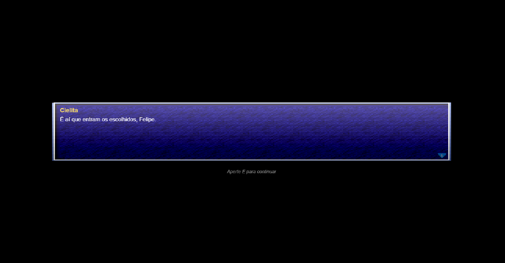<br>
  <sup>Fonte: Autoria própria</sup>
</div>

> <div align="center">
  <sub>Tela de seleção de personagem: 4 skins com animação idle e campo de nome</sub><br>
  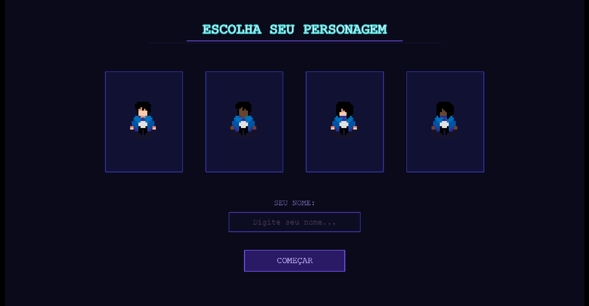<br>
  <sup>Fonte: Autoria própria</sup>
</div>

> <div align="center">
  <sub>Mapa Introdutório (Mundo da Cielita): visão geral do mapa com o personagem</sub><br>
  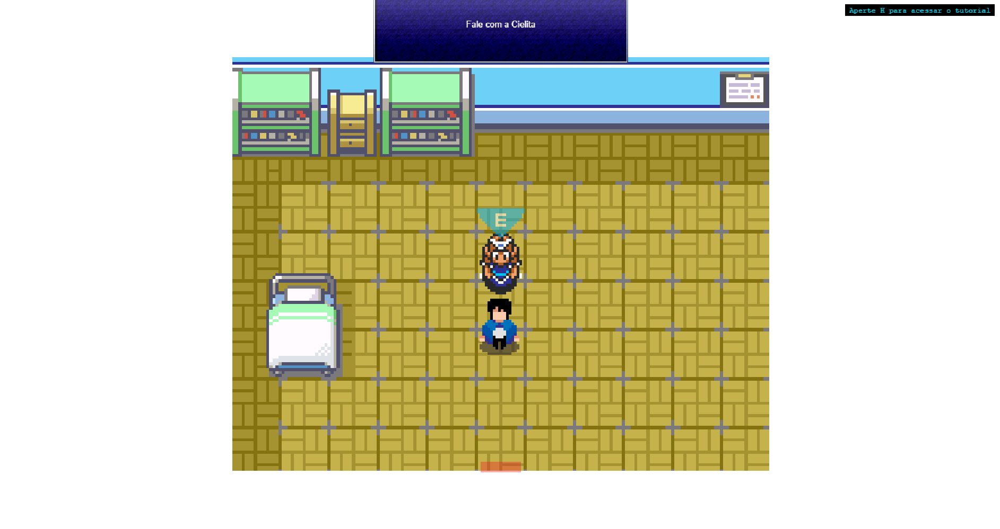<br>
  <sup>Fonte: Autoria própria</sup>
</div>


---

### Sistema de negociação por cartas — arquitetura e NPCs

O núcleo estratégico do jogo é a negociação. A decisão de arquitetura mais importante do projeto foi criar `CenaNegociacao` como **classe-base** e especializar cada cliente por herança — cada NPC é uma subclasse com suas próprias falas, cartas exigidas, curva de satisfação e regras de pontuação, sem duplicar nenhuma lógica de UI ou de fluxo de fases.

#### Clientes implementados no MVP

| NPC | Região | Fases |
| :--- | :--- | :--- |
| **Seu Pedro** | Quebra Gelo | 5 fases completas |
| **Thainá** | Vila do Varejo | 3 fases (abordagem → sondagem → demonstração) |
| **Julia** | Praia dos Proveitos | 5 fases completas |
| **Rafael** | Cidade Cielo | Boss final — todas as competências |

As quatro negociações formam uma jornada de aprendizado progressiva: cada cliente aborda um conjunto específico de competências comerciais, e o conhecimento acumulado em uma negociação é pressuposto para a seguinte. O design segue uma lógica de complexidade crescente — Pedro introduz o funil completo de vendas, Thainá aprofunda a coerência narrativa entre fases, Julia consolida o repertório, e o Rafael representa o clímax dessa progressão: uma negociação de complexidade significativamente maior, que pressupõe o domínio de tudo que foi aprendido nas regiões anteriores e exige do jogador o desempenho completo de um Gerente de Negócios Cielo.

#### As 5 fases do funil de vendas

| Fase | Representação comercial | Observação técnica |
| :--- | :--- | :--- |
| **Abordagem** | Primeiro contato e quebra de gelo | 5 cartas disponíveis |
| **Sondagem** | Identificação das necessidades do cliente | 6 cartas; excede o limite visual → paginação automática com botões `<` e `>` |
| **Demonstração** | Apresentação de produtos Cielo | Pedro: 1 produto; Thainá: seleção múltipla de 3 |
| **Negociação** | Superação de objeções de preço | 3 cartas (Pedro e Julia) |
| **Fechamento** | Confirmação da venda | 5 cartas (Pedro e Julia) |

A **barra de satisfação** vai de 0 a 100 e muda de cor e expressão do NPC em tempo real:

- **Satisfeito** (67–100): cliente receptivo — barra verde
- **Neutro** (34–66): cliente hesitante — barra amarela
- **Bravo** (0–33): cliente prestes a encerrar — barra vermelha

> <div align="center">
  <sub>Tela de negociação com o NPC Pedro</sub><br>
  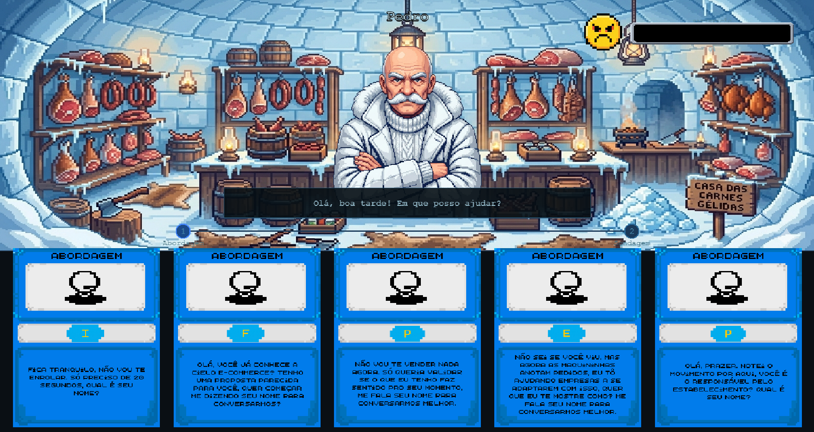<br>
  <sup>Fonte: Autoria própria</sup>
</div>

> <div align="center">
  <sub>Carta de abordagem ampliada</sub><br>
  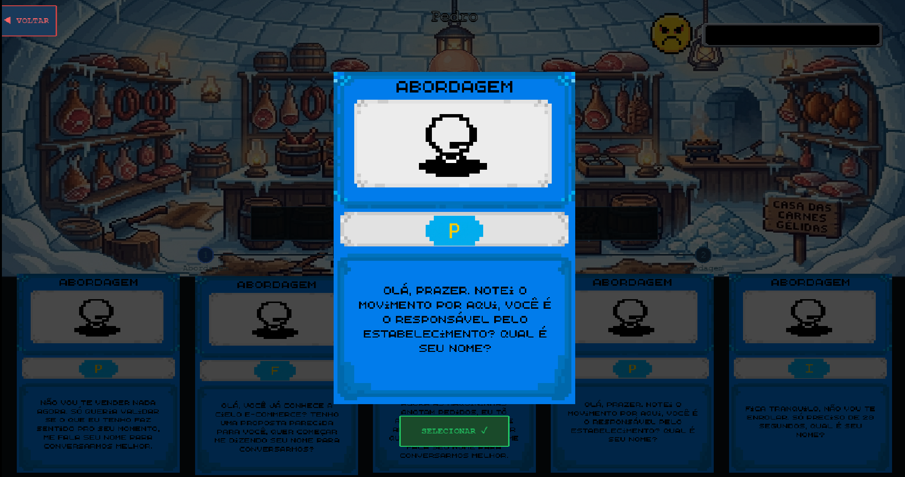<br>
  <sup>Fonte: Autoria própria</sup>
</div>

---

### Sistemas de suporte entregues na sprint 4

**AudioManager — trilha sonora por região com fade cruzado**

Cada mapa tem sua própria trilha musical e som ambiente. O `AudioManager` roda como cena paralela persistente e gerencia as trocas com fade de 800ms entre faixas — nenhuma música corta abruptamente. O som ambiente (ruído de fundo) é tratado em canal separado da música principal, permitindo que os dois coexistam com volumes independentes.

```
QuebraGelo   → musica_quebragelo + ambiente_quebragelo
VilaDoVarejo → musica_viladovarejo + ambiente_viladovarejo
PraiaDosProveitos → musica_praiadosproveitos + ambiente_praiadosproveitos
```

**ColorblindManager — acessibilidade para daltonismo**

O jogo implementa suporte a três tipos de daltonismo via filtro SVG aplicado sobre o canvas inteiro, configurável no menu de opções:

| Modo | Tipo de daltonismo |
| :--- | :--- |
| Deuteranopia | Dificuldade com verde |
| Protanopia | Dificuldade com vermelho |
| Tritanopia | Dificuldade com azul |

Essa feature posiciona o Cielo Verso como uma solução de treinamento genuinamente inclusiva — relevante para uma empresa com força de vendas nacional e diversa.

**CenaMapa — classe-base para todos os mapas**

Para eliminar a duplicação de código de transição presente nas sprints anteriores, foi criada a classe `CenaMapa`, da qual todos os mapas herdam. Ela centraliza três responsabilidades: lançar e encerrar o HUD automaticamente, executar o fade de entrada, e injetar o parâmetro `vindoDe` em toda transição de cena — sem que a cena de destino precise saber de onde o jogador veio para reposicioná-lo corretamente.

**HUDCenas — indicador global sobreposто**

O HUD corre como cena paralela em todas as telas de mapa, exibindo balões de missão ("Fale com a Cielita", "Encontre o cliente") que guiam o jogador sem interromper o gameplay. A tecla **O** ativa/desativa os indicadores a qualquer momento, respeitando jogadores que preferem explorar sem assistência.

> <div align="center">
  <sub>Mapa Vila do Varejo com HUD de indicação</sub><br>
  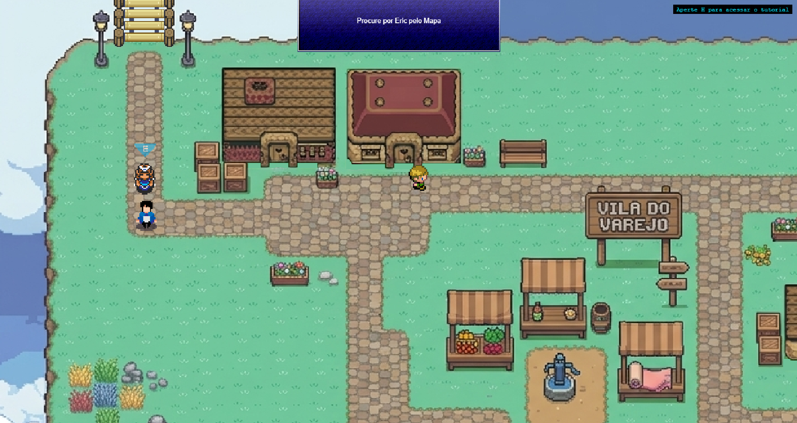<br>
  <sup>Fonte: Autoria própria</sup>
</div>


> <div align="center">
  <sub>Menu de configurações com opções de modo daltônico</sub><br>
  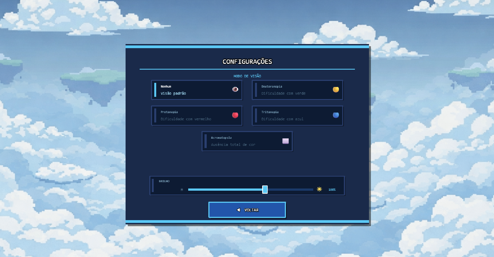<br>
  <sup>Fonte: Autoria própria</sup>
</div>


---

### Dificuldades encontradas

**Curva de entrada no desenvolvimento de jogos**

A principal dificuldade do grupo foi a ausência de experiência prévia com Phaser 3 e com desenvolvimento de jogos em geral. O ciclo de vida de cenas (`preload → create → update`), o sistema de câmera com zoom e bounds, o gerenciamento de física arcade e a lógica de `registry` para compartilhar estado entre cenas foram conceitos aprendidos durante o próprio desenvolvimento — e não antes dele. A adaptação foi rápida, como evidencia a progressão de complexidade entre as sprints: o que era código linear na sprint 1 tornou-se arquitetura orientada a objetos com herança na sprint 4. Ainda assim, partes do código das primeiras sprints precisaram ser refatoradas à medida que o grupo amadureceu as abstrações corretas (como a criação tardia das classes `CenaMapa` e `CenaNegociacao`).

**Coerência narrativa no sistema de cartas**

Traduzir o processo real de vendas em mecânica de jogo exigiu múltiplas iterações. A decisão de fazer as escolhas da Sondagem afetarem a pontuação da Demonstração (como na Thainá) foi o maior desafio de design: é necessário manter estado entre fases dentro de uma mesma negociação, validar qual carta foi usada previamente e aplicar tabelas de pontuação condicionais — tudo sem interromper o fluxo visual da jogabilidade.

**Bugs conhecidos — pendentes para sprint 5**

- Estado de cartas não é limpo corretamente em alguns reinícios de negociação, causando duplicação de cartas na mão
- O indicador de fase no topo da tela, em casos específicos, não avança visualmente em sincronia com a lógica interna

---

### Planos futuros

**Sprint 5 — obrigatório**

- Criar a tela de fim de jogo com resumo de desempenho por negociação
- Integrar o sistema de métricas: tempo total de conclusão e mapeamento de erros críticos por fase
- Corrigir os bugs conhecidos de reset de estado das cartas e sincronização do indicador de fase

**Melhorias de produto — pós-MVP**

- Expandir o catálogo de insígnias para cobrir todas as regiões (Praia dos Proveitos e Cidade Cielo)
- Implementar sistema de replay com contador de tentativas por negociação — dado valioso para o gestor de RH da Cielo avaliar onde cada GN tem dificuldade
- Ampliar o baralho com cartas desbloqueáveis por desempenho, aprofundando a progressão
- Melhorar a responsividade dos controles de movimentação (latência entre comando e animação, apontada nos testes de jogabilidade)
- Adicionar feedback sonoro às ações de carta (acerto, erro, virada de página) para reforço imediato do aprendizado
- Adicionar cinemáticas de transição entre regiões para reforçar a narrativa da jornada do GN

## 4.5. Revisão do MVP (sprint 5)

*Descreva e ilustre aqui o desenvolvimento dos refinamentos e revisões da versão final do jogo, explicando brevemente o que foi entregue em termos de MVP. Utilize prints de tela para ilustrar.*

# <a name="c5"></a>5. Testes

## 5.1. Casos de Teste (sprints 2 a 4)

Esta seção detalha os procedimentos de teste fundamentais para garantir a integridade técnica e a fluidez da experiência do jogador no Cielo Verso. Os testes cobrem cinco categorias do caminho crítico do jogo: navegação e menus, exploração e movimentação, sistema de diálogo com NPCs, sistema de negociação por cartas e sistemas de suporte. Esses testes devem ser executados de forma cíclica a cada nova implementação para assegurar que todos os sistemas permaneçam integrados corretamente.

### Categoria 1 — Navegação e Menus

| # | Pré-condição | Descrição do Teste | Pós-condição |
| :--- | :--- | :--- | :--- |
| **1** | Jogo recém-carregado no navegador | Aguardar o carregamento da barra de progresso do Preloader | A barra de progresso deve avançar de 0% a 100% e o Menu Principal deve ser exibido automaticamente ao término. |
| **2** | Menu Principal ativo | Clicar no botão INICIAR | A Cena de Introdução deve ser carregada, exibindo o monólogo animado da Cielita. |
| **3** | Menu Principal ativo | Clicar no botão CONFIGURAÇÕES | A tela de Configurações deve ser exibida com as opções de Visão, Resolução e Som. |
| **4** | Menu Principal ativo | Clicar no botão SAIR | O jogo deve encerrar ou exibir confirmação de saída. |
| **5** | Tela de Configurações ativa | Selecionar o modo de daltonismo "Deuteranopia" | O filtro SVG de deuteranopia deve ser aplicado sobre o canvas do jogo imediatamente, alterando a paleta de cores visível. |
| **6** | Filtro de daltonismo ativo | Selecionar o modo "Nenhum" nas configurações | O filtro deve ser removido e a paleta de cores padrão do jogo deve ser restaurada. |
| **7** | Tela de Configurações ativa | Clicar no botão VOLTAR | O sistema deve retornar à tela anterior sem perder as configurações salvas. |

---

### Categoria 2 — Exploração e Movimentação

| # | Pré-condição | Descrição do Teste | Pós-condição |
| :--- | :--- | :--- | :--- |
| **8** | Cena de Introdução ativa | Aguardar ou avançar todas as falas da Cielita | A tela de Seleção de Personagem deve ser carregada ao término da última fala. |
| **9** | Tela de Seleção de Personagem ativa | Clicar em cada uma das 4 skins disponíveis | A skin selecionada deve ser destacada e a animação idle correspondente deve tocar em loop. |
| **10** | Tela de Seleção de Personagem ativa | Digitar um nome no campo de texto e pressionar ENTER ou clicar em COMEÇAR | O jogo deve carregar o Mapa Introdutório com o nome e a skin selecionados persistidos via registry. |
| **11** | Personagem em qualquer mapa | Pressionar **W**, **A**, **S**, **D** | O personagem deve se mover para cima, esquerda, baixo e direita respectivamente, com a animação direcional correta tocando em cada caso. |
| **12** | Personagem em qualquer mapa | Pressionar **H** | O tutorial deve abrir como overlay. Pressionar **H** novamente deve fechá-lo, e o input do mapa deve ser bloqueado enquanto o tutorial estiver aberto. |
| **13** | Personagem no Mapa Introdutório | Caminhar em direção à porta da Casa da Cielita e pressionar **E** | O personagem deve ser teletransportado para o interior da casa com transição fadeIn. |
| **14** | Personagem no interior da Casa da Cielita | Caminhar em direção à porta de saída e pressionar **E** | O personagem deve retornar ao Mapa Introdutório posicionado corretamente do lado de fora, sem spawn na posição padrão. |
| **15** | Personagem no Mapa Introdutório | Caminhar em direção à Ponte MC→QG e atravessá-la | O sistema deve carregar o Mapa Quebra Gelo com transição fadeOut/fadeIn e posicionar o jogador na entrada correta. O mesmo deve ocorrer ao retornar. |
| **16** | Personagem no Mapa Quebra Gelo | Caminhar contra as casas de gelo, pedras e limites do cenário | O sistema de colisão via Tiled deve impedir o personagem de atravessar qualquer obstáculo ou sair dos limites do mapa. |
| **17** | Personagem no Mapa Quebra Gelo | Caminhar em direção à Ponte QG→VV e atravessá-la | O sistema deve carregar o Mapa Vila do Varejo com transição correta e spawn na posição correspondente à origem. |
| **18** | Personagem no Mapa Vila do Varejo | Caminhar em direção ao portal para a Praia dos Proveitos | O sistema deve carregar o Mapa Praia dos Proveitos corretamente. |
| **19** | Personagem em qualquer mapa de exploração | Pressionar **O** | O indicador de missão do HUD deve alternar entre visível e oculto a cada acionamento da tecla. |

---

### Categoria 3 — Sistema de Diálogo com NPCs

| # | Pré-condição | Descrição do Teste | Pós-condição |
| :--- | :--- | :--- | :--- |
| **20** | Personagem próximo a qualquer NPC | Entrar no raio de interação do NPC | O indicador visual do botão **E** deve aparecer flutuando sobre o NPC e o balão de missão do HUD deve ser atualizado. |
| **21** | Personagem próximo a qualquer NPC | Afastar-se do NPC para fora do raio de interação | O indicador visual e a caixa de diálogo devem desaparecer automaticamente e o diálogo deve ser encerrado. |
| **22** | Indicador de interação visível | Pressionar **E** para iniciar o diálogo | A caixa de diálogo deve aparecer e o texto da primeira fala deve ser exibido com efeito de máquina de escrever. |
| **23** | Diálogo ativo com texto sendo digitado | Pressionar **E** durante o efeito de máquina de escrever | O efeito deve ser interrompido e o texto completo da fala atual deve aparecer imediatamente na tela. |
| **24** | Texto da fala atual completo na tela | Pressionar **E** para avançar | O sistema deve exibir a próxima fala ou encerrar o diálogo caso seja a última, com o indicador de interação desaparecendo. |
| **25** | Diálogo com a Cielita concluído | Verificar o registry do jogo | A chave correspondente ao diálogo concluído (ex.: `cielita_gelo_concluido`) deve estar marcada como `true`, impedindo que o diálogo se repita ao reentrar na cena. |

---

### Categoria 4 — Sistema de Negociação por Cartas

| # | Pré-condição | Descrição do Teste | Pós-condição |
| :--- | :--- | :--- | :--- |
| **26** | Personagem no interior da Casa do Pedro, diálogo introdutório concluído | Sair da casa pela porta | A cena de negociação com Seu Pedro deve ser carregada com fadeIn, exibindo a barra de satisfação, as cartas na mão e o indicador de fases. |
| **27** | Negociação ativa na fase de Abordagem | Passar o cursor sobre uma carta | A carta deve se elevar levemente (efeito hover) indicando que é interativa. |
| **28** | Negociação ativa | Clicar em uma carta | O modal de detalhe da carta deve aparecer com a imagem ampliada e os botões "Voltar" e "Selecionar". |
| **29** | Modal de detalhe da carta aberto | Clicar em "Voltar" | O modal deve fechar e as cartas originais devem permanecer na mão sem alteração. |
| **30** | Modal de detalhe aberto com carta correta | Clicar em "Selecionar" | A satisfação do cliente deve aumentar, a barra deve animar para o novo valor, o sprite do cliente deve atualizar conforme o estado (satisfeito/neutro/bravo) e a carta deve ser removida da mão. |
| **31** | Modal de detalhe aberto com carta incorreta | Clicar em "Selecionar" | A satisfação deve diminuir em 10 pontos, o sprite do cliente deve atualizar para um estado mais negativo e uma fala de erro deve ser exibida no balão de diálogo. |
| **32** | Negociação ativa com satisfação em 1–10 | Jogar uma carta incorreta | A satisfação deve chegar a zero, a mensagem de derrota deve ser exibida e o sistema deve retornar à cena de origem após 2 segundos. |
| **33** | Negociação ativa na fase de Sondagem | Verificar a área de cartas | As 6 cartas da fase de Sondagem devem estar divididas em páginas de 3, com os botões de navegação "<" e ">" visíveis e funcionais. |
| **34** | Paginação ativa na fase de Sondagem | Clicar no botão ">" | A segunda página de cartas deve ser exibida e o botão "<" deve se tornar visível. Clicar em "<" deve retornar à primeira página e ocultá-lo novamente. |
| **35** | Número de acertos necessários na fase atingido | Verificar o indicador de progresso de fases | O círculo da fase atual deve ser destacado com animação de pulso, os círculos das fases concluídas devem mudar de cor para verde e a próxima fase deve ser iniciada automaticamente. |
| **36** | Todas as fases da negociação concluídas com satisfação acima de 0 | Concluir a última fase | O modal de insígnia deve aparecer sobre a tela com animação de entrada (escala de 0 para 1) e o botão "CONTINUAR" deve estar visível. |
| **37** | Modal de insígnia exibido | Clicar em "CONTINUAR" | O modal deve fechar, a insígnia deve ser salva no registry e o sistema deve retornar à cena de origem com transição fadeOut. |
| **38** | Negociação vencida anteriormente | Retornar ao mapa e entrar novamente na casa do NPC | A negociação não deve reiniciar — a chave de vitória no registry (`pedro_vencido`, `varejo_vencido`) deve impedir nova execução da cena de negociação. |

---

### Categoria 5 — Sistemas de Suporte

| # | Pré-condição | Descrição do Teste | Pós-condição |
| :--- | :--- | :--- | :--- |
| **39** | Personagem transitando entre dois mapas | Observar o áudio durante a transição | A trilha do mapa de origem deve diminuir gradualmente (fade out de 800ms) e a trilha do novo mapa deve aumentar progressivamente (fade in de 800ms), sem corte abrupto entre faixas. |
| **40** | Mapa com som ambiente ativo | Transitar para outro mapa | O som ambiente do mapa anterior deve encerrar com fade de 600ms e o som ambiente do novo mapa deve iniciar em seguida, sem sobreposição. |
| **41** | Personagem retornando de uma cena interior para o mapa externo | Verificar a posição de spawn do personagem | O personagem deve reaparecer na posição correta correspondente à porta pela qual saiu, não na posição padrão do mapa. |
| **42** | Jogo em execução com qualquer cena de mapa ativa | Recarregar a página do navegador e iniciar novamente | O Preloader deve executar o carregamento de todos os assets sem erros de "Texture key already in use" no console do navegador. |

---

A execução consistente dos casos de teste acima garante que o Cielo Verso permaneça estável ao longo de todo o desenvolvimento. A cobertura vai desde o carregamento inicial e a navegação entre mapas até a lógica central de negociação e os sistemas de suporte — assegurando que cada componente funcione de forma isolada e em integração com os demais.


## 5.2. Testes de jogabilidade (playtests) (sprint 5)

### 5.2.1. Registros de testes

> **Nota metodológica:** Os playtests desta sprint foram realizados com estudantes do Inteli (turma T26), com idades entre 18 e 19 anos e perfil predominantemente gamer. Esses participantes funcionam como **proxies do público-alvo real** — Gerentes de Negócios da Cielo, com média de 44 anos e menor familiaridade com jogos digitais. As implicações dessa diferença de perfil são discutidas na seção de análise ao final deste bloco.

---

Nome | Marcos Andrade 
--- | ---
Já possuía experiência prévia com games? | Sim, jogador com experiência moderada
Conseguiu iniciar o jogo? | Sim, sem dificuldades
Entendeu as regras e mecânicas do jogo? | Entendeu a lógica geral, mas indicou que as instruções para o jogador sobre o que fazer em cada etapa poderiam ser mais claras. Os HUDs de indicação de objetivos também foram apontados como pouco evidentes.
Conseguiu progredir no jogo? | Sim
Apresentou dificuldades? | Dificuldade leve na interpretação dos controles, que considerou "não muito claros" à primeira vista
Que nota deu ao jogo? | 7,5
O que gostou no jogo? | Design visual geral, considerado muito bom; trilha sonora adequada ao contexto
O que poderia melhorar no jogo? | Melhorar as instruções contextuais ao longo da jornada; aprimorar os HUDs de indicação de objetivos para que o jogador saiba sempre o que deve fazer a seguir

---

Nome | Lucas Vinicius 
--- | ---
Já possuía experiência prévia com games? | Sim
Conseguiu iniciar o jogo? | Sim
Entendeu as regras e mecânicas do jogo? | Sim; destacou positivamente a intuitividade da exploração, mas sugeriu a adição de ícones de localização de objetivos no mapa para facilitar a navegação
Conseguiu progredir no jogo? | Sim
Apresentou dificuldades? | Dificuldade para localizar objetivos no mapa sem indicadores visuais de direção
Que nota deu ao jogo? | 9,0
O que gostou no jogo? | Boa intuitividade geral; controles considerados adequados; design e som avaliados positivamente
O que poderia melhorar no jogo? | Aumentar o tamanho da fonte da instrução "Aperte H para o tutorial"; adicionar tutorial específico para a fase de negociação; implementar a possibilidade de retornar após selecionar uma carta; corrigir a seta de navegação entre cartas em determinada fase

---

Nome | Gabriel Tavares 
--- | ---
Já possuía experiência prévia com games? | Sim
Conseguiu iniciar o jogo? | Sim
Entendeu as regras e mecânicas do jogo? | Sim, considerou as mecânicas claras, porém sinalizou que há excesso de texto nas telas de negociação, o que pode comprometer a fluidez da leitura
Conseguiu progredir no jogo? | Sim
Apresentou dificuldades? | Percepção de sobrecarga textual; inconsistência de estilo visual entre diferentes partes do jogo
Que nota deu ao jogo? | 8,5
O que gostou no jogo? | Design agradável; trilha sonora compatível com o ambiente
O que poderia melhorar no jogo? | Reduzir a quantidade de texto nas cenas de combate; aumentar a intuitividade da mecânica de negociação; avaliar a substituição dos controles WASD por teclas de seta como opção alternativa de movimentação

---

Nome | Matheus Augusto 
--- | ---
Já possuía experiência prévia com games? | Sim
Conseguiu iniciar o jogo? | Sim
Entendeu as regras e mecânicas do jogo? | Sim, as mecânicas foram consideradas claras
Conseguiu progredir no jogo? | Sim, com ressalvas
Apresentou dificuldades? | Identificou bug crítico: ao selecionar uma carta, retornar e acessar novamente a mesma cena, a carta anteriormente selecionada reaparecia e era contabilizada novamente como resposta correta. Também reportou falha na exibição de descrição e imagem de algumas cartas na Vila do Varejo, e dificuldade de leitura devido ao tamanho reduzido da fonte nas cartas.
Que nota deu ao jogo? | 9,5
O que gostou no jogo? | Mecânicas de negociação bem estruturadas; experiência geral positiva
O que poderia melhorar no jogo? | Correção do bug de re-seleção de carta; reposicionamento do botão de fechar carta para local mais próximo ao card; ajuste do tamanho da fonte nos textos das cartas; correção da falha de carregamento de imagem/descrição de cartas na Vila do Varejo

---

Nome | Heitor Goulart
--- | ---
Já possuía experiência prévia com games? | Sim
Conseguiu iniciar o jogo? | Sim
Entendeu as regras e mecânicas do jogo? | Sim, considerou o sistema de negociação bem claro
Conseguiu progredir no jogo? | Sim
Apresentou dificuldades? | Dificuldade pontual ao navegar entre cartas (seta lateral com falha de funcionamento); colisões imprecisas com objetos de cenário
Que nota deu ao jogo? | 9,0
O que gostou no jogo? | Clareza geral das mecânicas; experiência considerada fluida
O que poderia melhorar no jogo? | Ajustar colisões de elementos decorativos do cenário; corrigir a hitbox dos botões de interface para maior precisão de clique

---

Nome | Bruno Araújo 
--- | ---
Já possuía experiência prévia com games? | Sim
Conseguiu iniciar o jogo? | Sim
Entendeu as regras e mecânicas do jogo? | Sim; elogiou a intuitividade do tutorial, mas identificou que é possível iniciar um diálogo de tutorial com um NPC e simplesmente se afastar, fazendo com que a missão avance sem que o conteúdo tenha sido assimilado
Conseguiu progredir no jogo? | Sim
Apresentou dificuldades? | Conseguiu reproduzir o bug de re-seleção de carta: ao escolher uma carta correta, navegar para outras cartas via seta e retornar, a carta correta reaparecia clicável e era contada novamente — quebrando a progressão da cena de negociação
Que nota deu ao jogo? | 8,0
O que gostou no jogo? | Sistema de batalha/negociação bem recebido; design do mundo aberto elogiado
O que poderia melhorar no jogo? | Corrigir o bug de estado de cartas na cena de negociação; adicionar trava de diálogo que impeça o jogador de abandonar um NPC no meio da interação sem consequência

---

Nome | Arthur Morais 
--- | ---
Já possuía experiência prévia com games? | Sim
Conseguiu iniciar o jogo? | Sim
Entendeu as regras e mecânicas do jogo? | Sim; elogiou o esquema de poucos comandos, considerando-o acessível
Conseguiu progredir no jogo? | Sim
Apresentou dificuldades? | Dificuldade para distinguir áreas e regiões do mapa sem demarcação clara; identificou bug relacionado ao banco de dados de negociação e apontou ausência de identificação de nome dos locais
Que nota deu ao jogo? | 9,0
O que gostou no jogo? | Design do mundo aberto; esquema de controles simples e eficientes; trilha sonora adequada ao ambiente
O que poderia melhorar no jogo? | Implementar minimapa ou indicadores de região; corrigir bug de persistência de dados na cena de negociação; adicionar nomes ou placas identificadoras nos locais do mapa

---

Nome | Felipe Cabeza / 18 anos / Eng. Comp. / T26
--- | ---
Já possuía experiência prévia com games? | Sim, fã declarado do estilo visual inspirado em Pokémon
Conseguiu iniciar o jogo? | Sim
Entendeu as regras e mecânicas do jogo? | Sim; considerou o sistema de negociação simples e coerente com o contexto
Conseguiu progredir no jogo? | Sim, com ressalvas relacionadas à movimentação e visibilidade em alguns mapas
Apresentou dificuldades? | Velocidade de deslocamento percebida como lenta em determinados mapas; visibilidade dificultada pela paleta de cores em certas áreas; ausência de indicador visual diferenciando casas com conteúdo das sem conteúdo
Que nota deu ao jogo? | 8,0
O que gostou no jogo? | Design visual inspirado em Pokémon bem recebido; trilha sonora elogiada mesmo sendo repetitiva; mecânicas de negociação claras e coerentes
O que poderia melhorar no jogo? | Corrigir erros de colisão; adicionar trava ou estado visual em personagens cujas negociações já foram concluídas; diferenciar visualmente as cartas por categoria (cores distintas por tipo de iniciativa); indicar visualmente quais casas possuem conteúdo disponível; revisar velocidade de movimentação e paleta de cores em mapas com baixo contraste

**Categorias de problemas por frequência:**
 
| Categoria | Testadores afetados |
| --- | :---: |
| Bugs na cena de negociação (cartas) | 4/8 |
| Falta de indicadores visuais / minimapa | 3/8 |
| Excesso de texto | 2/8 |
| Colisão com objetos de cenário | 2/8 |
| Tutorial ou instrução insuficiente | 2/8 |
| Legibilidade (tamanho de fonte) | 2/8 |

---

### Análise dos resultados e relação com o público-alvo

Os playtests desta sprint foram conduzidos com estudantes do Inteli com idades entre 18 e 19 anos, todos com experiência prévia em jogos digitais — um perfil consideravelmente distinto do público-alvo final do projeto, composto por Gerentes de Negócios da Cielo com média de 44 anos e menor familiaridade com o universo gamer. Essa condição deve ser considerada na interpretação dos dados: os testadores funcionaram como **proxies qualificados**, capazes de identificar problemas técnicos, de usabilidade e de clareza de mecânicas com precisão, mas não necessariamente representam as dificuldades que um usuário não-gamer enfrentaria. Ainda assim, os resultados são reveladores — e, em alguns aspectos, mais preocupantes do que parecem à primeira vista. Se jogadores experientes relataram dificuldade para localizar objetivos no mapa, identificar áreas distintas, interpretar o excesso de texto nas negociações e navegar pelo sistema de cartas sem indicadores claros, é razoável supor que o público-alvo real — acostumado a ferramentas de trabalho e não a interfaces de jogo — encontraria dificuldades ainda mais acentuadas nesses mesmos pontos. Nesse sentido, os feedbacks sobre sobrecarga textual, ausência de minimapa, falta de demarcação de regiões e necessidade de tutorial expandido para a mecânica de negociação ganham peso estratégico: não são apenas melhorias de experiência para gamers, mas requisitos de acessibilidade para que o jogo cumpra sua função como ferramenta de treinamento corporativo. A nota média atribuída ao jogo pelos testadores foi **8,6**, indicando boa recepção geral — um sinal positivo que, combinado com os pontos de melhoria levantados, fornece uma base concreta para a revisão do MVP.

### 5.2.2. Melhorias

Com base nos resultados consolidados dos playtests realizados na sprint 5, foram identificados seis eixos de melhoria, organizados por prioridade de impacto. A classificação considera tanto a frequência de relato entre os testadores quanto a severidade do problema sobre a experiência de jogo e sobre os objetivos de aprendizado do produto.

---

#### Prioridade 1 — Correção do bug de re-seleção de carta na cena de negociação

**Origem:** Relatado de forma independente por Matheus Augusto e Bruno Araújo.

**Descrição do problema:** Ao selecionar uma carta correta durante a negociação, navegar para outras cartas via seta lateral e retornar à carta anteriormente escolhida, o sistema a exibe novamente como disponível para seleção. Clicar nela uma segunda vez a contabiliza como uma nova resposta correta, corrompendo o estado da cena e permitindo progressão indevida.

**Impacto:** Crítico. Além de quebrar a progressão da cena de negociação, o bug compromete diretamente o objetivo pedagógico do jogo — o jogador avança sem ter tomado a decisão correta de forma consciente, esvaziando o valor de treinamento da mecânica.

**Ação recomendada:** Implementar controle de estado por carta após seleção, marcando-a como `selected: true` e desabilitando o evento de clique. O estado deve persistir mesmo após navegação lateral e ser reiniciado apenas ao iniciar uma nova cena de negociação. Adicionalmente, investigar o bug secundário de carregamento de imagem/descrição reportado na Vila do Varejo (Matheus Augusto), que pode compartilhar a mesma raiz de gerenciamento de estado.

---

#### Prioridade 2 — Implementação de indicadores visuais de navegação e objetivos

**Origem:** Relatado por Lucas Vinicius, Arthur Morais e Felipe Cabeza.

**Descrição do problema:** O mapa não oferece indicadores suficientes para que o jogador saiba onde estão os objetivos ativos, quais regiões já foram concluídas e quais casas possuem conteúdo disponível. A ausência de um minimapa ou de ícones de localização obriga o jogador a explorar por tentativa e erro.

**Impacto:** Alto. Para o público-alvo real (GNs da Cielo com pouca experiência em jogos), a desorientação espacial é um dos principais fatores de abandono em jogos de mundo aberto. Se jogadores experientes já relataram dificuldade, usuários não-gamers provavelmente encontrariam uma barreira de progressão nesse ponto.

**Ação recomendada:** Implementar, em ordem de viabilidade: (1) ícone flutuante ou marcador de objetivo no mapa indicando o NPC-alvo da fase atual; (2) estado visual diferenciado para casas com conteúdo disponível versus casas já concluídas; (3) minimap como melhoria futura de maior escopo. Adicionalmente, adicionar placas ou rótulos de nome nas regiões do mapa (sugerido por Arthur Morais).

---

#### Prioridade 3 — Redução da carga textual nas cenas de negociação

**Origem:** Relatado por Gabriel Tavares e Lucas Vinicius.

**Descrição do problema:** As cenas de negociação apresentam volume excessivo de texto por tela, o que prejudica a fluidez da leitura e pode causar fadiga cognitiva. Gabriel Tavares apontou que "tem muito texto" como principal obstáculo à experiência de combate.

**Impacto:** Alto para o público-alvo real. GNs da Cielo interagem com o jogo em contexto de treinamento corporativo, onde sessões longas e densas de leitura reduzem o engajamento. O excesso de texto também entra em conflito com o princípio de aprendizado por ação, central à proposta do jogo.

**Ação recomendada:** Revisar os textos das cartas e das falas de NPC com foco em concisão. Textos de carta devem comunicar a essência da técnica de negociação em no máximo 2–3 linhas. Considerar o uso de ícones ou elementos visuais para complementar a informação textual em vez de substituí-la por mais texto.

---

#### Prioridade 4 — Ajuste de colisões e hitboxes de interface

**Origem:** Relatado por Heitor Goulart e Felipe Cabeza (colisão de cenário); Heitor Goulart (hitbox de botões).

**Descrição do problema:** Objetos decorativos do cenário apresentam colisão imprecisa, ora bloqueando o personagem em posições inesperadas, ora permitindo sobreposição indevida. Paralelamente, os botões de interface da cena de negociação possuem área de clique menor do que a representação visual, gerando frustração ao tentar interagir.

**Impacto:** Moderado na experiência geral, mas capaz de causar interrupções abruptas no fluxo de jogo. Para usuários com menor familiaridade com jogos, esse tipo de fricção técnica é frequentemente interpretado como erro do usuário, não do sistema, podendo reduzir a autoeficácia durante o treinamento.

**Ação recomendada:** Revisar e ajustar os polígonos de colisão dos objetos de cenário em todos os mapas. Para os botões de interface, garantir que a hitbox corresponda visualmente à área do elemento, com margem mínima de 8px de padding interativo.

---

#### Prioridade 5 — Expansão e melhoria do tutorial

**Origem:** Relatado por Marcos Andrade e Bruno Araújo; indiretamente corroborado por Lucas Vinicius (sugestão de tutorial específico para negociação).

**Descrição do problema:** O tutorial existente cobre as mecânicas básicas de movimentação, mas não prepara adequadamente o jogador para a mecânica de negociação por cartas — a mais complexa e central do jogo. Além disso, Bruno Araújo identificou que é possível iniciar um diálogo de tutorial com um NPC e se afastar antes do fim, avançando a missão sem ter assimilado o conteúdo.

**Impacto:** Alto para o público-alvo real. A mecânica de cartas é o núcleo do treinamento; um jogador que não a compreende plenamente não extrai o valor pedagógico do jogo. A possibilidade de "pular" o tutorial por acidente agrava esse risco.

**Ação recomendada:** Desenvolver um módulo de tutorial dedicado à cena de negociação, acionado antes da primeira interação com um NPC de combate. Implementar trava de proximidade que impeça o jogador de se afastar de um NPC durante um diálogo ativo de tutorial, ou exibir alerta de confirmação caso tente fazê-lo. Aumentar o tamanho da fonte da instrução "Aperte H para o tutorial" para garantir sua leitura imediata na tela inicial.

---

#### Prioridade 6 — Ajustes de legibilidade, paleta e movimentação

**Origem:** Matheus Augusto e Lucas Vinicius (fonte das cartas); Felipe Cabeza (contraste de paleta e velocidade de movimentação).

**Descrição do problema:** O texto das cartas foi considerado difícil de ler devido ao tamanho reduzido da fonte. Em determinados mapas, a paleta de cores apresenta baixo contraste, dificultando a distinção de elementos do cenário. A velocidade de movimentação do personagem foi percebida como lenta em algumas áreas.

**Impacto:** Moderado isoladamente, mas com potencial de acúmulo: um jogo que exige esforço visual constante, apresenta movimentação arrastada e tem paleta de baixo contraste comunica descuido técnico e reduz a imersão — especialmente em um produto que precisa ser percebido como profissional por seu público corporativo.

**Ação recomendada:** Aumentar o tamanho mínimo da fonte nos cards de carta para 13–14px e revisar o contraste de texto sobre fundo nos elementos de interface (relação mínima recomendada de 4,5:1 para acessibilidade WCAG AA). Revisar a paleta dos mapas com menor legibilidade relatada. Avaliar o ajuste de velocidade de deslocamento por mapa, com valor-base mais alto para áreas de transição e exploração livre.

# <a name="c6"></a>6. Conclusões e trabalhos futuros (sprint 5)

De forma geral, a solução desenvolvida — o jogo Cielo Verso — atingiu os objetivos propostos na Seção 1 ao transformar o treinamento dos Gerentes de Negócios em uma experiência digital gamificada, acessível e padronizada. A proposta de eliminar barreiras geográficas foi atendida por meio de uma solução totalmente remota, permitindo que qualquer colaborador, independentemente da região, tenha acesso ao mesmo conteúdo de capacitação. Além disso, o uso de mecânicas interativas, como o sistema de cartas e simulações de negociação, contribuiu para aumentar o engajamento e a retenção do conteúdo, substituindo o modelo tradicional expositivo por uma abordagem prática e imersiva.

Outro ponto relevante é o alinhamento do jogo com o funil de vendas da Cielo, garantindo que todas as etapas — abordagem, sondagem, demonstração, benefícios e negociação — fossem trabalhadas de forma progressiva. A estrutura em fases e regiões, junto com o sistema de métricas (tempo de conclusão e mapeamento de erros), também atende ao objetivo de monitorar o desempenho dos usuários, permitindo identificar lacunas de aprendizado.

Como pontos fortes do projeto, destacam-se:
- A estrutura escalável do jogo, que permite a adição de novos conteúdos com baixo custo técnico;
- O alto nível de alinhamento com o contexto real de vendas, tornando o aprendizado aplicável;
- A acessibilidade, incluindo mecânicas simples e o modo daltônico;
- O engajamento proporcionado pela gamificação, com progressão, desafios e feedback visual.

Por outro lado, alguns pontos a melhorar foram identificados:
- Necessidade de maior polimento na interface (HUD) e consistência visual entre cenas;
- Ajustes no balanceamento da dificuldade, especialmente no sistema de satisfação;
- Correção de bugs técnicos, como reset de estados e sincronização de indicadores;
- Maior clareza em alguns momentos da experiência para usuários menos familiarizados com jogos.


Com base nos testes realizados (Seção 5), foram identificadas oportunidades de melhoria que podem ser organizadas em um plano de ação futuro:

- Correção de bugs críticos: garantir o reset correto do sistema de cartas e estabilidade das mecânicas de negociação;
- Ajuste de balanceamento: calibrar ganhos e perdas na barra de satisfação com base em dados de playtest;
- Melhoria da interface: padronizar HUD, indicadores visuais e feedbacks ao jogador;
- Aprimoramento da progressão: tornar mais claro o avanço entre fases e objetivos de cada etapa;
- Testes com usuários externos: ampliar a validação com o público-alvo real para refinar a experiência.

Além disso, o grupo identificou diversas ideias para melhorias futuras, que podem expandir o impacto do projeto:

- Implementação de um sistema mais robusto de métricas e relatórios, permitindo análise detalhada de desempenho por usuário;
- Criação de um sistema de recompensas e progressão, como cartas desbloqueáveis ou níveis de habilidade;
- Expansão do jogo com novos cenários, clientes e desafios, aumentando a longevidade da plataforma;
- Integração com sistemas corporativos da Cielo, tornando o jogo uma ferramenta oficial de treinamento;
- Inclusão de modos colaborativos ou competitivos, incentivando interação entre usuários;
- Aprimoramento da personalização da experiência, adaptando o conteúdo conforme o desempenho do jogador.

Em síntese, o projeto atingiu com sucesso seu propósito principal como MVP, demonstrando viabilidade técnica e valor estratégico para a capacitação corporativa. As melhorias propostas indicam um caminho claro para evolução futura, com potencial de transformar o jogo em uma plataforma completa de treinamento e desenvolvimento profissional.


# <a name="c7"></a>7. Referências (sprint 5)

_Incluir as principais referências de seu projeto, para que seu parceiro possa consultar caso ele se interessar em aprofundar. Um exemplo de referência de livro e de site:_<br>

LUCK, Heloisa. Liderança em gestão escolar. 4. ed. Petrópolis: Vozes, 2010. <br>
SOBRENOME, Nome. Título do livro: subtítulo do livro. Edição. Cidade de publicação: Nome da editora, Ano de publicação. <br>

INTELI. Adalove. Disponível em: https://adalove.inteli.edu.br/feed. Acesso em: 1 out. 2023 <br>
SOBRENOME, Nome. Título do site. Disponível em: link do site. Acesso em: Dia Mês Ano

Porter, M. E. (2008). The five competitive forces that shape strategy. Harvard Business Review.
https://hbr.org/2008/01/the-five-competitive-forces-that-shape-strategy

> - ABECS. *Associação Brasileira das Empresas de Cartões de Crédito e Serviços*. 2023.
> - BANCO CENTRAL DO BRASIL. *Relatório de Estabilidade Financeira*. 2023.
> - CIELO. *Relatório Anual*. 2023.
> - FERNANDES, A. et al. *Planejamento estratégico*. 2015.
> - VIAL, G. Understanding digital transformation. *Journal of Strategic Information Systems*, 2019.


# <a name="c8"></a>Anexos

*Inclua aqui quaisquer complementos para seu projeto, como diagramas, imagens, tabelas etc. Organize em sub-tópicos utilizando headings menores (use ## ou ### para isso)*
